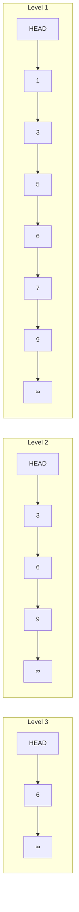

# Skip Lists

> **One-line summary**: A skip list is a probabilistic data structure of layered linked lists that achieves $O(\log n)$ expected search, insertion, and deletion with simpler implementation and better concurrency properties than balanced binary search trees.

## 🎯 Intuition
**The Core Idea:** Stack randomized “express lanes” on top of a sorted linked list so searches can skip over most elements while updates remain local pointer splices.
**Analogy:** Like express elevator stops in a skyscraper — the ground floor has every floor button (level 0 = full sorted list), the express elevator skips to every 4th floor (higher levels), and you combine express + local to reach any floor in $O(\log n)$ stops.
**Why It Matters:** Skip lists show that randomization can replace the complex invariants of balanced trees with a structure that is easier to implement and often easier to make concurrent. They are used in Redis ZSETs, LevelDB and RocksDB MemTables, and Lucene. They also provide a clean case study in expected-time analysis and probabilistic balancing.

---

## ⚙️ Core Mechanics
### How It Works
A **skip list** organizes a sorted collection as a hierarchy of linked lists. The **bottom layer** (level 0) is a complete sorted linked list of all elements. Each higher layer is a random subset of the layer below -- typically, each element is promoted to the next layer with probability 1/2. This creates an "express lane" structure: searching starts at the topmost layer and drops down when the next element at the current layer would overshoot the target, analogous to binary search but implemented with forward pointers rather than array indexing.

The expected number of layers is $O(\log n)$, and at each layer the search advances past a constant expected number of elements before dropping down. This yields **$O(\log n)$ expected time** for search, insert, and delete -- matching balanced BSTs -- with **$O(n)$ expected space** (each element appears in 1 + 1 + 1/2 + 1/4 + ... = ~2 lists on average). Insertion creates a new node, flips coins to determine its height, and splices it into each layer up to that height. Deletion simply removes the node from all layers it participates in.

**Figure:** Skip list — layered linked lists with randomized express lanes for $O(\log n)$ search

Invented by William Pugh in 1990, skip lists are prized for their **simplicity**: no rotations, no color flipping, no balance factors -- just linked-list splicing with randomized height. They are also naturally suited to **concurrent access** because insertions and deletions only touch local pointers at each level, enabling fine-grained locking or lock-free implementations. In practice, skip lists power Redis sorted sets (ZSET), LevelDB and RocksDB MemTables, and Apache Lucene's in-memory posting list index.

### Key Operations

| Operation   | Expected Time | Worst Case | Notes                           |
|-------------|--------------|------------|---------------------------------|
| Search      | $O(\log n)$     | $O(n)$       | High-probability $O(\log n)$       |
| Insert      | $O(\log n)$     | $O(n)$       | Coin flips determine height     |
| Delete      | $O(\log n)$     | $O(n)$       | Remove from all levels          |
| Min / Max   | $O(1)$         | $O(1)$       | Head of bottom list / tail      |
| Range scan  | $O(\log n + k)$ | $O(n + k)$   | k = number of elements in range |
| Space       | $O(n)$         | $O(n \log n)$ | Expected 2n pointers total      |

### Key Facts
- Expected $O(\log n)$ search, insert, and delete; $O(n)$ worst case (but astronomically unlikely).
- Expected $O(n)$ space; each element occupies an average of ~2 forward pointers across all levels.
- Promotion probability p is typically 1/2 but can be tuned (1/4 reduces space at the cost of taller lists).
- Maximum level is usually capped at $O(\log n)$ to bound memory and pathological cases.
- No rebalancing operations -- insertion only requires local pointer updates.
- Concurrent skip lists (lock-free or fine-grained locking) are simpler to implement than concurrent balanced BSTs.
- Used in Redis (sorted sets), LevelDB/RocksDB (MemTable), and Lucene (in-memory index).
- Deterministic skip lists exist (e.g., 1-2-3 skip lists) but are rarely used in practice.

---

## 🔬 Deep Dive
### Formal Properties
- If each node is promoted independently with probability **1/2**, the expected height is **$O(\log n)$** and each element participates in about **2 forward pointers** on average.
- Search, insert, and delete are all **$O(\log n)$ expected time**, with **$O(n)$** worst case still possible but exponentially unlikely.
- The structure achieves balanced-tree-like behavior **without rotations**, because randomness replaces strict balancing invariants.
- **Deterministic skip lists** exist, but the classic Pugh 1990 form uses probabilistic promotion because it keeps implementation simple while retaining strong expected bounds.

| Aspect              | Skip List               | Balanced BST (e.g., Red-Black) | Hash Table           |
|---------------------|------------------------|--------------------------------|----------------------|
| Search              | $O(\log n)$ expected      | $O(\log n)$ worst case            | $O(1)$ expected        |
| Sorted iteration    | Yes (follow level 0)   | Yes (in-order traversal)       | No                   |
| Implementation      | Simple (list splicing)  | Complex (rotations)            | Simple               |
| Concurrency         | Easy (fine-grained)    | Hard (rotation conflicts)      | Moderate             |
| Space overhead      | ~2 pointers/element    | 2-3 pointers/element           | Load-factor dependent|
| Deterministic       | No (probabilistic)     | Yes                            | No (hash collisions) |

### Edge Cases and Pitfalls
- Poor randomization or an incorrectly chosen promotion policy can create imbalanced towers and hurt performance.
- Implementations must update **all levels** touched by an insertion or deletion; missing one forward pointer corrupts the structure.
- Maximum level caps should scale with dataset size; too low wastes the skip-list advantage, too high wastes memory.
- Skip lists preserve sort order, but unlike hash tables they are not the right choice when only exact lookup with no ordering is needed.

### Real-World Usage
Skip lists underpin **Redis ZSET** sorted sets, **LevelDB/RocksDB MemTables**, and **Lucene** in-memory indexing because they combine ordered iteration with simple, localized updates. Their lack of rotations makes them especially attractive for **fine-grained locking** and **lock-free** concurrent implementations, which is a major reason they are often chosen over balanced BSTs in systems software.

---

## 🏋️ Practice
### Warm-Up (5 min)
- Why does promoting nodes with probability 1/2 create only $O(\log n)$ expected levels?
- What advantage do skip lists have over balanced BSTs in concurrent settings?

### Core Problems
- **Design Sorted Set** — support search, insert, delete, and ordered iteration for a changing set of keys.
- **Range Query in Ordered Stream** — return all keys in `[l, r]` after logarithmic search to the first element.
- **MemTable Design Exercise** — compare a skip list with a red-black tree for in-memory write buffering.

### Challenge
- Sketch a **deterministic skip list** or concurrent skip list design and explain what complexity or implementation trade-offs change relative to the classic randomized version.

---

*See also:* [[Disjoint Sets and Union-Find]], [[Segment Trees]], [[Fenwick Trees]], [[Interval Trees and Range Trees]] | Cross-wiki links

## Supporting Chunks
- [[CS Data Structures/_chunks/chunk-ds-015 Skip lists achieve Ologn with probabilistic layering|Skip lists achieve O(log n) with probabilistic layering]]
- [[CS Data Structures/_chunks/chunk-ds-090 Skip list expected space is On despite multiple levels|Skip list expected space is O(n) despite multiple levels]]
- [[CS Data Structures/_chunks/chunk-ds-072 Skip lists support lock-free concurrent operations|Skip lists support lock-free concurrent operations]]
- [[CS Data Structures/_chunks/chunk-ds-137 Memtables use skip lists or red-black trees|Memtables use skip lists or red-black trees]]

## References

→ [[CS Data Structures/Sources/Sources Index|Sources Index]]
