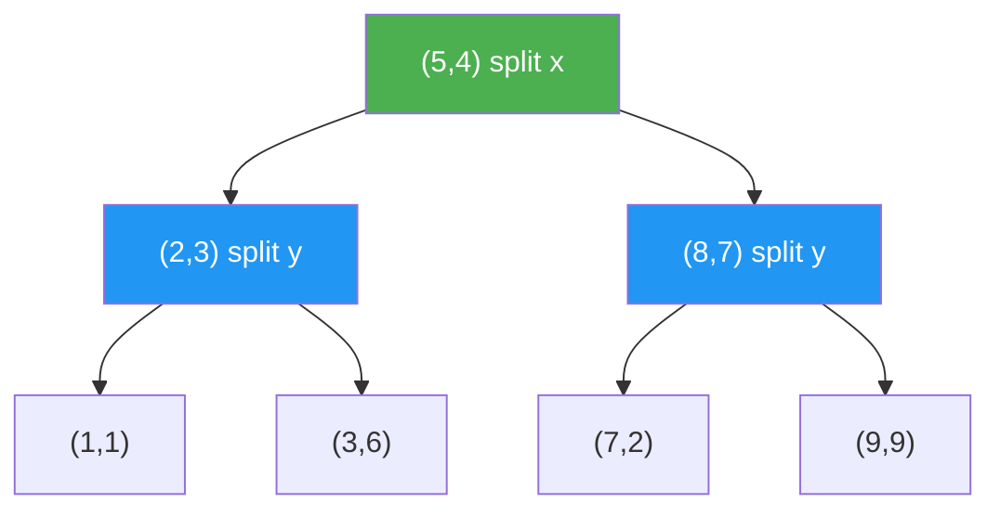

# k-d Trees and Spatial Data Structures

> **One-line summary**: A k-d tree is a binary space-partitioning tree that recursively splits k-dimensional points by alternating coordinate axes, enabling efficient nearest-neighbor and range searches that underpin applications in graphics, GIS, and machine learning.

## 🎯 Intuition
**The Core Idea:** Recursively carve space with alternating axis-aligned cuts so nearest-neighbor and range queries can ignore most of the dataset.
**Analogy:** Like repeatedly cutting a pizza — first a vertical cut, then horizontal, then vertical again — each cut splits the remaining points roughly in half. To find the closest topping to a spot, you only need to check the slice you're in and maybe peek at neighbors.
**Why It Matters:** k-d trees are the default spatial index for low-dimensional point data because they make nearest-neighbor and range search practical. They power work in graphics, GIS, and machine learning, and they also expose the deeper limitation that exact spatial indexing gets much harder as dimension grows. Learning them helps frame when to prefer ball trees, R-trees, or quad/octrees instead.

---

## ⚙️ Core Mechanics
### How It Works
A **k-d tree** (k-dimensional tree) organizes a set of points in k-dimensional space by recursively partitioning along alternating coordinate axes. At depth 0, points are split by the x-coordinate; at depth 1, by y; at depth 2, by z; and so on, cycling through all k dimensions. Each internal node stores one point and defines a splitting hyperplane; all points with a smaller coordinate along the splitting dimension go to the left subtree, and the rest to the right. The **median** point along the splitting dimension is typically chosen as the splitter, ensuring a balanced tree of height $O(\log n)$.

**Figure:** 2D k-d tree — alternating splits by x (vertical) and y (horizontal) partition space

**Nearest-neighbor search** starts at the root, recurses into the subtree closer to the query point, then checks whether the other subtree could contain a closer point by comparing the distance to the splitting hyperplane. This pruning makes the average-case query $O(\log n)$, though the worst case is $O(n)$ for pathological point distributions. **Range search** (find all points in a query hyperrectangle) achieves $O(n^(1-1/k)$ + output) -- sublinear in n for low dimensions, but degrading as k grows. This "curse of dimensionality" means k-d trees are effective primarily for low-dimensional data (k <= 20 or so).

Construction by recursively selecting medians runs in $O(n \log n)$. Dynamic insertions can degrade balance; periodic rebuilding or using scapegoat-style rebalancing restores $O(\log n)$ height. For high-dimensional data, alternatives include **ball trees** (partition by bounding hyperspheres, better for distance-based queries), **R-trees** (bounding rectangles, designed for disk-based spatial indexing), and **quad-trees / octrees** (regular grid subdivision in 2D/3D). k-d trees are widely used in computer graphics (ray tracing, photon mapping), geographic information systems, and machine learning (KNN classification, k-means acceleration).

### Key Operations

| Operation             | Average Case        | Worst Case         | Notes                          |
|-----------------------|--------------------|--------------------|--------------------------------|
| Build                 | $O(n \log n)$         | $O(n \log n)$         | Median selection at each level |
| Nearest neighbor      | $O(\log n)$           | $O(n)$               | Prune via hyperplane distance  |
| k-nearest neighbors   | $O(k \log n)$         | $O(kn)$              | Maintain priority queue of k   |
| Range search          | $O(n^{1-1/k} + out)$ | $O(n)$              | Axis-aligned query box         |
| Insert (unbalanced)   | $O(\log n)$           | $O(n)$               | May degrade tree balance       |
| Delete                | $O(\log n)$           | $O(n)$               | Replace with subtree min/max   |
| Space                 | $O(n)$               | $O(n)$               | One point per node             |

### Key Facts
- Construction: $O(n \log n)$ by recursively selecting the median along the splitting axis.
- Nearest-neighbor search: $O(\log n)$ average case, $O(n)$ worst case.
- Range search: $O(n^{1-1/k} + output)$ for axis-aligned hyperrectangular queries.
- Balanced tree height: $O(\log n)$ with median-based construction.
- Splitting dimension cycles through 0, 1, ..., k-1 at each successive depth level.
- Effective for k <= ~20; performance degrades exponentially in higher dimensions (curse of dimensionality).
- Dynamic insertions without rebalancing can degrade to $O(n)$ height; lazy rebuilding or scapegoat variants help.
- Used in ray tracing, photon mapping, spatial databases, KNN classifiers, and k-means clustering.

---

## 🔬 Deep Dive
### Formal Properties
- A k-d tree is a **binary space-partitioning tree** whose splitting axis is determined by depth modulo `k`, producing alternating **axis-aligned hyperplanes**.
- With **median selection**, the tree height is **$O(\log n)$** and build time is **$O(n \log n)$**; without rebalancing, dynamic updates can degrade the height to **$O(n)$**.
- Exact **nearest-neighbor** search is **$O(\log n)$** on average but **$O(n)$** in the worst case because pruning may fail on adversarial or high-dimensional data.
- Axis-aligned **range search** runs in **$O(n^{1-1/k} + output)$**, which explains both the usefulness of k-d trees in low dimensions and the **curse of dimensionality** as `k` increases.

| Aspect              | k-d Tree                  | R-Tree                    | Ball Tree                | Quad/Octree              |
|---------------------|---------------------------|---------------------------|--------------------------|--------------------------|
| Partition type      | Axis-aligned hyperplanes  | Bounding rectangles       | Bounding hyperspheres    | Regular grid subdivision |
| Best for            | Low-dim point data        | Disk-based spatial index  | Distance-based queries   | 2D/3D regular grids      |
| Construction        | $O(n \log n)$                | $O(n \log n)$                | $O(n \log n)$               | $O(n)$ to $O(n \log n)$       |
| NN query (avg)      | $O(\log n)$                  | $O(\log n)$                  | $O(\log n)$                 | $O(\log n)$ to $O(sqrt n)$    |
| Dynamic updates     | Degrades balance          | Designed for updates      | Degrades balance         | Easy (grid-based)        |
| High dimensions     | Poor (curse of dim.)      | Poor                      | Better than k-d          | Not applicable           |

### Edge Cases and Pitfalls
- Duplicate coordinates or highly skewed data can produce poor split quality unless median handling is implemented carefully.
- Dynamic insertions are deceptively simple but can silently destroy balance; real systems often rebuild periodically.
- In high dimensions, exact nearest-neighbor pruning becomes weak enough that a k-d tree may behave close to linear scan.
- Deletion is more subtle than BST deletion because replacement points must preserve the splitting-dimension invariant.

### Real-World Usage
k-d trees are common in **ray tracing** and **photon mapping**, where spatial pruning saves massive amounts of geometric work. They also support **KNN classification**, **k-means acceleration**, and low-dimensional **GIS** and spatial-database queries. When workloads are more dynamic or data are better modeled by regions than points, practitioners often switch to **R-trees**, **ball trees**, or **quad/octrees**.

---

## 🏋️ Practice
### Warm-Up (5 min)
- Why does nearest-neighbor search sometimes have to explore the “far” subtree after first descending into the near one?
- What role does median selection play in k-d tree construction?

### Core Problems
- **K Closest Points to Origin** — compare heap-based solutions with a conceptual k-d tree index for repeated nearest-neighbor queries.
- **2D Range Search** — report all points inside an axis-aligned rectangle using recursive pruning.
- **Nearest Neighbor Search** — implement exact search with hyperplane-distance pruning and backtracking.

### Challenge
- Given a high-dimensional embedding dataset, decide whether a **k-d tree**, **ball tree**, or **approximate ANN structure** is most appropriate, and justify the choice in terms of the curse of dimensionality.

---

*See also:* [[Interval Trees and Range Trees]], [[Segment Trees]], [[Skip Lists]], [[Disjoint Sets and Union-Find]] | Cross-wiki links

## Supporting Chunks / References
### Supporting Chunks
*Pending chunk extraction.*

### References
-> Sources Index
