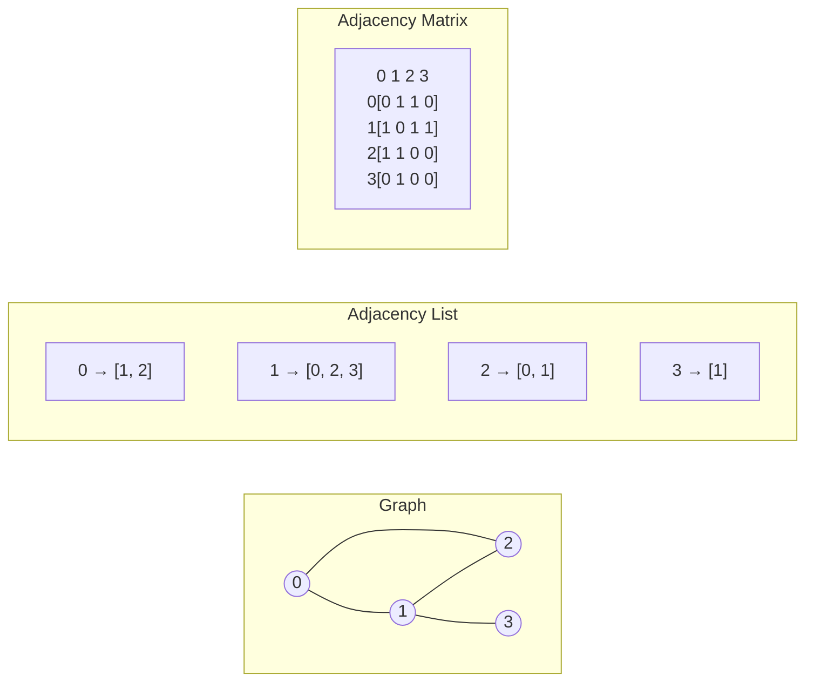

# Adjacency List and Adjacency Matrix

> **One-line summary**: The adjacency list and adjacency matrix are the two workhorse representations that underpin virtually all graph algorithm implementations.

## 🎯 Intuition
**The Core Idea:** Graph representations trade space, edge-query speed, and neighbor-iteration speed, with adjacency lists favoring sparse traversal-heavy workloads and adjacency matrices favoring dense constant-time edge lookups.
**Analogy:** A road map — the adjacency list is like writing turn-by-turn directions for each intersection (only listing actual roads), while the adjacency matrix is a full distance table between every pair of cities (mostly empty for sparse road networks).
**Why It Matters:** Nearly every graph algorithm's running time depends on the underlying representation. Dijkstra on an adjacency list with a binary heap runs in $O((V + E) \log V)$, while on a matrix it degrades to $O(V^2)$ neighbor scans. Choosing the representation is therefore a scaling decision, not a cosmetic one.

---

## ⚙️ Core Mechanics
### How It Works
An **adjacency list** represents a graph as an array (or hash map) of size $|V|$, where each entry stores a collection—typically a linked list, dynamic array, or hash set—of that vertex's neighbors. Total space is $O(V + E)$, and iterating over a vertex's neighbors costs $O(\deg(v))$. This makes it the natural fit for traversal-heavy algorithms like BFS, DFS, Dijkstra, and topological sort, where the dominant operation is "visit every neighbor of $v$."

**Figure:** A graph represented as adjacency list (left) and adjacency matrix (right)

An **adjacency matrix** stores the graph in a $V \times V$ array $A$ where $A[i][j] = 1$ (or the edge weight) if edge $(i, j)$ exists. Space is $O(V^2)$ regardless of edge count, but edge-existence queries are $O(1)$—a single array lookup. The matrix form also enables algebraic graph operations: the $k$-th power $A^k$ counts walks of length $k$, and Boolean matrix multiplication computes transitive closure. These properties make it indispensable in dense-graph settings, spectral graph theory, and network analysis.

The **sparse-vs-dense threshold** is the practical dividing line. When $|E|$ is close to $|V|^2$ (dense), the matrix wastes little space and offers faster edge queries. When $|E| \ll |V|^2$ (sparse), the list avoids allocating memory for millions of absent edges. In implementation, adjacency lists backed by hash sets give $O(1)$ average-case edge queries while preserving $O(V + E)$ space—a useful hybrid when both operations matter.

### Key Operations

| Operation              | Adjacency List (array-backed) | Adjacency List (hash-set) | Adjacency Matrix |
|------------------------|-------------------------------|---------------------------|-------------------|
| Space                  | $O(V + E)$                   | $O(V + E)$               | $O(V^2)$         |
| Edge query             | $O(\deg(v))$                 | $O(1)$ avg                | $O(1)$           |
| Iterate neighbors      | $O(\deg(v))$                 | $O(\deg(v))$             | $O(V)$           |
| Add edge               | $O(1)$ amortized             | $O(1)$ avg                | $O(1)$           |
| Remove edge            | $O(\deg(v))$                 | $O(1)$ avg                | $O(1)$           |
| Add vertex             | $O(1)$ amortized             | $O(1)$ amortized          | $O(V^2)$ resize  |

### Key Facts
- Adjacency list implementations: `vector<vector<int>>` (C++), `List<List<Integer>>` (Java), `defaultdict(list)` (Python).
- Adjacency matrix implementations: 2-D array, `bitset` rows for unweighted graphs (reduces space by ~64×).
- For undirected graphs, the adjacency matrix is symmetric; storing only the upper triangle halves memory.
- Adding an edge is $O(1)$ in both representations; removing an edge is $O(\deg(v))$ in a list, $O(1)$ in a matrix.
- Checking whether vertex $u$ is adjacent to $v$ is $O(\deg(u))$ in a plain list, $O(1)$ in a matrix or hash-set list.
- Cache performance favors contiguous arrays; CSR (compressed sparse row) gives adjacency-list semantics with matrix-like cache behavior.
- Most real-world graphs (web, social, biological) are sparse—adjacency lists dominate in practice.
- For weighted graphs, lists store `(neighbor, weight)` pairs; matrices store the weight directly in $A[i][j]$.

---

## 🔬 Deep Dive
### Formal Properties
- Adjacency-list space is $\Theta(V + E)$ because storage scales with one container per vertex plus one record per realized edge.
- Adjacency-matrix space is $\Theta(V^2)$ regardless of sparsity, since every ordered or unordered vertex pair gets a cell.
- In an adjacency matrix, edge existence is a direct array lookup, so membership queries are $O(1)$.
- For a vertex $v$, adjacency-list neighbor iteration is $O(\deg(v))$, whereas matrix scanning is $O(V)$ because the entire row must be inspected.
- Matrix powers encode walk structure: the $(i,j)$ entry of $A^k$ counts walks of length $k$ from $i$ to $j$.

### Edge Cases and Pitfalls
- Using an adjacency matrix for a very sparse graph wastes memory on absent edges and can dominate runtime through unnecessary row scans.
- Using a plain list when you need frequent membership checks makes `hasEdge(u, v)` degrade to $O(\deg(u))$ instead of hash-set average $O(1)$.
- In undirected adjacency lists, forgetting to insert both $(u,v)$ and $(v,u)$ creates subtle one-way bugs.
- Matrix implementations need a clear sentinel for "no edge" in weighted graphs so that zero-weight edges are not confused with missing edges.

### Real-World Usage
Adjacency lists dominate sparse real-world graphs such as social networks, biological networks, and web crawls, where traversal and storage efficiency matter most. Adjacency matrices are common in dense network analysis, spectral methods, and algebraic graph algorithms where constant-time edge queries and matrix operations are valuable. Hybrid hash-set-backed lists are useful in systems that need sparse storage plus fast membership tests.

---

## 🏋️ Practice
### Warm-Up (5 min)
- Given $|V| = 5$ and $|E| = 4$, which representation uses less memory and why?
- Why does iterating neighbors of a vertex cost $O(V)$ in a matrix but only $O(\deg(v))$ in a list?

### Core Problems
- **Clone Graph** — Rebuild a graph from node-neighbor structure; good for thinking in adjacency-list terms.
- **Course Schedule** — Model prerequisites as a graph and reason about efficient neighbor traversal.
- **Find if Path Exists in Graph** — Compare how traversal behavior changes under list vs matrix representations.

### Challenge
- Design a representation strategy for a graph-processing system that must support fast edge queries, efficient traversals, and occasional algebraic analysis on both sparse and dense inputs.

---

*See also:* [[Graph Representations Overview]] | [[Implicit and Compressed Graph Representations]] | [[Weighted and Directed Graphs]] | [[Graph Properties and Terminology]] | Cross-wiki links

## Supporting Chunks
- [[CS Data Structures/_chunks/chunk-ds-019 Adjacency lists dominate for sparse graphs|Adjacency lists dominate for sparse graphs]]
- [[CS Data Structures/_chunks/chunk-ds-094 Adjacency matrix enables O1 edge queries but wastes space|Adjacency matrices enable O(1) edge queries but waste space]]
- [[CS Data Structures/_chunks/chunk-ds-076 CSR stores graphs in flat arrays for cache efficiency|CSR stores graphs in flat arrays for cache efficiency]]
- [[CS Data Structures/_chunks/chunk-ds-127 Edge list is simplest graph representation|Edge lists are the simplest graph representation]]

## References

→ [[CS Data Structures/Sources/Sources Index|Sources Index]]
