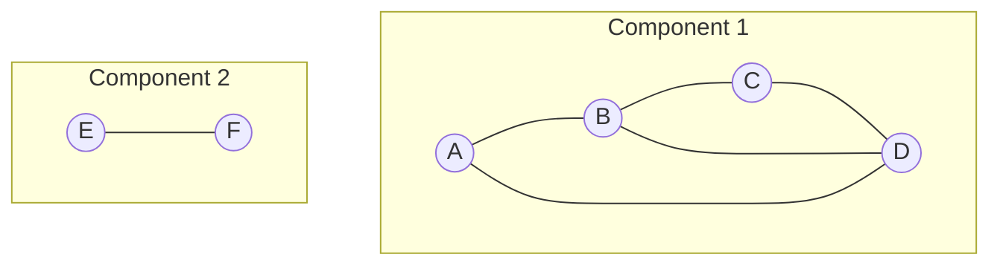

# Graph Properties and Terminology

> **One-line summary**: Graph theory's vocabulary—vertices, edges, degrees, paths, cycles, components—provides the precise language needed to state problems, prove bounds, and communicate algorithms.

## 🎯 Intuition
**The Core Idea:** Graph terminology names the structural features that algorithms rely on, from local concepts like degree to global concepts like connectivity, trees, bipartiteness, and planarity.
**Analogy:** A road map of a country — vertices are cities, edges are roads, degree is how many roads meet at a city, connected components are separate island groups, and a cycle is a round trip.
**Why It Matters:** Precise terminology prevents ambiguity when specifying algorithms and analyzing correctness. Knowing that an input is a DAG unlocks topological sort, recognizing bipartiteness enables matching algorithms, and confirming planarity gives strong structural guarantees. This vocabulary is the gateway to graph theory and graph algorithm design.

---

## ⚙️ Core Mechanics
### How It Works
A **graph** $G = (V, E)$ consists of a set of **vertices** (nodes) and a set of **edges** (links) connecting pairs of vertices. An edge $\{u, v\}$ is **undirected** if order does not matter; $(u, v)$ is **directed** otherwise. The **degree** of a vertex is the number of edges incident to it; in a digraph this splits into in-degree and out-degree. A **path** is a sequence of vertices connected by edges with no repeated vertices; a **cycle** is a path that returns to its starting vertex. A **connected component** is a maximal set of vertices such that a path exists between every pair.

A **tree** is a connected acyclic graph on $n$ vertices with exactly $n - 1$ edges—the minimal connected structure. A **forest** is a disjoint union of trees. A graph is **bipartite** if its vertices can be two-colored so that every edge connects vertices of different colors; equivalently, it contains no odd-length cycle. **Planarity** is governed by Euler's formula $V - E + F = 2$ (for connected planar graphs) and characterized by Kuratowski's theorem (no $K_5$ or $K_{3,3}$ subdivision).

**Figure:** Undirected graph with two connected components — vertices, edges, and a cycle (B–C–D)

**Density** measures how close a graph is to complete: $\delta = 2|E| / (|V|(|V|-1))$ for undirected simple graphs. A **complete graph** $K_n$ has every possible edge. Two graphs are **isomorphic** if there exists a bijection on vertices that preserves adjacency—determining this in general is in NP but not known to be NP-complete (Babai's quasi-polynomial result notwithstanding). These foundational terms recur in every algorithm description, complexity proof, and system design discussion involving graphs.

### Key Operations

| Property / Query              | Complexity         | Method                    |
|-------------------------------|--------------------|---------------------------|
| Find connected components     | $O(V + E)$        | BFS / DFS / Union-Find    |
| Test bipartiteness            | $O(V + E)$        | Two-color BFS             |
| Compute diameter              | $O(V \cdot (V+E))$| BFS from every vertex     |
| Test planarity                | $O(V)$            | Left-right planarity test |
| Count edges                   | $O(V + E)$        | Sum degrees / 2           |
| Detect cycle                  | $O(V + E)$        | DFS back-edge check       |
| Check graph isomorphism       | quasi-polynomial   | Babai's algorithm         |

### Key Facts
- **Handshaking lemma**: the sum of all vertex degrees equals $2|E|$.
- A tree on $n$ vertices has exactly $n - 1$ edges; adding any edge creates exactly one cycle.
- A graph is bipartite if and only if it contains no odd-length cycle (testable via BFS in $O(V + E)$).
- Euler's formula for connected planar graphs: $V - E + F = 2$, implying $|E| \leq 3|V| - 6$.
- A **simple graph** has no self-loops or parallel edges; a **multigraph** allows both.
- The **complement** $\bar{G}$ has an edge wherever $G$ does not.
- **Diameter** is the longest shortest path between any pair of vertices.
- Connected components can be found in $O(V + E)$ via BFS/DFS or Union-Find.

---

## 🔬 Deep Dive
### Formal Properties
- For any undirected graph, $\sum_{v \in V} \deg(v) = 2|E|$ by the handshaking lemma.
- A connected graph is a tree if and only if it is acyclic and has exactly $n - 1$ edges.
- A graph is bipartite if and only if it has no odd-length cycle.
- For connected planar graphs, Euler's formula gives $V - E + F = 2$, which implies $|E| \leq 3|V| - 6$ for simple planar graphs.
- Graph density for an undirected simple graph is $\delta = 2|E| / (|V|(|V|-1))$, measuring closeness to $K_n$.

### Edge Cases and Pitfalls
- Confusing walks, paths, and cycles can invalidate proofs or algorithm reasoning, especially when repeated vertices are allowed in one notion but not another.
- Self-loops and parallel edges break assumptions that hold only for simple graphs.
- Connectivity in directed graphs is subtler than in undirected graphs; weak and strong connectivity should not be conflated.
- A disconnected acyclic graph is a forest, not a tree, so "no cycles" alone is not enough to conclude tree structure.

### Real-World Usage
These terms are the language of modeling road networks, social graphs, dependency graphs, and communication networks. Components describe disconnected subnetworks, bipartiteness models two-sided systems like jobs and applicants, and planarity appears in circuit layout and map drawing. Density, completeness, and isomorphism matter in both theoretical analysis and graph matching applications.

---

## 🏋️ Practice
### Warm-Up (5 min)
- If a graph has 10 edges, what is the sum of all vertex degrees?
- Why does the presence of an odd cycle immediately show that a graph is not bipartite?

### Core Problems
- **Number of Connected Components in an Undirected Graph** — Apply the definition of components directly.
- **Is Graph Bipartite?** — Use two-coloring and the odd-cycle characterization.
- **Graph Valid Tree** — Combine connectivity and acyclicity to test whether a graph is a tree.

### Challenge
- Given only degree data, connectivity information, and whether a graph is planar or bipartite, determine which global properties can be inferred and which still require explicit structure.

---

*See also:* [[Graph Representations Overview]] | [[Weighted and Directed Graphs]] | [[Trees and Tree Traversals]] | [[Adjacency List and Adjacency Matrix]] | Cross-wiki links

## Supporting Chunks / References
### Supporting Chunks
*Pending chunk extraction.*

### References
→ [[Sources Index]]
