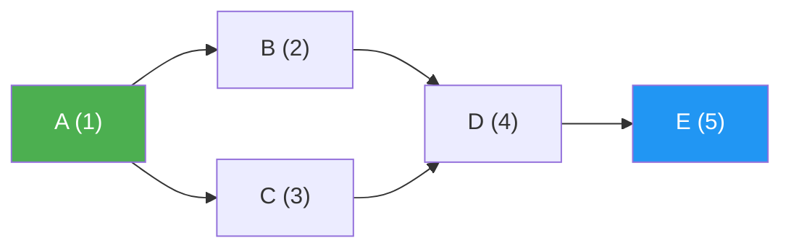

# Weighted and Directed Graphs

> **One-line summary**: Directed and weighted edges transform a simple graph into a model powerful enough to capture roads with distances, dependencies with priorities, and flows with capacities.

## 🎯 Intuition
**The Core Idea:** Adding direction and weights turns plain connectivity into richer structure for modeling asymmetric relationships, optimization, ordering constraints, and flow or cost problems.
**Analogy:** A directed graph is like a system of one-way streets — you can go from A to B but not necessarily B to A. Weights are the distances or tolls on each street. A DAG is a waterfall of tasks — water only flows downhill, never in circles.
**Why It Matters:** Direction and weight make graphs useful for GPS routing, dependency scheduling, flow networks, and influence modeling. They determine which algorithms are valid: DAGs admit topological ordering, SCCs reveal cyclic structure, and negative weights rule out plain Dijkstra. Mastering these properties is essential for non-trivial graph problems.

---

## ⚙️ Core Mechanics
### How It Works
A **directed graph** (digraph) replaces each undirected edge $\{u, v\}$ with an ordered pair $(u, v)$, introducing the concept of direction. Every vertex now has an **in-degree** (edges arriving) and an **out-degree** (edges leaving). Digraphs model one-way relationships: web hyperlinks, prerequisite chains, function call graphs. A central structural concept is the **strongly connected component** (SCC)—a maximal subset of vertices where every vertex is reachable from every other. Tarjan's and Kosaraju's algorithms find all SCCs in $O(V + E)$.

A **weighted graph** assigns a numerical cost, distance, or capacity to each edge. Weights enable shortest-path algorithms (Dijkstra, Bellman-Ford, Floyd-Warshall), minimum spanning trees (Prim, Kruskal), and network flow (Ford-Fulkerson, Edmonds-Karp). In representation terms, adjacency lists store `(neighbor, weight)` tuples, and adjacency matrices store the weight value (with a sentinel like $\infty$ for absent edges).

**Directed acyclic graphs** (DAGs) are digraphs with no cycles. They admit **topological ordering**—a linear sequence of vertices such that every edge points forward. Topological sort runs in $O(V + E)$ via DFS or Kahn's algorithm and is the backbone of build systems, task schedulers, and data-pipeline orchestration. Every DAG has at least one topological order; a digraph has one if and only if it is a DAG.

**Figure:** DAG with topological ordering — edges point forward, enabling dependency scheduling

### Key Operations

| Operation / Algorithm        | Time Complexity             | Requires            |
|------------------------------|-----------------------------|----------------------|
| Topological sort (Kahn / DFS)| $O(V + E)$                 | DAG                  |
| SCC detection (Tarjan)       | $O(V + E)$                 | Digraph              |
| Dijkstra (binary heap)       | $O((V + E) \log V)$        | Non-negative weights |
| Bellman-Ford                 | $O(V \cdot E)$             | No negative cycles   |
| Floyd-Warshall               | $O(V^3)$                   | Any weights          |
| DAG shortest path            | $O(V + E)$                 | DAG + weights        |
| Transitive closure (matrix)  | $O(V^3)$                   | Digraph              |

### Key Facts
- In a digraph, the adjacency list for vertex $u$ contains only outgoing neighbors; a separate reverse-adjacency list is needed for incoming neighbors.
- The sum of all in-degrees equals the sum of all out-degrees equals $|E|$.
- An SCC condensation collapses each SCC to a single node, yielding a DAG—useful for reasoning about reachability.
- Negative edge weights are valid but require Bellman-Ford; Dijkstra assumes non-negative weights.
- DAGs support single-source shortest paths in $O(V + E)$ by relaxing edges in topological order.
- A tournament is a complete digraph—every pair of vertices has exactly one directed edge.
- Weighted undirected graphs store each edge twice (once per endpoint) in an adjacency list.
- Representing weights in an adjacency matrix simply replaces the boolean with the weight value.

---

## 🔬 Deep Dive
### Formal Properties
- In any digraph, the sum of all in-degrees equals the sum of all out-degrees, and both equal $|E|$.
- SCC condensation forms a DAG because any directed cycle among components would contradict maximality of the SCCs.
- A digraph has a topological ordering if and only if it is acyclic.
- DAG shortest paths can be computed in $O(V + E)$ by processing vertices in topological order and relaxing outgoing edges once.
- Bellman-Ford tolerates negative weights but not negative cycles reachable from the source.

### Edge Cases and Pitfalls
- Running Dijkstra on graphs with negative edge weights gives incorrect answers even if there is no negative cycle.
- In directed graphs, forgetting whether an API expects outgoing neighbors, incoming neighbors, or both causes subtle reachability bugs.
- SCC algorithms are for directed graphs; applying undirected intuition to SCCs or condensation graphs leads to wrong conclusions.
- Topological sorting only applies to DAGs, so cycle detection must be accounted for when dependencies may be circular.

### Real-World Usage
Directed graphs model hyperlinks, prerequisite chains, call graphs, and one-way routing systems. Weighted graphs represent distances, tolls, capacities, and priorities in transportation, networking, scheduling, and flow optimization. DAGs run build systems and workflow orchestrators, while SCC analysis helps reason about mutually reachable modules or communities in large directed networks.

---

## 🏋️ Practice
### Warm-Up (5 min)
- Why can a digraph fail to have a topological ordering?
- If a graph has negative edge weights but no negative cycles, which shortest-path algorithm is appropriate?

### Core Problems
- **Course Schedule II** — Topological ordering on a directed dependency graph.
- **Network Delay Time** — Single-source shortest paths on a weighted digraph with non-negative weights.
- **Find Eventual Safe States** — Reason about directed cycles, SCC-style structure, and DAG condensation intuition.

### Challenge
- Design an algorithmic approach for a weighted digraph platform that must support shortest paths, SCC analysis, and dependency scheduling while safely handling negative weights and cyclic inputs.

---

*See also:* [[Graph Representations Overview]] | [[Adjacency List and Adjacency Matrix]] | [[Graph Properties and Terminology]] | [[Shortest Path Algorithms]] | [[Minimum Spanning Trees]] | Cross-wiki links

## Supporting Chunks

- [[CS Data Structures/_chunks/chunk-ds-039 DFS edge classification detects cycles and enables topo sort|DFS edge classification detects cycles and enables topological sort]]
- [[CS Data Structures/_chunks/chunk-ds-040 Tarjans SCC finds all strongly connected components in one DFS|Tarjan's SCC algorithm finds all strongly connected components in one DFS]]
- [[CS Data Structures/_chunks/chunk-ds-157 Kosarajus SCC uses two DFS on forward and reverse graph|Kosaraju's SCC algorithm uses forward and reverse graph passes]]
- [[CS Data Structures/_chunks/chunk-ds-041 Dijkstras complexity depends on priority queue choice|Dijkstra's complexity depends on priority queue choice]]
- [[CS Data Structures/_chunks/chunk-ds-132 Bellman-Ford detects negative cycles in round V|Bellman-Ford detects negative cycles after V relaxation rounds]]

## References

→ [[CS Data Structures/Sources/Sources Index|Sources Index]]
