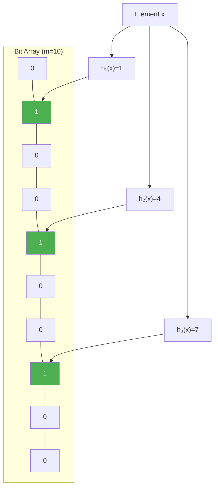

# Bloom Filters and Probabilistic Structures

> **One-line summary**: Bloom filters provide space-efficient probabilistic set membership testing with no false negatives but a tunable false positive rate, using a bit array and multiple hash functions.

## 🎯 Intuition
**The Core Idea:** Trade perfect accuracy for massive space savings — a Bloom filter can tell you "definitely not in the set" or "probably in the set," but never gives a false negative.
**Analogy:** A bouncer with a guest list that sometimes says "yeah, you're on the list" to people who aren't — but never turns away someone who's actually invited.
**Why It Matters:** Bloom filters let web browsers check millions of malicious URLs in kilobytes, databases skip expensive disk reads for absent keys, and network routers filter packets at wire speed.

---

## ⚙️ Core Mechanics
### How It Works
A Bloom filter represents a set using a **bit array of *m* bits** and **k independent hash functions**. To insert an element, compute *k* hash values and set the corresponding bits to 1. To query membership, check all *k* bit positions:
- **All bits are 1** → "probably present" (may be a false positive).
- **Any bit is 0** → "definitely absent" (never a false negative).

**Figure:** Bloom filter — k hash functions set bits in a bit array; all k bits must be 1 for "maybe present"

**False positive rate**: approximately (1 − $e^{−kn/m}$)^k, where *n* is the number of inserted elements.

**Optimal tuning**: for a target false positive rate *p*:
- Optimal hash functions: k = (m/n) · ln(2)
- Required space: m = −n · ln(p) / (ln 2)²
- At 1% false positive rate: ~9.6 bits per element, regardless of element size.

**Deletion**: standard Bloom filters do **not** support deletion (clearing a bit may affect other elements). Counting Bloom filters replace each bit with a counter, enabling deletion at 3–4× space cost.

**Variants**: cuckoo filters (support deletion, less space), quotient filters (cache-friendly, resizable).

**Related structures**: Count-Min Sketch (approximate frequency), HyperLogLog (approximate cardinality), MinHash (approximate set similarity).

### Key Operations

| Operation | Time | Notes |
|---|---|---|
| Insert | $O(k)$ | Set k bit positions |
| Query | $O(k)$ | Check k bit positions |
| Delete | Not supported | Use counting Bloom filter |
| Space | $O(m)$ bits | m = −n ln(p) / (ln 2)² |
| False positive rate | Tunable | Decreases with more bits per element |

### Key Facts
- **False positive rate**: approximately (1 − $e^{−kn/m}$)^k.
- **No false negatives**: if the filter says "absent," the element is definitely absent.
- **Space**: ~9.6 bits per element for 1% false positive rate.
- **No deletion**: standard Bloom filters; counting variant supports deletion.
- **Applications**: network routers, database query optimisation, spell checkers, Bitcoin SPV.
- **Related structures**: Count-Min Sketch, HyperLogLog, cuckoo filters.

---

## 🔬 Deep Dive
### Formal Properties / Proofs
- **False positive probability derivation**: after inserting *n* elements, each of *m* bits is still 0 with probability (1 − 1/m)^(kn) ≈ $e^{−kn/m}$. The probability all *k* probed bits are 1 for a non-member is (1 − $e^{−kn/m}$)^k. Minimising over *k* gives k_opt = (m/n) ln 2.
- **Space lower bound**: information-theoretically, any data structure answering membership queries with false positive rate *p* requires at least n · log₂(1/p) bits. Bloom filters use 1.44× this optimal, so they are near-optimal.
- **Union and intersection**: the union of two Bloom filters (same *m*, *k*) is their bitwise OR. Intersection can be approximated but is not exact.

### Edge Cases and Pitfalls
- **Overfilling**: inserting far more than *n* elements into a filter sized for *n* causes the false positive rate to skyrocket — all bits approach 1.
- **Cannot enumerate**: you cannot list the elements in a Bloom filter; it's a one-way membership test.
- **Hash function independence**: in practice, two good hash functions combined via double hashing (h₁ + i·h₂) suffice for *k* probes (Kirsch & Mitzenmacher, 2006).
- **Counting overflow**: counting Bloom filters with small counters (4 bits) can overflow under heavy insert/delete workloads.

### Real-World Usage
- **Network routers**: Bloom filters check packet membership in forwarding tables at line rate.
- **Databases**: LevelDB, RocksDB, and Cassandra use Bloom filters to skip disk reads for absent keys (avoiding costly I/O).
- **Web browsers**: Google Chrome's Safe Browsing uses a Bloom-filter-like structure to check URLs against a malware blocklist.
- **Bitcoin SPV nodes**: lightweight clients use Bloom filters to request only relevant transactions from full nodes.
- **CDNs**: cache servers use Bloom filters to decide whether to cache a resource (cache on second hit).

---

## 🏋️ Practice
### Warm-Up (5 min)
1. A Bloom filter has m = 10 bits and k = 3 hash functions. You insert element *x* which hashes to positions {1, 4, 7}. Now you query element *y* which hashes to {1, 4, 9}. What is the result and why?
2. Why can't you delete an element from a standard Bloom filter?
3. If you need a 0.1% false positive rate and plan to store 1 million elements, approximately how many bits do you need?

### Core Problems
1. **Design a URL Blocklist**: you have 10 million malicious URLs. Design a Bloom filter that achieves <1% false positive rate. Calculate *m*, *k*, and the total memory. Compare with storing full URL hashes.
2. **Cache-on-second-hit**: implement a system where a CDN node caches a resource only if it's been requested at least twice. Use a Bloom filter to track "seen once" resources. Analyse the false positive impact (caching resources that were only requested once).

### Challenge
1. **Counting Bloom Filter with Deletions**: implement a counting Bloom filter supporting insert, query, and delete. Then construct an adversarial workload that causes counter overflow with 4-bit counters. Propose and implement a mitigation strategy (e.g., counter saturation with periodic rebuild). Measure the false positive and false negative rates under heavy churn.

---

*See also:* [[Hash Tables and Hash Functions]] | [[Cuckoo Hashing]] | [[Universal and Perfect Hashing]] | **CS Algorithms:** [[Dijkstra's Algorithm]], [[Huffman Coding]]

## Supporting Chunks

- [[CS Data Structures/_chunks/chunk-ds-012 Bloom filters use 9.6 bits per element for 1pct FP|Bloom filters use about 9.6 bits per element for 1% false positives]]
- [[CS Data Structures/_chunks/chunk-ds-114 Counting Bloom filters allow deletion at 4x space|Counting Bloom filters allow deletion at higher space cost]]
- [[CS Data Structures/_chunks/chunk-ds-051 Cuckoo filters support deletion unlike Bloom filters|Cuckoo filters support deletion unlike standard Bloom filters]]
- [[CS Data Structures/_chunks/chunk-ds-056 Bloom filters in LSM avoid 90pct unnecessary reads|Bloom filters in LSM trees avoid many unnecessary reads]]

## References

→ [[CS Data Structures/Sources/Sources Index|Sources Index]]
