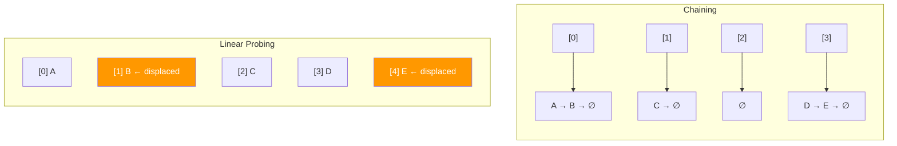

# Collision Resolution Strategies

> **One-line summary**: Collision resolution determines how a hash table handles two or more keys that map to the same array slot, with the two dominant families being chaining and open addressing.

## 🎯 Intuition
**The Core Idea:** When two people are assigned the same locker, you need a rule — either stack their stuff together in that locker (chaining) or find the next empty locker nearby (open addressing).
**Analogy:** A parking garage — chaining is like stacking cars vertically in the same spot (valet garage), while open addressing is like driving to the next open spot when yours is taken (self-park garage).
**Why It Matters:** The choice of collision strategy profoundly affects cache behaviour, memory overhead, and worst-case latency. A mismatch between strategy and workload can turn $O(1)$ expectations into real-world performance cliffs.

---

## ⚙️ Core Mechanics
### How It Works
Because a hash function compresses a large key space into *m* slots, collisions are inevitable once more than *m* keys are stored — and probable well before that.

**Chaining**: attach a secondary data structure (typically a linked list) to each slot. All keys hashing to slot *i* live in that chain. Under simple uniform hashing with load factor α = n/m, the expected chain length is α, so search is $O(1 + α)$.

**Open addressing**: store all entries inside the table itself. When a collision occurs at h(k), a **probe sequence** scans alternative slots:
- **Linear probing** (stride 1): cache-friendly but susceptible to **primary clustering**.
- **Quadratic probing** (stride grows quadratically): avoids primary clustering but risks secondary clustering.
- **Double hashing** (stride from a second hash function): most uniform distribution, costlier per probe.
- **Robin Hood hashing**: displacing key "steals" a slot from a richer key (one closer to its home), evening out probe lengths.

**Deletion in open addressing**: simply emptying a slot breaks probe chains. The fix is **tombstone markers** — deleted slots are flagged so probes pass through them. Excessive tombstones degrade performance; periodic rehashing clears them.

**Figure:** Chaining vs linear probing — two strategies for handling hash collisions

### Key Operations

| Strategy | Successful Search (avg) | Unsuccessful Search (avg) | Space Overhead |
|---|---|---|---|
| Chaining | $O(1 + α)$ | $O(1 + α)$ | Pointer per entry + list nodes |
| Linear Probing | $O(½(1 + 1/(1−α)$)) | $O(½(1 + (1/(1−α)$)²)) | None beyond table |
| Double Hashing | $O((1/α)$ ln(1/(1−α))) | $O(1/(1−α)$) | None beyond table |
| Robin Hood | Same avg as linear, lower variance | Same avg, lower variance | None beyond table |

### Key Facts
- Chaining tolerates α > 1 gracefully; open addressing requires α < 1 (typically ≤ 0.7).
- Linear probing achieves high cache-hit rates on modern CPUs, making it fast in practice despite clustering.
- Quadratic probing guarantees a slot is found if α < 0.5 and m is prime.
- Double hashing provides the most uniform probe distribution among the three basic strategies.
- Robin Hood hashing bounds the variance of probe lengths, giving tighter worst-case expectations.
- Tombstones accumulate over mixed insert/delete workloads and inflate effective load factor.
- Java's `HashMap` uses chaining (with tree-ified bins at high chain length); Python's `dict` uses open addressing with a custom probe sequence.
- Swiss Table (Google Abseil) combines open addressing with SIMD metadata probing for high throughput.

---

## 🔬 Deep Dive
### Formal Properties / Proofs
- **Chaining expected cost**: under SUHA, the expected number of elements in any chain is α = n/m. A successful search examines 1 + (α − 1/m)/2 ≈ 1 + α/2 elements on average; unsuccessful search examines α elements.
- **Linear probing analysis (Knuth, 1963)**: expected probes for an unsuccessful search is ½(1 + (1/(1−α))²). This diverges as α → 1, explaining the performance cliff at high load factors.
- **Robin Hood variance bound**: the maximum probe length in Robin Hood hashing is $O(\log n)$ with high probability, compared to $O(\log n / \log \log n)$ expected for standard linear probing.
- **Birthday paradox connection**: with *m* slots, the first collision is expected after ~$\sqrt{πm/2}$ insertions — much earlier than *m*.

### Edge Cases and Pitfalls
- **Clustering cascade**: with linear probing at α > 0.7, clusters merge into mega-clusters, causing dramatic slowdowns.
- **Tombstone accumulation**: after many insert/delete cycles, tombstones inflate the effective load factor. Periodic full rehash is necessary.
- **Thread safety**: concurrent open-addressing tables need careful lock-free designs (e.g., lock-free Robin Hood hashing).
- **Hash function quality**: all analysis assumes uniform hashing. Poor hash functions (e.g., identity hash on sequential integers) can degrade any strategy to $O(n)$.

### Real-World Usage
- **Java HashMap**: chaining with linked lists; tree-ifies (red-black tree) chains exceeding 8 elements (Java 8+).
- **Python dict**: open addressing with a custom perturbation-based probe sequence; resizes at α = 2/3.
- **Google Swiss Table (Abseil)**: open addressing with SIMD-parallel metadata probes; 1-byte control per slot.
- **Redis**: chaining with incremental rehashing (two tables during resize to avoid latency spikes).
- **Network hardware**: FPGA-based hash tables often use cuckoo hashing (a specialised open-addressing variant).

---

## 🏋️ Practice
### Warm-Up (5 min)
1. A hash table has 10 slots and uses linear probing. Insert keys hashing to slots 3, 3, 4, 3. Show the final table state.
2. Why does open addressing require α < 1 while chaining can tolerate α > 1?
3. What problem do tombstones solve, and what new problem do they create?

### Core Problems
1. **Chaining vs. Linear Probing Benchmark**: implement both strategies for a hash table of 10,000 slots. Insert 7,000 random keys, then perform 10,000 lookups (50% hits, 50% misses). Measure and compare average probe lengths and wall-clock time.
2. **Robin Hood Hashing**: implement Robin Hood hashing with linear probing. Track the maximum probe length across a sequence of 50,000 insertions at α = 0.8. Compare with standard linear probing.

### Challenge
1. **Graveyard Hashing**: design a tombstone-free deletion scheme for open addressing that maintains $O(1)$ expected search time. (Hint: on delete, find the last element in the probe cluster that belongs to the deleted slot's chain, and move it to the deleted position.) Prove correctness and analyse the expected cost of deletion.

---

*See also:* [[Hash Tables and Hash Functions]] | [[Cuckoo Hashing]] | [[Universal and Perfect Hashing]] | [[CS Data Structures/Hash-Based Structures/Collision Resolution Strategies|Robin Hood Hashing]] | **CS Algorithms:** [[Dijkstra's Algorithm]], [[Huffman Coding]]

## Supporting Chunks

- [[CS Data Structures/_chunks/chunk-ds-087 Chaining degrades gracefully but wastes memory|Chaining degrades gracefully but wastes memory]]
- [[CS Data Structures/_chunks/chunk-ds-034 Linear probing has best cache performance|Linear probing has strong cache performance]]
- [[CS Data Structures/_chunks/chunk-ds-011 Robin Hood hashing reduces probe variance|Robin Hood hashing reduces probe variance]]
- [[CS Data Structures/_chunks/chunk-ds-103 Backward-shift deletion avoids tombstones|Backward-shift deletion avoids tombstones]]
- [[CS Data Structures/_chunks/chunk-ds-035 Swiss Table uses SIMD to probe 16 slots in parallel|Swiss Table uses SIMD metadata probing]]

## References

→ [[CS Data Structures/Sources/Sources Index|Sources Index]]
