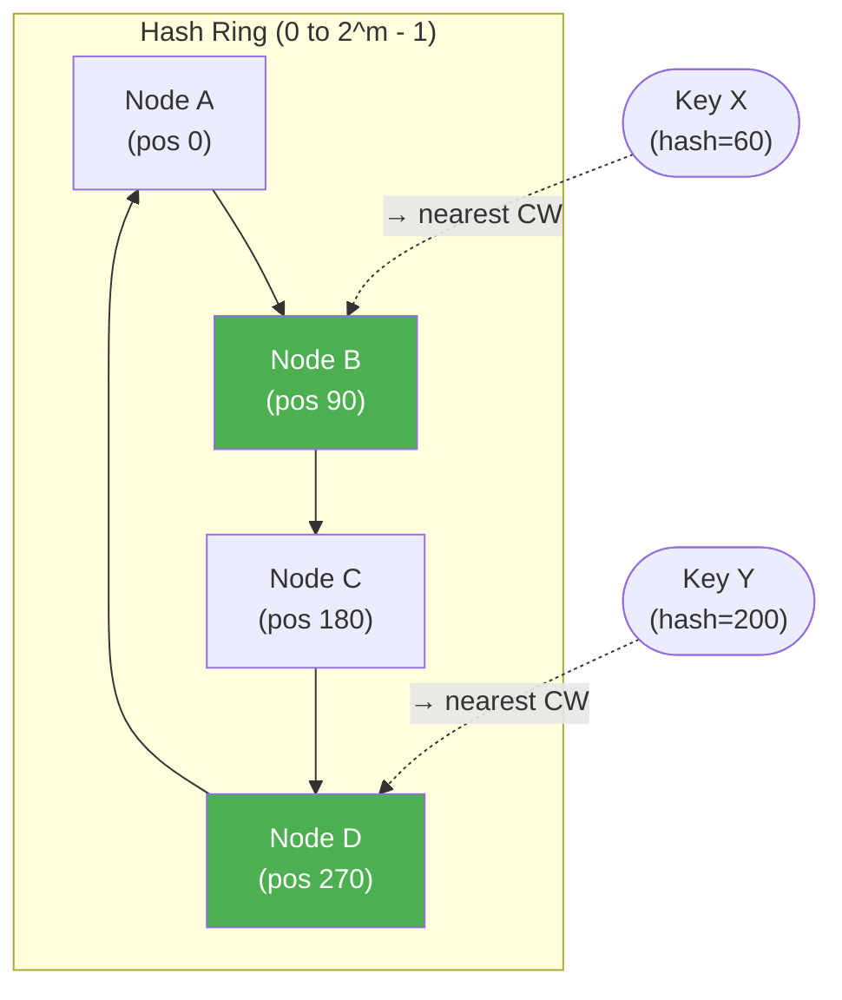

# Consistent Hashing

> **One-line summary**: Consistent hashing maps keys and nodes to positions on a hash ring, ensuring that adding or removing a node redistributes only a minimal fraction of keys — critical for distributed systems.

## 🎯 Intuition
**The Core Idea:** Arrange servers and data keys on a circular number line; each key belongs to the nearest server clockwise — so adding or removing a server only shuffles the keys in its immediate neighbourhood.
**Analogy:** Imagine seats arranged in a circle at a dinner party — when a new guest arrives and sits down, only the person immediately to their right needs to scoot over, not the entire table.
**Why It Matters:** Without consistent hashing, scaling a distributed cache from 10 to 11 nodes would invalidate ~91% of cached entries. With it, only ~9% of keys move — enabling elastic scaling in cloud-native databases, CDNs, and distributed caches.

---

## ⚙️ Core Mechanics
### How It Works
In traditional modular hashing (key mod *n*), changing *n* remaps nearly all keys — catastrophic for distributed caches. **Consistent hashing** (Karger et al., 1997) solves this by mapping both keys and nodes to positions on a **circular hash space** (a "ring" from 0 to $2^{m}$ − 1).

**Key assignment**: each key is assigned to the first node encountered walking **clockwise** from the key's hash position.

**Node changes**:
- **Node added**: takes responsibility only for keys between it and its counter-clockwise predecessor.
- **Node removed**: its keys transfer to the next clockwise node.
- In both cases, only **$O(K/N)$ keys are remapped** on average (K = total keys, N = total nodes).

**Figure:** Consistent hashing ring — keys are assigned to the next clockwise node

**Virtual nodes**: a naive implementation suffers from load imbalance (some nodes own much larger ring segments). Virtual nodes solve this by mapping each physical node to **100–200 positions** on the ring, smoothing the distribution.

### Key Operations

| Operation | Time | Notes |
|---|---|---|
| Key lookup | $O(\log N)$ | Binary search on sorted node positions |
| Add node | $O(K/N + \log N)$ | Redistribute affected keys |
| Remove node | $O(K/N + \log N)$ | Transfer keys to successor |
| Space | $O(N × V)$ | V = virtual nodes per physical node |
| Load balance | $O(1/N)$ expected | With sufficient virtual nodes |

### Key Facts
- **Hash ring**: circular space from 0 to $2^{m}$ − 1.
- **Key assignment**: first clockwise node from key's hash position.
- **Minimal disruption**: only $O(K/N)$ keys remapped when a node changes.
- **Virtual nodes**: 100–200 per physical node for load balance.
- **Introduced by**: Karger et al., 1997.
- **Used in**: Dynamo, Cassandra, Chord, CDNs, load balancers.

---

## 🔬 Deep Dive
### Formal Properties / Proofs
- **Minimal disruption proof**: with *N* nodes uniformly distributed on the ring, each node owns an expected 1/N fraction of the ring. Adding one node splits one arc, affecting an expected K/N keys. Removing one node merges one arc, again affecting K/N keys.
- **Load balance with virtual nodes**: with *V* virtual nodes per physical node, the maximum load on any physical node is $O(K/N · (\log N)$/V) with high probability. At V = $\Theta(\log N)$, the load is balanced to within a constant factor.
- **Monotonicity**: if a key maps to node A, and a new node B is added, the key either stays with A or moves to B — it never moves to a third node C. This property is critical for cache consistency.

### Edge Cases and Pitfalls
- **Hot spots without virtual nodes**: random node placement can create 2–3× load imbalance; always use virtual nodes in production.
- **Node removal cascades**: if a node fails and its keys transfer to the successor, the successor temporarily bears double load. Replication mitigates this.
- **Hash function choice**: the ring hash function must be fast and uniform; cryptographic hashes (SHA-256) are overkill — xxHash or MurmurHash suffice.
- **Heterogeneous nodes**: nodes with different capacities should get proportionally more virtual nodes.

### Real-World Usage
- **Amazon DynamoDB**: uses consistent hashing for partition assignment across storage nodes.
- **Apache Cassandra**: consistent hashing determines which nodes own which token ranges.
- **CDNs (Akamai, Cloudflare)**: route requests to the nearest cache node using consistent hashing.
- **Chord DHT**: peer-to-peer distributed hash table built entirely on consistent hashing with $O(\log N)$ lookup.
- **Load balancers (Nginx, HAProxy)**: consistent hashing mode ensures session stickiness with minimal disruption on backend changes.

---

## 🏋️ Practice
### Warm-Up (5 min)
1. You have 4 nodes on a ring at positions 0, 90, 180, 270. A key hashes to position 100. Which node owns it?
2. If you add a 5th node at position 135, which keys need to move?
3. Why doesn't modular hashing (key mod N) work well for distributed caches?

### Core Problems
1. **Implement Consistent Hashing**: build a consistent hash ring with virtual nodes. Support `addNode(nodeId)`, `removeNode(nodeId)`, and `getNode(key)`. Use a sorted map for $O(\log N)$ lookup. Test with 1,000 keys and 5 physical nodes (100 virtual nodes each). Measure load balance (keys per node).
2. **Measure Disruption**: starting with 10 nodes and 100,000 keys, add an 11th node. Count how many keys are reassigned. Compare with the theoretical $O(K/N)$ prediction.

### Challenge
1. **Bounded-Load Consistent Hashing**: implement the "Consistent Hashing with Bounded Loads" algorithm (Mirrokni et al., 2018) where no node may exceed (1 + ε) × (K/N) keys. When a node is "full," overflow keys walk clockwise to the next non-full node. Analyse the trade-off between ε and maximum probe distance. Benchmark against standard consistent hashing on a skewed key distribution.

---

*See also:* [[Hash Tables and Hash Functions]] | [[Bloom Filters and Probabilistic Structures]] | [[Collision Resolution Strategies]] | **CS Algorithms:** [[Dijkstra's Algorithm]], [[Huffman Coding]]

## Supporting Chunks

*Pending chunk extraction.*

## References

-> [[Sources Index]]
