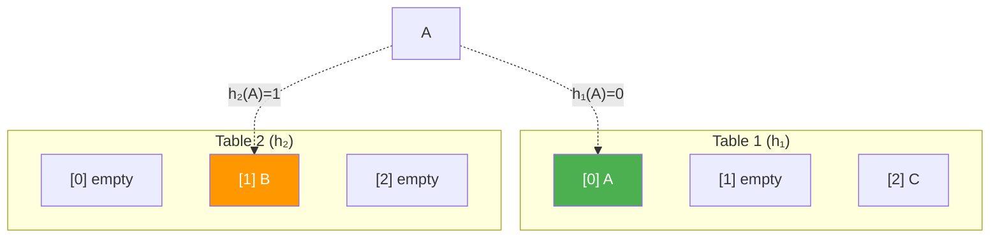

# Cuckoo Hashing

> **One-line summary**: Cuckoo hashing uses two hash functions to achieve $O(1)$ worst-case lookup by storing each key at one of two possible positions and displacing existing keys on collision.

## 🎯 Intuition
**The Core Idea:** Every key has exactly two possible homes; if both are occupied, the new key evicts an occupant who then moves to *their* alternate home — like a cuckoo bird pushing other eggs out of the nest.
**Analogy:** A coat check room with two designated hooks per ticket number — if both hooks are taken, the attendant moves one coat to its other hook, cascading until everyone has a spot (or the room is declared full and rebuilt with new hooks).
**Why It Matters:** Cuckoo hashing provides the strongest lookup guarantee of any practical hash table — true $O(1)$ worst case, not just expected — making it ideal for latency-sensitive systems like network hardware and real-time applications.

---

## ⚙️ Core Mechanics
### How It Works
In cuckoo hashing, each key *k* can reside at position **h₁(k)** or **h₂(k)**. A lookup checks exactly two positions → **$O(1)$ worst-case**.

**Insertion** follows a displacement protocol:
1. Try to place the new key at h₁(k).
2. If occupied, evict the occupant and place the new key there.
3. The evicted key moves to its alternate position, potentially evicting another key.
4. This chain continues until an empty slot is found.
5. If the chain exceeds a threshold or forms a cycle → **rehash** with new hash functions.

**Figure:** Cuckoo hashing — each key has two candidate positions; collisions trigger displacement chains

**Load factor**: must remain below ~50% for two hash functions. Generalisations using *d* > 2 hash functions or buckets with capacity *b* > 1 allow higher load factors (d = 3 → ~91%).

### Key Operations

| Operation | Time | Notes |
|---|---|---|
| Lookup | $O(1)$ worst case | Check 2 positions |
| Insert | $O(1)$ amortised | Expected; worst case triggers rehash |
| Delete | $O(1)$ worst case | Clear one of two positions |
| Space | $O(n)$ | ~2n slots for n keys (50% load) |
| Rehash | $O(n)$ | Full table rebuild with new hash functions |

### Key Facts
- **Two hash functions**: h₁(k) and h₂(k) give two candidate positions.
- **$O(1)$ worst-case lookup**: check exactly 2 positions.
- **Displacement on insert**: evict existing key to its alternate position.
- **Load factor**: must stay below ~50% for two functions.
- **Rehash**: triggered when displacement cycle detected.
- **Generalisations**: *d* hash functions or *b*-slot buckets increase load capacity.
- Introduced by Pagh and Rodler (2001).

---

## 🔬 Deep Dive
### Formal Properties / Proofs
- **Insertion expected time**: with load factor α < 0.5 and two truly random hash functions, the expected length of the displacement chain is $O(1)$. The probability of a chain exceeding length *t* decays geometrically.
- **Rehash probability**: the probability that an insertion triggers a rehash (cycle detection) is $O(1/n²)$ per insertion, making the expected amortised cost of rehashing $O(1/n)$ per insertion.
- **Graph-theoretic view**: the two hash functions define a random bipartite graph; a successful insertion corresponds to finding an augmenting path. The cuckoo graph has no component with more edges than vertices (with high probability when α < 0.5).
- **d-ary generalisation**: with *d* hash functions, the random hypergraph has a sharp threshold for "peelability" at α = c_d (e.g., c_3 ≈ 0.91).

### Edge Cases and Pitfalls
- **Infinite displacement loops**: without cycle detection, insertion can loop forever. Standard fix: cap the chain length at $O(\log n)$ and trigger rehash.
- **Poor hash function independence**: if h₁ and h₂ are correlated, displacement chains lengthen. Use strong universal hash families.
- **Rehash storms**: pathological key sets can cause repeated rehashes. Using *d* = 3 hash functions dramatically reduces this risk.
- **Memory waste at 50% load**: half the table is empty. Bucket-based variants (e.g., 4-way buckets) achieve 95%+ utilisation.

### Real-World Usage
- **Network routers**: TCAM alternatives for packet classification — cuckoo hashing provides guaranteed constant-time lookups in hardware.
- **GPU hash tables**: cuckoo hashing maps well to parallel architectures where $O(1)$ worst-case lookups avoid warp divergence.
- **MemC3 (improved Memcached)**: uses cuckoo hashing with 4-way buckets for high-throughput, low-latency caching.
- **Cuckoo filters**: probabilistic data structure (like Bloom filters) built on cuckoo hashing, supporting deletion.
- **Database indexing**: some in-memory databases use cuckoo hashing for predictable lookup latency.

---

## 🏋️ Practice
### Warm-Up (5 min)
1. A cuckoo hash table has 6 slots and two hash functions. h₁(A) = 0, h₂(A) = 3; h₁(B) = 0, h₂(B) = 1. Insert A, then B. Show the displacement chain.
2. Why must the load factor stay below 50% for two hash functions?
3. True or false: cuckoo hashing guarantees $O(1)$ worst-case insertion.

### Core Problems
1. **Implement Cuckoo Hashing**: build a cuckoo hash table with two hash functions, displacement chains capped at 10 iterations, and automatic rehash with new hash functions on cycle detection. Test with 1,000 random insertions at 40% load factor. Track the maximum displacement chain length observed.
2. **Cuckoo vs. Chaining Benchmark**: compare lookup latency (measure P50, P95, P99) of cuckoo hashing vs. chained hashing at load factors 0.3, 0.5, and 0.7. Explain the results.

### Challenge
1. **d-ary Cuckoo Hashing**: implement cuckoo hashing with *d* = 3 hash functions and bucket size *b* = 4. Measure the maximum achievable load factor before rehash frequency becomes unacceptable (>1% of insertions). Compare with the theoretical threshold of ~91% for *d* = 3. Analyse the trade-off between lookup time (now checking 3 × 4 = 12 slots) and space efficiency.

---

*See also:* [[Hash Tables and Hash Functions]] | [[Collision Resolution Strategies]] | [[Bloom Filters and Probabilistic Structures]] | **CS Algorithms:** [[Dijkstra's Algorithm]], [[Huffman Coding]]

## Supporting Chunks

- [[CS Data Structures/_chunks/chunk-ds-050 Cuckoo hashing provides worst-case O1 lookup|Cuckoo hashing provides worst-case O(1) lookup]]
- [[CS Data Structures/_chunks/chunk-ds-134 Cuckoo eviction chain has Ologn expected length|Cuckoo eviction chains have expected logarithmic length]]
- [[CS Data Structures/_chunks/chunk-ds-107 Bucketized cuckoo supports 95pct load factor|Bucketized cuckoo hashing supports high load factors]]
- [[CS Data Structures/_chunks/chunk-ds-051 Cuckoo filters support deletion unlike Bloom filters|Cuckoo filters support deletion unlike Bloom filters]]

## References

→ [[CS Data Structures/Sources/Sources Index|Sources Index]]
