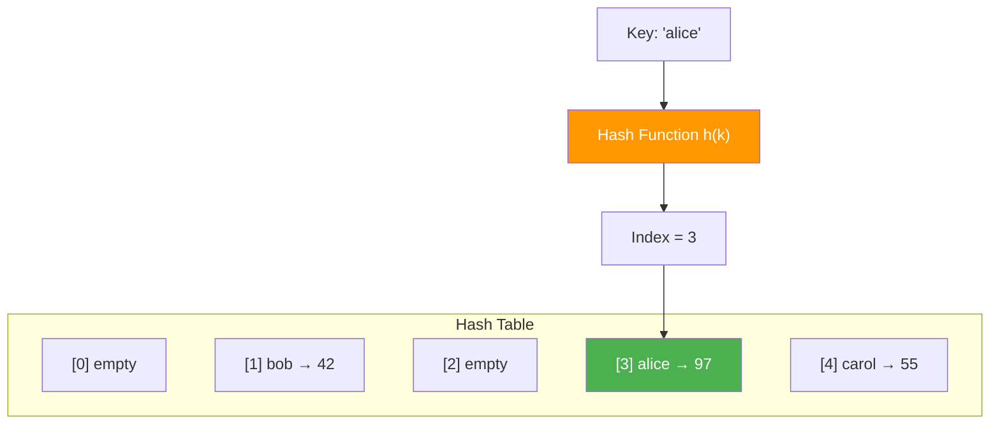

# Hash Tables and Hash Functions

> **One-line summary**: A hash table maps keys to array indices via a deterministic hash function, enabling expected constant-time access to key-value pairs.

## 🎯 Intuition
**The Core Idea:** Convert any key into an array index using a mathematical function, so you can jump directly to the right slot instead of searching.
**Analogy:** A coat check room — you hand over your coat (value), get a numbered ticket (hash), and later retrieve your coat instantly by presenting the ticket instead of searching through every coat.
**Why It Matters:** Hash tables underpin dictionaries in Python, JavaScript, Java, and C++ — they are arguably the most widely used non-trivial data structure in software, powering database indexes, compiler symbol tables, caches, and virtually every key-value lookup.

---

## ⚙️ Core Mechanics
### How It Works
A hash table implements an **associative array** — a collection of key-value pairs where each key appears at most once. The central mechanism is a **hash function** h(k) that converts a key *k* into an index in a backing array of size *m*.

**Hash function families:**
- **Division method**: h(k) = k mod m, where m is ideally a prime not close to a power of two.
- **Multiplication method**: h(k) = ⌊m · (k · A mod 1)⌋ for a constant 0 < A < 1; Knuth recommends A ≈ ($\sqrt{5}$ − 1)/2.

**Load factor**: α = n/m (stored keys / table size). As α grows, collisions multiply and performance degrades.

**Figure:** Hash table lookup — a hash function maps keys to array indices

**Resizing**: practical implementations double *m* when α crosses a threshold (commonly 0.7–0.75). Resizing rehashes every existing key — $O(n)$ work, but amortised $O(1)$ per insert.

### Key Operations

| Operation | Average Case | Worst Case | Notes |
|---|---|---|---|
| Search | $O(1)$ | $O(n)$ | Worst case when all keys collide |
| Insert | $O(1)$ amortised | $O(n)$ | $O(n)$ during resize/rehash |
| Delete | $O(1)$ | $O(n)$ | Requires collision-resolution support |
| Resize | $O(n)$ | $O(n)$ | Triggered when α exceeds threshold |

### Key Facts
- A hash function must be deterministic: the same key always yields the same index.
- The division method is simple but sensitive to poor choices of m (e.g., powers of two can cause clustering).
- The multiplication method is less sensitive to the choice of m and works well in practice.
- Load factor α = n/m directly governs expected collision rate and lookup time.
- Resizing doubles the array and rehashes all n keys in $O(n)$ time, amortised $O(1)$ per insertion.
- A good hash function approximates the **simple uniform hashing assumption** (SUHA): each key is equally likely to hash to any slot.
- Cryptographic hash functions (SHA-256) are rarely used for hash tables due to computational cost; fast non-cryptographic hashes (MurmurHash, xxHash) are preferred.
- In-memory hash tables underpin dictionaries in Python (`dict`), JavaScript objects/Maps, Java `HashMap`, and C++ `unordered_map`.

---

## 🔬 Deep Dive
### Formal Properties / Proofs
- **SUHA expected cost**: under simple uniform hashing, the expected number of probes for a successful search in a chained hash table is 1 + α/2; for an unsuccessful search, it is α. Both are $O(1)$ when α = $O(1)$.
- **Amortised $O(1)$ insert with resizing**: using the doubling strategy, the total cost of *n* insertions is Σ(i=0 to ⌊log n⌋) $2^{i}$ = $O(n)$, giving $O(1)$ amortised per insertion (aggregate method).
- **Birthday paradox**: with *m* slots, the probability of at least one collision exceeds 50% after approximately $\sqrt{πm/2}$ insertions — collisions happen far sooner than intuition suggests.
- **Universality requirement**: deterministic hash functions are vulnerable to adversarial inputs. Universal hashing (Carter-Wegman) guarantees Pr[h(x) = h(y)] ≤ 1/m for any distinct x, y.

### Edge Cases and Pitfalls
- **All keys collide**: a malicious or unlucky key set can degrade all operations to $O(n)$. Mitigate with universal hashing or randomised hash seeds.
- **Hash table DoS**: web servers using deterministic hash functions were attacked by crafting colliding POST parameters (HashDoS, 2011). Modern languages randomise hash seeds at startup.
- **Non-hashable keys**: mutable objects (e.g., Python lists) cannot be reliably hashed — mutating a key after insertion corrupts the table.
- **Resize latency spikes**: a single insert triggering a resize is $O(n)$. For latency-sensitive applications, use incremental rehashing (e.g., Redis's two-table strategy).

### Real-World Usage
- **Python `dict`**: open addressing with 64-bit hash, resize at α = 2/3, compact key-sharing for class instances.
- **Java `HashMap`**: chaining with linked lists; tree-ifies chains > 8 elements (Java 8+); load factor threshold 0.75.
- **C++ `std::unordered_map`**: chaining; bucket count is prime; growth factor configurable.
- **Databases**: hash indexes in PostgreSQL, MySQL (MEMORY engine), and in-memory databases like Redis.
- **Compilers**: symbol tables mapping identifiers to type/scope information.
- **Caches**: Memcached and Redis are essentially network-accessible hash tables.

---

## 🏋️ Practice
### Warm-Up (5 min)
1. A hash table has m = 7 slots and uses h(k) = k mod 7. Insert keys 14, 21, 35. What happens and why?
2. What is the load factor of a hash table with 15 keys and 20 slots? Should it resize?
3. Why is h(k) = k mod $2^{p}$ a poor hash function for integer keys?

### Core Problems
1. **Two Sum** (LeetCode 1): use a hash map to find two numbers that add to a target in $O(n)$ time. Analyse the expected and worst-case complexities.
2. **Group Anagrams** (LeetCode 49): design a hash function for strings such that anagrams hash to the same key. Implement and analyse collision behaviour.

### Challenge
1. **Build a Hash Table from Scratch**: implement a hash table supporting insert, search, delete, and automatic resizing. Use chaining with linked lists first, then reimplement with linear probing. Benchmark both on 100,000 random insertions and lookups. Compare average probe lengths, memory usage, and wall-clock time at load factors 0.5, 0.75, and 0.9.

---

*See also:* [[Collision Resolution Strategies]] | [[Universal and Perfect Hashing]] | [[Cuckoo Hashing]] | [[Bloom Filters and Probabilistic Structures]] | [[Amortized Analysis]] | **CS Algorithms:** [[Dijkstra's Algorithm]], [[Huffman Coding]]

## Supporting Chunks

- [[CS Data Structures/_chunks/chunk-ds-010 Hash tables achieve expected O1 via load factor management|Hash tables achieve expected O(1) via load-factor management]]
- [[CS Data Structures/_chunks/chunk-ds-152 Multiplicative hashing distributes keys using golden ratio|Multiplicative hashing distributes keys using the golden ratio]]
- [[CS Data Structures/_chunks/chunk-ds-066 Universal hashing eliminates adversarial worst-case|Universal hashing eliminates adversarial worst-case behavior]]
- [[CS Data Structures/_chunks/chunk-ds-034 Linear probing has best cache performance|Linear probing has strong cache performance]]

## References

→ [[CS Data Structures/Sources/Sources Index|Sources Index]]
