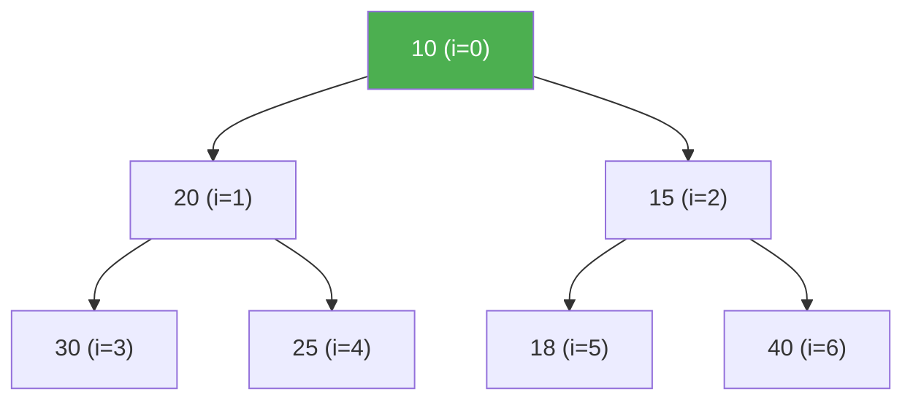

# Binary Heaps

> **One-line summary**: A complete binary tree stored implicitly in an array that satisfies the heap property, enabling $O(\log n)$ insert and extract operations.

## 🎯 Intuition
**The Core Idea:** Every parent is "more important" than its children, so the most important element always sits at the top.
**Analogy:** A hospital triage queue — the sickest patient is always seen first, and when they leave the front desk, the remaining patients shuffle up in severity order without rebuilding the entire queue.
**Why It Matters:** The binary heap is the default priority queue behind Python's `heapq`, Java's `PriorityQueue`, C++'s `std::priority_queue`, and Go's `container/heap` — you use it whenever you need fast access to a minimum or maximum.

---

## ⚙️ Core Mechanics
### How It Works
A **binary heap** exploits the regularity of a **complete binary tree** to eliminate pointers entirely: the tree is stored in a contiguous array where the node at index *i* has its left child at 2i + 1, its right child at 2i + 2, and its parent at ⌊(i − 1) / 2⌋ (zero-based indexing). This implicit representation yields excellent cache locality and zero per-node overhead.

The **heap property** comes in two flavours:
- **Min-heap**: every node's key ≤ its children's keys → minimum at root (index 0).
- **Max-heap**: every node's key ≥ its children's keys → maximum at root.

**Figure:** Min-heap — parent keys are always ≤ children; stored as an array (indices shown)

Two fundamental repair operations maintain the invariant:
- **Heapify-up** (sift-up / bubble-up): after inserting a new element at the end, compare with parent and swap upward until the heap property is restored — $O(\log n)$ worst case.
- **Heapify-down** (sift-down / percolate-down): after replacing the root with the last element during extract-min, swap with the smaller child repeatedly — $O(\log n)$.

The celebrated **build-heap** algorithm constructs a heap from an unordered array in $O(n)$ time by calling heapify-down on every non-leaf node from the bottom up. The proof relies on the observation that most nodes are near the leaves and sift down only a short distance — a geometric series that sums to $O(n)$.

**Heapsort** combines build-heap with *n* extract-max operations, yielding an in-place, $O(n \log n)$ worst-case comparison sort, though its poor cache behaviour relative to quicksort limits practical throughput.

### Key Operations

| Operation | Time (worst) | Time (amortised) | Notes |
|---|---|---|---|
| Find-min / Find-max | $O(1)$ | $O(1)$ | Root element |
| Insert | $O(\log n)$ | $O(1)$* | *Amortised $O(1)$ for random input |
| Extract-min / Extract-max | $O(\log n)$ | $O(\log n)$ | Swap root with last, sift down |
| Build-heap | $O(n)$ | — | Bottom-up heapify |
| Decrease-key | $O(\log n)$ | $O(\log n)$ | Requires knowing element index |
| Heapsort | $O(n \log n)$ | — | In-place; not stable |

### Key Facts
- A binary heap is a complete binary tree stored in a flat array; no pointers needed.
- Parent of index *i* is ⌊(i−1)/2⌋; children are 2i+1 and 2i+2 (zero-based).
- Insert (heapify-up) and extract-min/max (heapify-down) both run in $O(\log n)$.
- Build-heap constructs a heap from an unsorted array in $O(n)$ via bottom-up sift-down.
- Heapsort is in-place and $O(n \log n)$ worst-case but not stable and not cache-friendly.
- Peek (find-min or find-max) is $O(1)$ — just read index 0.
- Space overhead is zero beyond the array itself; ideal for embedded and real-time systems.
- Decrease-key (or increase-key) runs in $O(\log n)$ if the index is known.

---

## 🔬 Deep Dive
### Formal Properties / Proofs
- **Build-heap $O(n)$ proof**: nodes at height *h* number at most ⌈n / $2^{h+1}$⌉; each sifts down at most *h* levels. The total work is Σ(h=0 to ⌊log n⌋) ⌈n/$2^{h+1}$⌉ · $O(h)$ = $O(n · Σ h/2^h)$ = $O(n)$ since the series converges to 2.
- **Heap property invariant**: after every insert or extract, heapify-up or heapify-down restores the invariant in $O(\log n)$ by traversing at most one root-to-leaf path.
- **Heapsort correctness**: build-heap establishes a valid max-heap; each extract-max places the current maximum at the end of the unsorted region and restores the heap on the remaining prefix.

### Edge Cases and Pitfalls
- **Heap underflow**: extracting from an empty heap — guard with a size check.
- **Stability**: heapsort is **not stable**; equal elements may be reordered.
- **Decrease-key without index**: if you don't track each element's array position, decrease-key requires an $O(n)$ scan — use an auxiliary index map.
- **Cache behaviour**: despite $O(n \log n)$ guarantees, heapsort's non-sequential access pattern causes more cache misses than quicksort or mergesort in practice.

### Real-World Usage
- **Priority schedulers**: OS task schedulers (Linux CFS uses a red-black tree, but many RTOS kernels use binary heaps for simplicity).
- **Dijkstra's algorithm**: binary heap gives $O((V + E)$ log V); the most common practical implementation.
- **Huffman coding**: repeated extract-min + insert to build the prefix-free code tree.
- **Median maintenance**: pair of heaps (max-heap for lower half, min-heap for upper half).
- **Standard libraries**: Python `heapq`, Java `PriorityQueue`, C++ `std::priority_queue`, Go `container/heap`.

---

## 🏋️ Practice
### Warm-Up (5 min)
1. Given the array `[4, 10, 3, 5, 1]`, show the state after build-min-heap using bottom-up heapify-down.
2. What is the maximum number of swaps that a single insert can cause in a heap of height *h*?
3. True or false: in a min-heap of *n* elements, the second-smallest element must be a child of the root.

### Core Problems
1. **Kth Largest Element in a Stream** (LeetCode 703): maintain a min-heap of size *k*; each new element either replaces the root or is discarded. Analyse time and space.
2. **Merge k Sorted Lists** (LeetCode 23): use a min-heap of *k* list heads to repeatedly extract the global minimum. Prove the time complexity is $O(n \log k)$.

### Challenge
1. **Median of a Data Stream** (LeetCode 295): maintain a max-heap for the lower half and a min-heap for the upper half, rebalancing after each insertion. Achieve $O(\log n)$ per insert and $O(1)$ median query. Extend to support `remove(value)` in $O(\log n)$ with lazy deletion.

---

*See also:* [[Priority Queue ADT]] | [[Heap Applications and d-ary Heaps]] | [[Binomial Heaps]] | [[Binary Trees and Traversals]] | **CS Algorithms:** [[Dijkstra's Algorithm]], [[Huffman Coding]]

## Supporting Chunks

*Pending chunk extraction.*

## References

→ Sources Index
