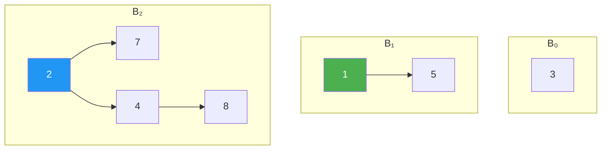

# Binomial Heaps

> **One-line summary**: A collection of heap-ordered binomial trees that supports efficient merge in $O(\log n)$ time, with the forest structure mirroring the binary representation of the heap's size.

## 🎯 Intuition
**The Core Idea:** A binomial heap is a bag of specially-shaped trees whose sizes correspond to the 1-bits in the binary representation of the element count — merging two heaps works exactly like binary addition.
**Analogy:** Think of a cash register that holds bills in denominations 1, 2, 4, 8, … — to add money you "carry" just like in binary arithmetic, and combining two registers means adding the bills denomination by denomination.
**Why It Matters:** Binomial heaps are the first clean demonstration that a mergeable priority queue can achieve $O(\log n)$ across all operations, and they are the direct ancestor of Fibonacci heaps.

---

## ⚙️ Core Mechanics
### How It Works
A **binomial tree** of order *k* (B_k) is defined recursively: B_0 is a single node, and B_k is formed by linking two copies of B_{k−1}, making one the leftmost child of the other's root. This yields a tree with exactly $2^{k}$ nodes, height *k*, and C(k, d) nodes at depth *d*.

**Figure:** Binomial heap — a forest of binomial trees with increasing orders (B₀, B₁, B₂)

A **binomial heap** is a forest of binomial trees satisfying two constraints:
1. Each tree obeys the **min-heap property** (every node's key ≤ its children's keys).
2. There is **at most one binomial tree of each order**.

Because a heap with *n* elements has tree orders corresponding to the set bits in the binary representation of *n*, a binomial heap contains at most ⌊log₂ n⌋ + 1 trees.

**Merging two binomial heaps is analogous to binary addition**: trees of the same order are linked (one root becomes a child of the other, preserving heap order), with carries propagating to the next order.

- **Insert**: merge with a single-element heap — amortised $O(1)$, worst-case $O(\log n)$.
- **Extract-min**: find and remove the root of the tree with the smallest key, then merge the root's children (which form a valid binomial heap) back into the remaining forest — $O(\log n)$.
- **Decrease-key**: bubble the updated node upward within its binomial tree — $O(\log n)$.

### Key Operations

| Operation | Worst-case | Amortised | Notes |
|---|---|---|---|
| Find-min | $O(\log n)$ | $O(1)$* | *$O(1)$ if a min-pointer is maintained |
| Insert | $O(\log n)$ | $O(1)$ | Merge with singleton heap |
| Extract-min | $O(\log n)$ | $O(\log n)$ | Remove min root, merge child forest |
| Decrease-key | $O(\log n)$ | $O(\log n)$ | Sift up within binomial tree |
| Merge | $O(\log n)$ | $O(\log n)$ | Binary-addition analogy |
| Delete | $O(\log n)$ | $O(\log n)$ | Decrease-key to −∞, then extract-min |

### Key Facts
- Binomial tree B_k has $2^{k}$ nodes, height *k*, and root degree *k*.
- A binomial heap contains at most one tree of each order; the orders mirror *n*'s binary digits.
- Merge is analogous to binary addition: link equal-order trees, carry to next order. Cost: $O(\log n)$.
- Insert is merge with a singleton: $O(\log n)$ worst-case, $O(1)$ amortised.
- Extract-min removes the minimum root and re-merges its children forest: $O(\log n)$.
- Decrease-key sifts up within a binomial tree: $O(\log n)$.
- The total number of trees in the forest is at most ⌊log₂ n⌋ + 1.
- Binomial heaps form the conceptual stepping stone to Fibonacci heaps.

---

## 🔬 Deep Dive
### Formal Properties / Proofs
- **Amortised $O(1)$ insert (Banker's method)**: assign 1 credit to each tree in the forest. An insert that triggers *t* carries (tree links) uses *t* stored credits and deposits 1 new credit on the resulting tree. Since each insert deposits at most 1 credit, the amortised cost is $O(1)$.
- **Structure theorem**: a binomial heap of *n* elements has exactly one B_k for each bit position *k* where the *k*-th bit of *n* is 1.
- **Maximum degree**: the root of B_k has exactly *k* children (B_{k−1}, B_{k−2}, …, B_0), so the maximum degree in a heap of *n* elements is ⌊log₂ n⌋.

### Edge Cases and Pitfalls
- **Find-min without min-pointer**: scanning all root nodes costs $O(\log n)$ — maintain a min-pointer for $O(1)$.
- **Decrease-key requires parent pointers**: each node must store a pointer to its parent for sift-up to work.
- **Merge of two large heaps**: worst case triggers ⌊log₂ n⌋ carries, each $O(1)$, but the constant factor from pointer manipulation can dominate for small *n*.

### Real-World Usage
- **Mergeable priority queues**: any algorithm that frequently merges heaps (e.g., merging partial results in parallel computations) benefits from $O(\log n)$ merge.
- **Stepping stone to Fibonacci heaps**: understanding binomial heap linking is prerequisite to lazy consolidation and cascading cuts.
- **Network routing protocols**: some distributed algorithms use binomial-heap-like merge structures for priority aggregation.

---

## 🏋️ Practice
### Warm-Up (5 min)
1. Draw the binomial heap that results from inserting the keys 7, 3, 1, 5, 9, 4 one at a time. How many trees are in the final forest?
2. What is the binary representation of 11? Which binomial trees appear in a binomial heap of 11 elements?
3. True or false: a binomial heap can contain two trees of the same order.

### Core Problems
1. **Merge two binomial heaps**: given heaps with 6 and 10 elements, trace the merge step by step, showing each link and carry. What is the structure of the resulting 16-element heap?
2. **Amortised insert analysis**: prove that *n* successive insertions into an initially empty binomial heap cost $O(n)$ total, using the binary-counter analogy.

### Challenge
1. **Lazy binomial heap**: design a variant where insert simply adds a new tree to the root list (no linking). Defer all consolidation to extract-min. Analyse the amortised costs using a potential function Φ = number of trees in the root list. Show that insert is $O(1)$ amortised and extract-min is $O(\log n)$ amortised. Compare with Fibonacci heaps.

---

*See also:* [[Binary Heaps]] | [[Fibonacci Heaps]] | [[Priority Queue ADT]] | [[Heap Applications and d-ary Heaps]] | **CS Algorithms:** [[Dijkstra's Algorithm]], [[Huffman Coding]]

## Supporting Chunks

- [[CS Data Structures/_chunks/chunk-ds-037 Binomial heaps support Ologn merge|Binomial heaps support O(log n) merge by linking same-degree trees]]

## References

→ [[CS Data Structures/Sources/Sources Index|Sources Index]]
