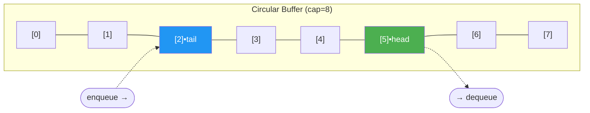

# Circular Buffers

> **One-line summary**: A circular buffer (ring buffer) is a fixed-size array that wraps around using modular arithmetic, enabling $O(1)$ enqueue and dequeue without ever shifting elements.

## 🎯 Intuition
**The Core Idea:** A fixed array whose end connects back to its beginning, so two pointers can chase each other in an endless loop.
**Analogy:** Imagine a conveyor-belt sushi restaurant—the chef places plates at one spot and diners grab plates as they come around. The belt has a fixed number of slots; when the last slot passes the chef, the first slot comes back empty and ready. If you don't pick up your plate in time, the chef may replace it with a fresh one (overwrite policy).
**Why It Matters:** Whenever you need predictable latency, zero allocation during steady state, and a hard cap on memory—I/O buffers, audio streams, producer-consumer channels—the circular buffer is the right choice.

---

## ⚙️ Core Mechanics
### How It Works
A circular buffer allocates a contiguous block of memory once and treats it as if the end connects back to the beginning. Two pointers—**head** (read position) and **tail** (write position)—track where the next dequeue and enqueue will occur. After each operation the relevant pointer advances by one and wraps around via `pointer = (pointer + 1) % capacity`. Because the array size is fixed and the pointers simply chase each other in a circle, there is no allocation, no copying, and no shifting—every insert and remove is a true $O(1)$ operation in both time and space.

**Figure:** Circular buffer — head and tail pointers chase each other around a fixed-size ring



The main design decision is how to distinguish a **full** buffer from an **empty** one, since in both states head and tail can coincide. Three common strategies exist. First, **waste one slot**: the buffer is considered full when `(tail + 1) % capacity == head`, sacrificing one element of capacity for simplicity. Second, **maintain a count**: an integer tracks the current number of elements, and full/empty are checked against zero and capacity. Third, **use a flag**: a boolean records whether the last operation was a write or a read, resolving the ambiguity when the pointers overlap. Each approach has negligible performance differences; the count-based method is the most readable in practice.

Because the buffer is fixed-size, it naturally enforces **bounded memory usage**. When the buffer is full, a write either blocks (in a blocking queue) or overwrites the oldest element (in a lossy stream). This overwrite behaviour is a feature, not a bug, in many real-time systems where stale data is less valuable than fresh data.

### Key Operations

| Operation           | Time  | Space | Notes                            |
|---------------------|:-----:|:-----:|----------------------------------|
| Enqueue (write)     | $O(1)$  | $O(1)$  | Advances tail pointer            |
| Dequeue (read)      | $O(1)$  | $O(1)$  | Advances head pointer            |
| Peek                | $O(1)$  | $O(1)$  | Read at head without advancing   |
| Is Empty            | $O(1)$  | $O(1)$  | `head == tail` (or count == 0)   |
| Is Full             | $O(1)$  | $O(1)$  | `(tail+1)%cap == head` (or count == cap) |
| Overall space       | —     | $O(n)$  | Fixed at creation time           |

### Pseudocode
```
// Circular Buffer — count-based full/empty disambiguation
structure CircularBuffer:
    buffer[capacity]
    head = 0        // next read index
    tail = 0        // next write index
    count = 0

function enqueue(cb, item):
    if cb.count == capacity:
        error "Buffer full" // or overwrite: cb.head = (cb.head + 1) % capacity
    cb.buffer[cb.tail] = item
    cb.tail = (cb.tail + 1) % capacity
    cb.count += 1

function dequeue(cb):
    if cb.count == 0:
        error "Buffer empty"
    item = cb.buffer[cb.head]
    cb.head = (cb.head + 1) % capacity
    cb.count -= 1
    return item

function peek(cb):
    if cb.count == 0: error "Buffer empty"
    return cb.buffer[cb.head]
```

### Key Facts
- **Fixed-size allocation** — memory is allocated once at creation; no resizing or garbage collection pressure.
- **Modular arithmetic wrap** — `index % capacity` causes pointers to cycle from the last slot back to the first.
- **Head and tail pointers** — head marks the next element to read; tail marks the next slot to write.
- **Full vs. empty disambiguation** — solved by wasting a slot, keeping a count, or using a boolean flag.
- **Lock-free variants** — a single-producer, single-consumer ring buffer can be made lock-free with atomic head/tail pointers and memory barriers.
- **Overwrite policy** — when full, new writes can either block or overwrite the oldest entry, depending on the use case.

---

## 🔬 Deep Dive
### Implementation Variants
- **Waste-a-slot** — simplest; capacity is `N+1` to store `N` items. No extra state beyond two pointers. Common in embedded C code.
- **Count-based** — uses an integer counter. Most readable; allows the buffer to use all `N` slots. Slightly more state to maintain.
- **Mirrored / virtual-memory trick** — map two contiguous virtual pages to the same physical memory. Pointers can increment linearly past the end and automatically wrap via the MMU—no modulus needed. Used in high-perf systems (e.g., Linux `io_uring` ring buffers).
- **Power-of-two sizing** — when capacity is a power of two, `% capacity` becomes a fast bitmask `& (capacity - 1)`. Most production ring buffers enforce this.
- **LMAX Disruptor** — a high-performance inter-thread messaging library built around a ring buffer with sequence numbers instead of head/tail pointers, achieving millions of ops/sec with no locks.

### Cache and Memory Analysis
- The entire buffer fits in a known number of cache lines (e.g., a 4 KB buffer = 64 cache lines). Predictable footprint means fewer TLB misses than dynamic structures.
- Sequential writes and reads follow a linear access pattern within the buffer, benefiting from hardware prefetching—until the wrap-around, which may cause a single cache miss.
- Per-element overhead: **0 bytes** beyond the element itself (the head/tail/count metadata is shared, not per-element). Compare to a linked-list queue's 8–16 bytes of pointer overhead per node.

### Edge Cases and Pitfalls
- **Empty buffer dequeue** — must check `count == 0` (or `head == tail`) before reading; otherwise you read stale data from a previous cycle.
- **Single-element buffer** — legal but useless for pipelining; full and empty alternate every operation.
- **Non-power-of-two capacity** — the modulus operator is significantly slower than a bitmask; always prefer power-of-two sizes in performance-critical code.
- **Multi-producer / multi-consumer** — the simple lock-free design only works for SPSC (single-producer, single-consumer). MPMC requires CAS loops or the Disruptor pattern.
- **Overwrite semantics** — when overwriting the oldest element on a full write, you must also advance head, or the consumer will read corrupted data.

### Real-World Usage
- **OS kernel I/O** — keyboard, serial port, and NIC receive buffers are ring buffers (Linux `kfifo`).
- **Audio / video streaming** — ALSA and PulseAudio use ring buffers to decouple capture from playback with bounded latency.
- **Producer-consumer channels** — Go channels, Rust `crossbeam`, and Java's `ArrayBlockingQueue` are all backed by ring buffers.
- **Networking** — DPDK and `io_uring` use ring buffers for zero-copy packet processing.
- **Logging** — circular log buffers (e.g., kernel `dmesg` ring buffer) keep the most recent messages without unbounded growth.

---

## 🏋️ Practice
### Warm-Up (5 min)
1. A ring buffer has capacity 8 and currently `head=5, tail=2`. How many elements are stored? (Answer: `(2 - 5 + 8) % 8 = 5`)
2. Why can't you simply check `head == tail` to test both empty *and* full in a waste-a-slot design?
3. What happens if you use a capacity that is not a power of two in a bitmask-based implementation?

### Core Problems
1. **Design Circular Queue** (LeetCode 622) — Implement `MyCircularQueue` with `enQueue`, `deQueue`, `Front`, `Rear`, `isEmpty`, `isFull`. Use the count-based approach from the pseudocode above.
2. **Design Circular Deque** (LeetCode 641) — Extend to support `insertFront`, `insertLast`, `deleteFront`, `deleteLast`. Requires bidirectional pointer movement: `head = (head - 1 + capacity) % capacity`.

### Challenge
1. **Sliding Window Maximum** (LeetCode 239) — Maintain a monotonic deque over a fixed sliding window. While not a circular buffer per se, this problem forces you to reason about bounded windows and index wrapping—the same mental model underlying ring buffers. See also [[Queues and Deques]].

---

*See also:* [[Queues and Deques]] | [[Producer-Consumer Pattern]] | [[Memory-Mapped I/O]] | **CS Algorithms:** [[BFS and DFS]]

## Supporting Chunks

- [[CS Data Structures/_chunks/chunk-ds-005 Circular buffers use modular arithmetic for O1 queue ops|Circular buffers use modular arithmetic for O(1) queue operations]]
- [[CS Data Structures/_chunks/chunk-ds-141 Power-of-two buffer makes modulo a bitmask|Power-of-two buffer sizes make modulo a bitmask]]

## References

→ [[CS Data Structures/Sources/Sources Index|Sources Index]]
