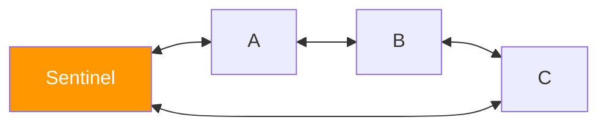

# Doubly Linked Lists and Circular Lists

> **One-line summary**: Doubly linked lists extend singly linked lists with a backward pointer, enabling $O(1)$ deletion at a known node, while circular variants connect the tail back to the head for seamless wrap-around traversal.

## 🎯 Intuition
**The Core Idea:** Every node knows both its successor *and* its predecessor, so you can move in either direction and remove any node instantly.
**Analogy:** Picture a conga line where every dancer has both hands on the person in front *and* behind them. Anyone can leave the line by simply connecting their two neighbours to each other—no need to walk from the front to find who was behind them. A circular list is the same conga line formed into a circle: after the last dancer comes the first, and the music never stops.
**Why It Matters:** Doubly linked lists are the backbone of LRU caches, operating-system task schedulers, and undo/redo systems. Circular variants model any domain with cyclic iteration—round-robin scheduling, multiplayer game turns, playlists on repeat.

---

## ⚙️ Core Mechanics
### How It Works
In a **doubly linked list**, each node carries three fields: `data`, `next`, and `prev`. The backward pointer eliminates the need to traverse from the head to find a predecessor, so given a direct reference to a node, both insertion before it and deletion of it run in $O(1)$. This property is exploited heavily in systems that maintain handles to internal nodes—LRU caches, for example, store a hash-map of keys to node pointers and move accessed nodes to the front in constant time.

**Figure:** Sentinel-based doubly linked list — prev/next pointers enable $O(1)$ insertion and deletion



A **sentinel (dummy) node** simplifies edge-case handling: the list is initialized with a single sentinel whose `next` and `prev` both point to itself, representing an empty list. Every real node sits between the sentinel and its neighbors, so insertion and deletion never need to special-case head or tail operations. This pattern is used in the Linux kernel's `list_head` implementation and in Java's `LinkedList`.

**Circular variants** link the last node's `next` to the first node (singly circular) or connect both ends through `next`/`prev` (doubly circular). Circular lists naturally model cyclic processes: round-robin CPU scheduling, circular buffer metadata, and multiplayer game turn orders. Traversal starts at any node and terminates when the starting node is revisited.

### Key Operations

| Operation               | Time | Space |
|-------------------------|:----:|:-----:|
| Insert at head/tail     | $O(1)$ | $O(1)$  |
| Delete known node       | $O(1)$ | $O(1)$  |
| Search by value         | $O(n)$ | $O(1)$  |
| Move node to head (LRU) | $O(1)$ | $O(1)$  |
| Traverse full list      | $O(n)$ | $O(1)$  |

### Pseudocode
```
// Sentinel-based Doubly Linked List
structure DLL:
    sentinel = new Node(nil)
    sentinel.next = sentinel
    sentinel.prev = sentinel

// Insert node AFTER a given node
function insertAfter(node, newNode):
    newNode.prev = node
    newNode.next = node.next
    node.next.prev = newNode
    node.next = newNode

// Delete a known node (O(1) — no search needed)
function deleteNode(node):
    node.prev.next = node.next
    node.next.prev = node.prev
    free(node)

// Move node to front (used in LRU cache)
function moveToFront(dll, node):
    deleteNode(node)               // unlink from current position
    insertAfter(dll.sentinel, node) // re-insert right after sentinel
```

### Key Facts
- Each node stores `prev` and `next` pointers, doubling per-node pointer overhead versus singly linked lists.
- Deletion of a known node is $O(1)$ because the predecessor is directly accessible via `prev`.
- Sentinel nodes eliminate null checks for head/tail, simplifying insertion and deletion logic.
- Circular doubly linked lists have no null pointers; every `next` and `prev` points to a valid node or sentinel.
- LRU caches combine a doubly linked list with a hash map for $O(1)$ get and put.
- The Linux kernel's `struct list_head` is an intrusive circular doubly linked list embedded directly in data structures.
- Circular singly linked lists are used in round-robin scheduling and the Josephus problem.

---

## 🔬 Deep Dive
### Implementation Variants
- **Sentinel-based (dummy head)** — the most common production pattern. Eliminates all `if head == null` / `if tail == null` checks. Java `LinkedList`, Linux `list_head`, and most textbook implementations use this.
- **Intrusive lists** — the node structure is embedded inside the data structure itself (e.g., Linux `struct list_head` is a field inside `struct task_struct`). Zero per-node allocation; the tradeoff is that the data type must "know" it can be in a list.
- **XOR linked list** — stores `prev XOR next` in a single pointer field, halving pointer overhead. Clever but impractical: incompatible with garbage collectors and very hard to debug. Mostly an interview curiosity.
- **Unrolled linked list** — each node holds a small array of elements instead of one. Improves cache utilisation while retaining $O(1)$ insert/delete at known positions. Used in some text editors and B-tree leaf chains.

### Cache and Memory Analysis
- Per-node overhead: **two pointers** (16 bytes on 64-bit) plus allocator metadata (often another 16 bytes). A list of 1 million 8-byte integers consumes ~40 MB vs. ~8 MB in a flat array.
- Nodes are scattered across the heap, so traversal generates one cache miss per node in the worst case. This makes doubly linked lists 5–10× slower than arrays for sequential scans.
- **Intrusive lists** eliminate allocator overhead and can be co-located in memory with their parent structures, significantly improving cache behaviour.
- The sentinel node is accessed on every insert/delete, so it stays hot in cache—a micro-optimisation that adds up.

### Edge Cases and Pitfalls
- **Dangling pointers after deletion** — after `deleteNode(n)`, code that still holds a reference to `n` will read freed memory. Sentinel-based designs mitigate this but don't eliminate it.
- **Circular list termination** — traversal must check for the sentinel (or starting node), not for `null`. An off-by-one in the termination condition causes an infinite loop.
- **Empty list operations** — with a sentinel, the empty list is `sentinel.next == sentinel`. Without one, every operation must check `head == null`.
- **Memory leaks in managed languages** — in Java/Python, nodes that reference each other via `prev`/`next` are handled by GC, but in C/C++ you must break the cycle or walk the list to free every node.

### Real-World Usage
- **LRU cache** — HashMap + doubly linked list for $O(1)$ get, put, and eviction. Used in every web browser, database buffer pool (PostgreSQL, MySQL InnoDB), and OS page cache.
- **Undo/redo** — each action is a node; undo moves backward, redo moves forward. The doubly linked structure allows branching histories.
- **OS task scheduler** — Linux's CFS scheduler maintains run queues as intrusive linked lists within `struct task_struct`.
- **Text editors** — Emacs and VS Code use variants of doubly linked lists (or ropes) for buffer management.
- **Merge sort on lists** — linked lists support $O(1)$ split and $O(1)$ merge without extra space, making merge sort the ideal sort for linked data → see [[Merge Sort]].

---

## 🏋️ Practice
### Warm-Up (5 min)
1. Draw a sentinel-based doubly linked list containing elements [A, B, C]. Show all `next` and `prev` pointers, including the sentinel's.
2. Why is deleting a node from a doubly linked list $O(1)$ but deleting from a singly linked list is $O(n)$?
3. How do you detect that a circular list is empty when using a sentinel node?

### Core Problems
1. **LRU Cache** (LeetCode 146) — Implement `get(key)` and `put(key, value)` in $O(1)$ using a hash map and doubly linked list. Practice the `moveToFront` and `evictLast` patterns from the pseudocode above.
2. **Flatten a Multilevel Doubly Linked List** (LeetCode 430) — Nodes have a `child` pointer in addition to `next`/`prev`. Flatten using DFS (explicit stack or recursion), reconnecting `prev`/`next` pointers.

### Challenge
1. **Josephus Problem** — `n` people stand in a circle; every `k`-th person is eliminated. Simulate with a circular singly linked list in $O(n·k)$ or solve mathematically in $O(n)$. Tests circular traversal, deletion, and termination logic.

---

*See also:* [[Singly Linked Lists]] | [[Stacks]] | [[Queues and Deques]] | [[Circular Buffers]] | [[Hash Tables]] | **CS Algorithms:** [[Merge Sort]], [[BFS and DFS]]

## Supporting Chunks

- [[CS Data Structures/_chunks/chunk-ds-004 DLL plus hash map gives O1 LRU cache operations|DLL plus hash map gives O(1) LRU cache operations]]
- [[CS Data Structures/_chunks/chunk-ds-082 XOR linked lists halve DLL pointer overhead|XOR linked lists halve DLL pointer overhead]]

## References

- [[CS Data Structures/Sources/Sources Index|Sources Index]]
