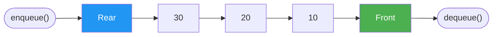

# Queues and Deques

> **One-line summary**: A queue is a linear data structure that follows the First-In, First-Out (FIFO) principle, while a deque (double-ended queue) generalises this by allowing insertion and removal at both ends.

## 🎯 Intuition
**The Core Idea:** Elements enter at the back and leave from the front—first come, first served.
**Analogy:** Think of a line at a grocery store. Customers join at the back and are served from the front; nobody cuts. A deque is like a line where VIPs can also be added to or removed from the front—it works from both ends.
**Why It Matters:** Queues are the natural abstraction for any process that serves requests in arrival order—BFS graph traversal, OS task scheduling, and message passing in distributed systems all rely on FIFO semantics.

---

## ⚙️ Core Mechanics
### How It Works
A **queue** enforces FIFO ordering: elements enter at the **rear** and leave from the **front**, just like a line of people waiting for service. The two fundamental operations are `enqueue(item)`, which appends to the rear, and `dequeue()`, which removes from the front. A naïve array implementation wastes space as the front index advances, so the standard approach is a **circular array**—the array wraps around using modular arithmetic (`index % capacity`), reusing vacated slots without shifting elements. When the buffer fills, it can be resized by doubling and copying, preserving amortized $O(1)$ performance.

**Figure:** Queue FIFO principle — elements enter at rear, leave from front



A **deque** (pronounced "deck") extends the queue contract to support `addFirst`, `addLast`, `removeFirst`, and `removeLast`, all in $O(1)$ time. Internally it is typically backed by a circular dynamic array, identical in spirit to the circular queue but with bookkeeping for both ends. Python's `collections.deque` is implemented as a doubly-linked list of fixed-size blocks, giving $O(1)$ appends and pops on either end plus $O(n)$ indexed access. Java's `ArrayDeque` uses a resizable circular array and is generally faster than `LinkedList` for queue and stack workloads due to better cache behaviour.

Both queues and deques can also be built on top of linked lists. A singly-linked list with head and tail pointers supports $O(1)$ enqueue and dequeue for a basic queue. A doubly-linked list naturally supports $O(1)$ operations on both ends for a deque. The trade-off is the same as with stacks: linked-list variants avoid resizing but add per-node allocation cost and reduce cache locality.

### Key Operations

| Operation        | Queue (Circular Array) | Deque (Circular Array) | Linked-List Queue |
|------------------|:----------------------:|:----------------------:|:-----------------:|
| Enqueue / addLast  | $O(1)$ amortized       | $O(1)$ amortized         | $O(1)$              |
| Dequeue / removeFirst | $O(1)$              | $O(1)$                   | $O(1)$              |
| addFirst         | —                      | $O(1)$ amortized         | $O(1)$*             |
| removeLast       | —                      | $O(1)$                   | $O(1)$**            |
| Peek front/rear  | $O(1)$                   | $O(1)$                   | $O(1)$              |
| Search           | $O(n)$                   | $O(n)$                   | $O(n)$              |

\* Requires doubly-linked list for $O(1)$ removeLast.
\** Singly-linked list removeLast is $O(n)$; doubly-linked is $O(1)$.

### Pseudocode
```
// Circular Array Queue
structure Queue:
    buffer[capacity]
    front = 0
    rear = 0
    size = 0

function enqueue(q, item):
    if q.size == capacity: resize(q)  // double and copy
    q.buffer[q.rear] = item
    q.rear = (q.rear + 1) % capacity
    q.size += 1

function dequeue(q):
    if q.size == 0: error "Queue empty"
    item = q.buffer[q.front]
    q.front = (q.front + 1) % capacity
    q.size -= 1
    return item

// Deque — addFirst extends the queue with backward index movement
function addFirst(dq, item):
    if dq.size == capacity: resize(dq)
    dq.front = (dq.front - 1 + capacity) % capacity
    dq.buffer[dq.front] = item
    dq.size += 1
```

### Key Facts
- **FIFO ordering** — the first element enqueued is the first element dequeued.
- **Circular array trick** — indices wrap via `i % capacity`, eliminating the need to shift elements on dequeue.
- **Deque generalisation** — supports $O(1)$ insert and remove at both front and rear.
- **Python `collections.deque`** — block-allocated doubly-linked list; $O(1)$ ends, $O(n)$ middle access, optional `maxlen` for bounded use.
- **Java `ArrayDeque`** — resizable circular array; preferred over `LinkedList` for both queue and stack use cases.
- **Priority queues are different** — they order by priority, not arrival time, and are typically heap-backed.

---

## 🔬 Deep Dive
### Implementation Variants
- **Circular array queue** — the default choice. Uses modular arithmetic for wrap-around. Java `ArrayDeque`, C++ `std::deque` (block-allocated), Rust `VecDeque`.
- **Linked-list queue** — singly linked with head and tail pointers. Simple; avoids resizing. Used when node-level handles are needed (e.g., cancelling a specific pending task).
- **Block-allocated deque** — Python `collections.deque` and C++ `std::deque` use an array of fixed-size blocks. $O(1)$ amortised at both ends; $O(1)$ random access in C++ via block + offset arithmetic.
- **Lock-free queues** — Michael-Scott queue (two-lock / CAS-based) is the standard concurrent FIFO. Java `ConcurrentLinkedQueue` implements this.
- **Steal-deque (work-stealing)** — used in fork/join frameworks (Java `ForkJoinPool`, Tokio, Go goroutine scheduler). Each worker owns a deque; idle workers "steal" from the back of busy workers' deques.

### Cache and Memory Analysis
- Circular array queues have the same cache advantages as arrays: elements are contiguous, hardware prefetching works, and per-element overhead is zero beyond the data itself.
- Linked-list queues scatter nodes across the heap: one cache miss per dequeue in the worst case. Allocating nodes from a pool mitigates this.
- C++ `std::deque`'s block structure provides good cache locality within each block (typically 512 bytes) while allowing $O(1)$ front insertion—a practical compromise.
- For throughput-critical queues (millions of ops/sec), the circular array backed by a power-of-two size and bitmask indexing is the optimal choice.

### Edge Cases and Pitfalls
- **Dequeue from empty queue** — must guard with `isEmpty()` check; common source of exceptions in production code.
- **Resize wraparound copy** — when a circular array queue doubles, elements may be split across the end and start of the buffer. The resize must "unwrap" them into a contiguous region in the new buffer.
- **Priority queue confusion** — a priority queue is *not* a FIFO queue; don't substitute one for the other.
- **BFS with visited set** — forgetting to mark nodes as visited before enqueuing (not after dequeuing) leads to duplicate entries and incorrect results.

### Real-World Usage
- **Breadth-first search (BFS)** — the canonical graph algorithm: dequeue a vertex, enqueue its unvisited neighbours, repeat. BFS guarantees shortest paths in unweighted graphs → see [[BFS and DFS]].
- **OS task scheduling** — processes sit in ready queues; the scheduler dequeues the next process to run.
- **Message queues** — RabbitMQ, Kafka, and SQS all implement producer-consumer FIFO semantics (with extensions for priority and ordering keys).
- **Sliding window maximum** — a monotonic deque maintains candidates in decreasing order so the maximum of any window is always at the front.
- **Print spooling** — print jobs queue in FIFO order; the printer dequeues and prints one at a time.

---

## 🏋️ Practice
### Warm-Up (5 min)
1. What is the difference between a queue and a deque in terms of allowed operations?
2. Why does a naïve (non-circular) array-based queue waste memory, and how does the circular array fix it?
3. Can you implement a queue using two stacks? What is the amortized cost of dequeue?

### Core Problems
1. **Implement Queue using Stacks** (LeetCode 232) — Use two stacks to simulate FIFO behaviour. Push onto `inStack`; on dequeue, if `outStack` is empty, pour `inStack` into `outStack`. Amortized $O(1)$ per operation.
2. **Sliding Window Maximum** (LeetCode 239) — Maintain a monotonic deque of indices. For each new element, pop smaller elements from the back; the front always holds the window maximum. $O(n)$ total.

### Challenge
1. **Shortest Path in Binary Matrix** (LeetCode 1091) — BFS on a grid from top-left to bottom-right, moving in 8 directions. The queue drives the level-by-level exploration; the answer is the depth when you first reach the goal. Directly connects queues to [[BFS and DFS]].

---

*See also:* [[Stacks]] | [[Circular Buffers]] | [[Priority Queues and Heaps]] | **CS Algorithms:** [[BFS and DFS]], [[Binary Search]]

## Supporting Chunks

- [[CS Data Structures/_chunks/chunk-ds-112 Deque with circular buffer gives O1 at both ends|Deque with circular buffer gives O(1) operations at both ends]]
- [[CS Data Structures/_chunks/chunk-ds-062 Two stacks simulate a queue with O1 amortized|Two stacks simulate a queue with O(1) amortized operations]]

## References

- [[CS Data Structures/Sources/Sources Index|Sources Index]]
