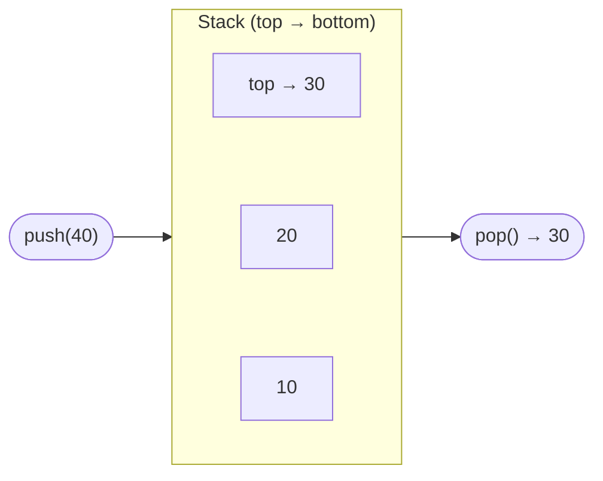

# Stacks

> **One-line summary**: A stack is a linear data structure that follows the Last-In, First-Out (LIFO) principle, where the most recently added element is the first to be removed.

## 🎯 Intuition
**The Core Idea:** Access is restricted to one end—you can only add or remove from the top.
**Analogy:** Think of a pile of plates in a cafeteria. You can only take the top plate or put a new one on top. The plate you placed last is the first one taken—last in, first out. Trying to grab a plate from the middle would topple the whole stack.
**Why It Matters:** Stacks are everywhere in computing—call stacks manage function invocations, compilers use them for expression evaluation, editors use them for undo, and DFS uses an explicit or implicit stack. Understanding stacks is foundational because recursion, backtracking, and syntax parsing all reduce to stack operations under the hood.

---

## ⚙️ Core Mechanics
### How It Works
A stack models a collection where access is restricted to one end, called the **top**. You can only insert (push) and remove (pop) elements from the top. This constraint may seem limiting, but it turns out to be exactly the right abstraction for a wide range of problems involving nested or recursive structure.

**Figure:** Stack LIFO principle — push adds to top, pop removes from top



There are two primary implementations. An **array-based stack** uses a contiguous block of memory with an integer tracking the top index. Pushes and pops simply increment or decrement that index. When the underlying array fills up, a dynamic array strategy (doubling the capacity) provides amortized $O(1)$ insertions. A **linked-list-based stack** allocates a new node for every push and frees it on every pop, using the head of the list as the top. This avoids resizing but incurs per-element allocation overhead and worse cache locality.

Both implementations guarantee $O(1)$ time for all three core operations—push, pop, and peek—making stacks one of the most efficient data structures available. The choice between array and linked-list backing depends on whether you need a bounded size, care about memory fragmentation, or require guaranteed (not amortized) constant-time operations.

### Key Operations

| Operation | Array-Based | Linked-List-Based |
|-----------|:-----------:|:-----------------:|
| Push      | $O(1)$ amortized | $O(1)$           |
| Pop       | $O(1)$        | $O(1)$              |
| Peek      | $O(1)$        | $O(1)$              |
| Search    | $O(n)$        | $O(n)$              |
| Space     | $O(n)$        | $O(n)$ + pointer overhead |

### Pseudocode
```
// Array-based Stack
structure Stack:
    buffer[capacity]
    top = -1    // index of topmost element; -1 = empty

function push(s, item):
    if s.top == capacity - 1: resize(s)  // double capacity
    s.top += 1
    s.buffer[s.top] = item

function pop(s):
    if s.top == -1: error "Stack underflow"
    item = s.buffer[s.top]
    s.top -= 1
    return item

function peek(s):
    if s.top == -1: error "Stack empty"
    return s.buffer[s.top]

function isEmpty(s):
    return s.top == -1
```

### Key Facts
- **LIFO ordering** — the last element pushed is the first element popped.
- **Three core operations** — `push(item)` adds to the top, `pop()` removes from the top, `peek()` reads the top without removing it.
- **Array implementation** — uses a dynamic array and a top-of-stack index; amortized $O(1)$ push via capacity doubling.
- **Linked-list implementation** — each node points to the one below it; the head pointer is the top of the stack.
- **Overflow / underflow** — a fixed-size array stack can overflow; any stack can underflow if you pop when empty.
- **Thread-safe variants** — concurrent stacks (e.g., Treiber stack) use CAS operations for lock-free push/pop.

---

## 🔬 Deep Dive
### Implementation Variants
- **Dynamic array stack** — the default in most standard libraries. Java `Stack` (legacy, use `ArrayDeque`), Python `list` used as a stack (`append`/`pop`), C++ `std::stack` (adaptor over `deque` or `vector`), Go `slice`.
- **Linked-list stack** — guaranteed worst-case $O(1)$ per operation (no amortisation). Preferred in real-time systems where a resize pause is unacceptable.
- **Min-stack / Max-stack** — augments each node with the current min (or max) of all elements below it, enabling $O(1)$ `getMin()` / `getMax()`. Uses $O(n)$ extra space, or can be optimised with a second auxiliary stack.
- **Treiber stack** — a lock-free concurrent stack using compare-and-swap (CAS) on the head pointer. Suffers from ABA problem; solved with hazard pointers or tagged pointers.
- **Cactus stack (spaghetti stack)** — used in language runtimes for coroutines/fibers. Each frame can have multiple children, forming a tree of stack frames rather than a single chain.

### Cache and Memory Analysis
- An array-based stack keeps all elements contiguous in memory. Push/pop at the top operates on the same cache line repeatedly, making it extremely cache-friendly.
- A linked-list stack allocates nodes individually on the heap—each push is a `malloc`, each pop a `free`. On modern allocators this costs ~50–100 ns per operation vs. ~5 ns for an array push.
- For small stacks (< 64 elements), the array version fits in a single page and benefits from L1 cache residency.
- Stack depth in recursive algorithms determines memory pressure: $O(n)$ recursion on a 1M-element input allocates ~8 MB of call-stack frames (at ~8 bytes per frame minimum).

### Edge Cases and Pitfalls
- **Stack overflow** — a fixed-capacity array stack or deep recursion can exhaust available memory. Default thread stack sizes are typically 1–8 MB; tail-call optimisation (TCO) can prevent overflow for tail-recursive functions.
- **Stack underflow** — popping from an empty stack is undefined behaviour in C++ and throws in Java. Always check `isEmpty()` or use exceptions.
- **Parenthesis matching edge case** — a string like `"(]"` requires checking that the popped element matches the expected closing bracket, not just that the stack is non-empty.
- **Monotonic stack off-by-one** — when building a "next greater element" solution, forgetting to flush the remaining stack elements after the loop is a common bug.

### Real-World Usage
- **Call stack** — every running program uses a hardware-assisted call stack for function invocations, local variables, and return addresses.
- **Depth-first search (DFS)** — an explicit stack replaces recursion for DFS on graphs and trees, avoiding stack overflow on large inputs → see [[BFS and DFS]].
- **Backtracking** — sudoku solvers, N-queens, and constraint-satisfaction problems push partial solutions and backtrack (pop) on dead ends → see [[Backtracking Overview|Backtracking]].
- **Expression evaluation** — the shunting-yard algorithm uses two stacks (operands and operators) to convert infix to postfix and evaluate.
- **Undo systems** — text editors push each action onto a stack; Ctrl+Z pops and reverses the most recent action.
- **Browser history** — the back button pops from a "back stack" and pushes onto a "forward stack."

---

## 🏋️ Practice
### Warm-Up (5 min)
1. Trace through push(1), push(2), pop(), push(3), peek() on an empty stack. What is the final state?
2. Why is an array-based stack generally faster than a linked-list stack in practice, even though both are $O(1)$?
3. How would you implement a stack that supports `getMin()` in $O(1)$ time?

### Core Problems
1. **Valid Parentheses** (LeetCode 20) — Push opening brackets; on a closing bracket, pop and check for a match. If the stack is non-empty at the end, the string is invalid. $O(n)$ time, $O(n)$ space.
2. **Daily Temperatures** (LeetCode 739) — Use a monotonic stack to find the next warmer day for each entry. Push indices onto the stack; pop when the current temperature exceeds the stack top. $O(n)$ time.

### Challenge
1. **Largest Rectangle in Histogram** (LeetCode 84) — Maintain a stack of bar indices in increasing height order. When a shorter bar arrives, pop and compute areas. This is the canonical hard monotonic-stack problem and connects stacks to [[BFS and DFS]] (DFS-based variants exist) and [[Backtracking Overview|Backtracking]] patterns.

---

*See also:* [[Queues and Deques]] | [[Singly Linked Lists]] | Recursion and the Call Stack | **CS Algorithms:** [[BFS and DFS]], [[Backtracking Overview|Backtracking]]

## Supporting Chunks

- [[CS Data Structures/_chunks/chunk-ds-083 Monotonic stacks solve next-greater-element in On|Monotonic stacks solve next-greater-element in O(n)]]
- [[CS Data Structures/_chunks/chunk-ds-062 Two stacks simulate a queue with O1 amortized|Two stacks simulate a queue with O(1) amortized operations]]

## References

- [[CS Data Structures/Sources/Sources Index|Sources Index]]
