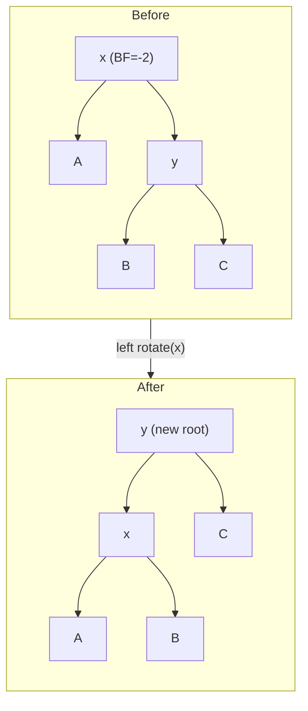

# AVL Trees

> **One-line summary**: AVL trees are the earliest self-balancing binary search trees, maintaining a balance factor of {−1, 0, +1} at every node through rotations to guarantee $O(\log n)$ worst-case operations.

## 🎯 Intuition
**The Core Idea:** Every node must have left and right subtrees of nearly equal height, enforced by rotations after each mutation.
**Analogy:** A self-balancing bookshelf — whenever one side gets too heavy (one extra book), the shelf automatically rearranges to keep both sides within one level of each other.
**Why It Matters:** When worst-case search time matters more than mutation cost — read-heavy workloads like in-memory dictionaries, symbol tables, and autocomplete indexes.

---

## ⚙️ Core Mechanics
### How It Works
Invented by Adelson-Velsky and Landis in **1962**, the AVL tree was the first data structure to guarantee logarithmic height. The local invariant: every node's **balance factor** — height(left) minus height(right) — must lie in {−1, 0, +1}. Whenever an insertion or deletion violates this, the tree is repaired by one or two **rotations**, each running in $O(1)$.

Each node stores or derives a balance factor or height, costing $O(1)$ extra space per node.

### Key Operations

| Operation | Time (worst) | Rotations (worst) | Notes |
|---|---|---|---|
| Search | $O(\log n)$ | 0 | Standard BST search |
| Insert | $O(\log n)$ | 1 (single or double) | Rebalance from inserted node upward |
| Delete | $O(\log n)$ | $O(\log n)$ | Rotations may cascade to root |
| Traversal | $O(n)$ | 0 | In-order yields sorted sequence |
| Height query | $O(1)$ | 0 | Stored or derived at each node |

### Pseudocode
```
SEARCH(node, key):
    if node is null: return NOT_FOUND
    if key < node.key: return SEARCH(node.left, key)
    if key > node.key: return SEARCH(node.right, key)
    return node

INSERT(node, key):
    1. Standard BST insert (recurse to leaf position)
    2. Update height of current node
    3. Compute balance factor = height(left) - height(right)
    4. If balance > 1 and key < node.left.key → RIGHT-ROTATE(node)
    5. If balance < -1 and key > node.right.key → LEFT-ROTATE(node)
    6. If balance > 1 and key > node.left.key → LEFT-ROTATE(left), then RIGHT-ROTATE(node)
    7. If balance < -1 and key < node.right.key → RIGHT-ROTATE(right), then LEFT-ROTATE(node)

LEFT-ROTATE(x):
    y = x.right
    x.right = y.left
    y.left = x
    update heights of x, y
    return y

RIGHT-ROTATE(y):
    x = y.left
    y.left = x.right
    x.right = y
    update heights of y, x
    return x

DELETE(node, key):
    1. Standard BST delete (successor swap for two-child case)
    2. Update height, compute balance factor
    3. Apply same rotation cases as insert
    4. Rotations may propagate up to root: O(log n) rotations worst case
```

### Key Facts
- First self-balancing BST; published by Adelson-Velsky and Landis in 1962.
- Balance factor at every node is in {−1, 0, +1}; violation triggers rotation.
- Four rotation types: left, right, left-right (double), right-left (double).
- Insertion requires at most one single or double rotation ($O(1)$ restructuring).
- Deletion may require $O(\log n)$ rotations in the worst case.
- Height is bounded by 1.44 log₂(n+2), tighter than red-black trees.
- Fibonacci trees are the sparsest (worst-case) AVL trees for a given height.
- Each node stores or derives a balance factor or height, costing $O(1)$ extra space per node.

---

## 🔬 Deep Dive
### Balance Proofs
The height of an AVL tree with *n* nodes satisfies h < 1.4405 log₂(n + 2) − 0.3277, meaning it is at most about 44% taller than a perfectly balanced binary tree. The **worst-case** (tallest) AVL trees for a given number of nodes are the **Fibonacci trees**, defined recursively: T₀ is empty, T₁ is a single node, and Tₕ has a root with Tₕ₋₁ and Tₕ₋₂ as subtrees. These trees contain F_{h+2} − 1 nodes (where F is the Fibonacci sequence), making the height bound tight.

### Rotations and Rebalancing
Four rotation cases arise:
- **Left rotation** — corrects a right-heavy imbalance (balance factor < −1, right child is right-heavy).
- **Right rotation** — corrects a left-heavy imbalance (balance factor > 1, left child is left-heavy).
- **Left-Right (double)** — left child is right-heavy: left-rotate the child, then right-rotate the node.
- **Right-Left (double)** — right child is left-heavy: right-rotate the child, then left-rotate the node.

**Figure:** AVL left rotation — corrects right-heavy imbalance at node x



After insertion, at most **one** single or double rotation suffices. After deletion, rotations may propagate up the tree, yielding up to $O(\log n)$ rotations in the worst case, though each is $O(1)$.

### Comparison with Other Trees

| Aspect | AVL | Red-Black | B-Tree | Splay |
|---|---|---|---|---|
| Height bound | 1.44 log₂ n | 2 log₂(n+1) | log_m n | amortised $O(\log n)$ |
| Rotations per insert | ≤ 1 | ≤ 2 | 0 (splits) | $O(\log n)$ amortised |
| Best for | Read-heavy | Mutation-heavy | Disk-based | Skewed access |

AVL trees offer the **tightest height guarantee** among practical BSTs, making them ideal when lookup latency must be minimised. Red-black trees are preferred when frequent insertions/deletions need fewer structural changes.

### Real-World Usage
- In-memory dictionaries and symbol tables in compilers.
- Embedded systems where worst-case latency is critical.
- The gateway structure for understanding balancing invariants and rotation mechanics that recur in [[Red-Black Trees]], [[B-Trees and B-Plus Trees]], and weight-balanced trees.
- The Fibonacci-tree connection beautifully links combinatorics to data-structure design.

---

## 🏋️ Practice
### Warm-Up (5 min)
1. Insert keys [10, 20, 30, 25, 28] into an empty AVL tree. Draw the tree after each insertion, showing rotations.
2. Given a tree with balance factors displayed, circle every node that violates the AVL property.
3. What is the minimum number of nodes in an AVL tree of height 5?

### Core Problems
1. **Validate AVL property** — Write a function that returns `true` if a binary tree satisfies both the BST invariant and the AVL balance condition. *(Hint: compute height bottom-up, check |balance| ≤ 1 at every node.)*
2. **Implement left rotation** — Given a node `x`, implement `leftRotate(x)` that returns the new subtree root with updated heights.

### Challenge
1. **Full AVL insert with rebalancing** — Implement `avlInsert(root, key)` that performs BST insertion followed by bottom-up balance-factor checks and the appropriate single or double rotation. Verify on the sequence [3, 2, 1, 4, 5, 6, 7].

---

*See also:* [[Binary Search Trees]] | [[Red-Black Trees]] | [[Splay Trees and Treaps]] | [[B-Trees and B-Plus Trees]] | [[Trees Overview]] | **CS Algorithms:** [[Binary Search]], [[Comparison Sort Lower Bound]]

## Supporting Chunks

- [[CS Data Structures/_chunks/chunk-ds-007 AVL trees guarantee height at most 1.44 log2 n|AVL trees guarantee height at most 1.44 log2 n]]
- [[CS Data Structures/_chunks/chunk-ds-064 AVL rotations restore balance in O1 time after insert|AVL rotations restore balance in O(1) time after insert]]
- [[CS Data Structures/_chunks/chunk-ds-142 AVL outperforms Red-Black for read-heavy workloads|AVL outperforms red-black for read-heavy workloads]]

## References

- [[CS Data Structures/Sources/Sources Index|Sources Index]]
