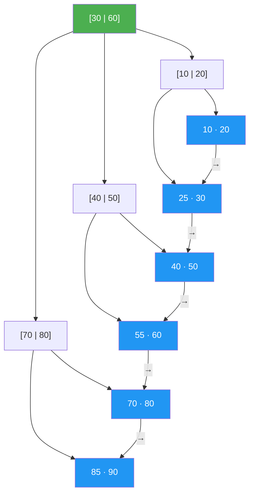

# B-Trees and B+ Trees

> **One-line summary**: B-trees and B+ trees are multi-way balanced search trees designed to minimise disk I/O by packing many keys per node, forming the backbone of database indexes and modern file systems.

## 🎯 Intuition
**The Core Idea:** Pack hundreds of keys into each node so the tree is only 3–4 levels deep, turning each level into exactly one disk read.
**Analogy:** A filing cabinet with overflow rules — each drawer (node) holds many folders (keys) sorted in order. When a drawer overflows, it splits in two and the middle folder is promoted to the cabinet's index; when it underflows, adjacent drawers merge.
**Why It Matters:** Every SQL `SELECT … WHERE id = ?` you've ever run almost certainly traversed a B+ tree. They are the single most impactful data structure in systems software — databases, file systems, and storage engines.

---

## ⚙️ Core Mechanics
### How It Works
A **B-tree of order *m*** has each internal node holding ⌈m/2⌉ − 1 to m − 1 keys and ⌈m/2⌉ to m children (the root may have as few as two). All leaves reside at the same depth — perfectly balanced by construction. By choosing m so that a single node fills one **disk page** (4–16 KB), each level of search costs exactly one disk read.

**Figure:** B+ tree — internal nodes hold routing keys, leaves hold data and are linked for range scans



**B+ trees** refine this with two modifications:
1. All data records reside **only in the leaves**; internal nodes store only routing keys.
2. Leaf nodes are linked in a **doubly linked list**, enabling efficient sequential access and range queries without revisiting internal nodes.

This separation yields higher internal fan-out (shallower trees) and is used by virtually all relational-database indexes (MySQL InnoDB, PostgreSQL, SQL Server) and file systems (NTFS, HFS+, Btrfs, ext4 via htree).

### Key Operations

| Operation | I/O (disk reads) | CPU time | Notes |
|---|---|---|---|
| Search | $O(log_m n)$ | $O(m · log_m n)$ | One disk read per level; binary search within node |
| Insert | $O(log_m n)$ | $O(m · log_m n)$ | May trigger split cascade |
| Delete | $O(log_m n)$ | $O(m · log_m n)$ | May trigger merge or redistribution |
| Range query (k results) | $O(log_m n + k/m)$ | $O(log_m n + k)$ | B+ leaf links enable sequential scan |
| Bulk load | $O(n / m)$ | $O(n)$ | Sort-then-build avoids random I/O |

### Pseudocode
```
B-TREE-SEARCH(node, key):
    i = 0
    while i < node.n and key > node.keys[i]: i++
    if i < node.n and key == node.keys[i]: return (node, i)
    if node.is_leaf: return NOT_FOUND
    DISK-READ(node.children[i])
    return B-TREE-SEARCH(node.children[i], key)

B-TREE-INSERT(tree, key):
    if root is full:
        new_root = allocate node
        new_root.children[0] = old_root
        SPLIT-CHILD(new_root, 0)
        tree.root = new_root
    INSERT-NONFULL(tree.root, key)

SPLIT-CHILD(parent, i):
    full_child = parent.children[i]
    new_node = allocate node
    move upper half of full_child's keys → new_node
    promote median key → parent.keys[i]
    parent.children[i+1] = new_node

DELETE(node, key):
    1. If key in leaf: remove directly; handle underflow via borrow or merge
    2. If key in internal node: replace with predecessor/successor from child, recurse
    3. Ensure child has ≥ ⌈m/2⌉ keys before descending (preemptive merge/borrow)
```

### Key Facts
- B-tree of order *m*: each node holds ⌈m/2⌉ − 1 to m − 1 keys; all leaves at same depth.
- Node size is chosen to match the disk page size, minimising I/O per search level.
- Height is $O(log_m n)$; with m = 1000, a billion keys need ≤ 3 levels.
- Insertion may cause node splits propagating upward; deletion may cause merges.
- B+ trees store data only in leaves and link leaves for efficient range scans.
- Higher internal fan-out in B+ trees yields shallower trees than equivalent B-trees.
- B+ trees are the default index structure in nearly all major RDBMS engines.
- File systems such as NTFS, HFS+, Btrfs, and ext4 (htree) use B-tree variants.

---

## 🔬 Deep Dive
### Balance Proofs
A B-tree storing *n* keys with order *m* has height at most log_{⌈m/2⌉}((n+1)/2). For practical values of m (hundreds to thousands), even billions of keys require only 3–4 levels. The tree is perfectly balanced by construction: all leaves are at the same depth, and the split/merge operations preserve this invariant.

### Rotations and Rebalancing
B-trees don't use rotations — they use **splits** and **merges**:
- **Split:** When a node exceeds m − 1 keys, it divides into two nodes and promotes the median key to the parent. This may cascade upward, potentially splitting the root and increasing tree height by one.
- **Merge:** When deletion causes underflow (fewer than ⌈m/2⌉ − 1 keys), the node borrows from a sibling or merges with an adjacent sibling, potentially cascading downward.
- **Redistribution:** Before merging, attempt to borrow a key from a sibling through the parent.

### Comparison with Other Trees

| Aspect | B-Tree / B+ Tree | AVL / Red-Black | Splay |
|---|---|---|---|
| Optimised for | Disk I/O | In-memory | Skewed access |
| Fan-out | High (hundreds) | 2 | 2 |
| Height for 10⁹ keys | 3–4 | ~30 | amortised ~30 |
| Range queries | Excellent (leaf links in B+) | $O(n)$ traversal | $O(n)$ traversal |

### Real-World Usage
- **Database indexes:** MySQL InnoDB, PostgreSQL, SQL Server, Oracle all use B+ tree variants for primary and secondary indexes.
- **File systems:** NTFS, HFS+, Btrfs, ext4 (htree for directory indexing).
- **Write-optimised descendants:** The B+ tree's leaf-linked architecture provides the conceptual basis for **LSM trees** and **fractal-tree indexes** (TokuDB) used in write-heavy workloads.
- **External sorting:** B-trees connect to [[External Sorting]] via the I/O model — both optimise for sequential disk access.

---

## 🏋️ Practice
### Warm-Up (5 min)
1. For a B-tree of order 5, what are the minimum and maximum number of keys per internal node?
2. Why do B+ trees outperform B-trees for range queries? Explain in one sentence.
3. If a B-tree has order 1001 and height 3, what is the maximum number of keys it can store?

### Core Problems
1. **B-tree search** — Trace a search for key 42 in a B-tree of order 4 with the following root keys: [20, 40, 60]. Show which child pointer you follow and what comparisons you make at each level.
2. **B-tree insertion with splits** — Insert keys [10, 20, 30, 40, 50, 60, 70] into an initially empty B-tree of order 3. Draw the tree after each split.

### Challenge
1. **Implement B-tree node split** — Write a function `splitChild(parent, i)` that splits the full child `parent.children[i]` into two nodes, promotes the median key, and updates the parent's key and child arrays. Handle the edge case where the parent itself becomes full.

---

*See also:* [[Binary Search Trees]] | [[Red-Black Trees]] | [[AVL Trees]] | [[Heaps and Priority Queues Overview]] | [[Trees Overview]] | **CS Algorithms:** [[Binary Search]], [[External Sorting]]

## Supporting Chunks

- [[CS Data Structures/_chunks/chunk-ds-009 B-trees minimize disk IO by matching node size to pages|B-trees minimize disk I/O by matching node size to pages]]
- [[CS Data Structures/_chunks/chunk-ds-065 B-plus trees link leaves for Ok range scans|B+ trees link leaves for efficient range scans]]
- [[CS Data Structures/_chunks/chunk-ds-086 B-tree node splitting propagates upward at most Ologn|B-tree node splitting propagates upward at most O(log n) levels]]
- [[CS Data Structures/_chunks/chunk-ds-143 B-tree minimum fill factor bounds space waste|B-tree minimum fill factor bounds space waste]]

## References

- [[CS Data Structures/Sources/Sources Index|Sources Index]]
