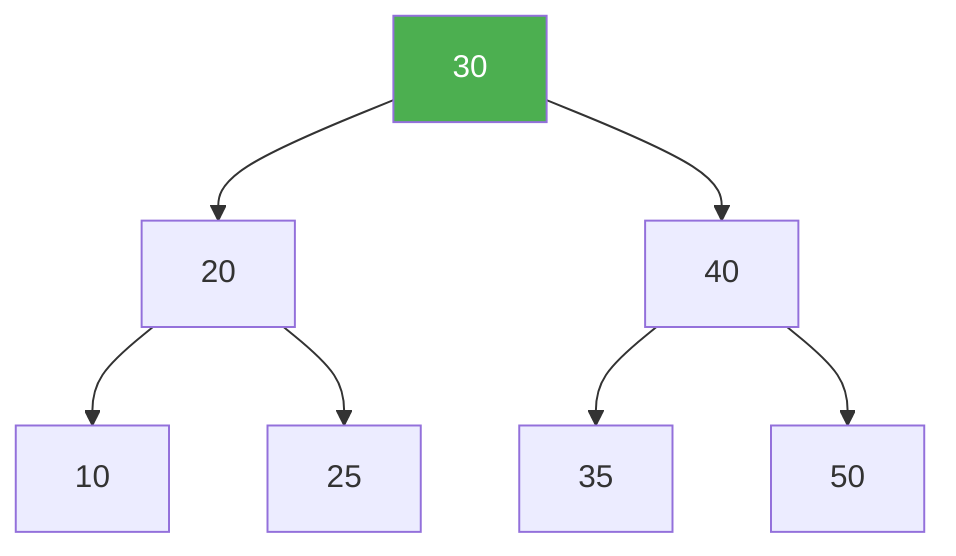

# Binary Search Trees

> **One-line summary**: A binary search tree is a binary tree that maintains the invariant that every node's key is greater than all keys in its left subtree and less than all keys in its right subtree, enabling efficient ordered dictionary operations.

## 🎯 Intuition
**The Core Idea:** At every node, smaller keys go left, larger keys go right — enabling binary search by following one path down the tree.
**Analogy:** A dictionary or phone book — you open to the middle, decide whether your word comes before or after, and repeat on the correct half. The BST is this process made into a data structure.
**Why It Matters:** BSTs are the conceptual kernel of every ordered associative container (maps, sets, databases). Understanding their weakness (degenerate $O(n)$ case) motivates the entire family of balanced trees.

---

## ⚙️ Core Mechanics
### How It Works
The **BST invariant**: for any node with key *k*, every key in the left subtree is less than *k* and every key in the right subtree is greater than *k*. This enables search by structural recursion — at each node, one subtree is eliminated, achieving $O(h)$ time where h is the tree's height.

When keys are inserted in random order, the expected height is $O(\log n)$. Without rebalancing, sorted or nearly sorted input produces a **degenerate tree** of height n − 1, degrading all operations to $O(n)$.

**Figure:** BST invariant — left subtree keys < node < right subtree keys



**Deletion** has three cases:
- **Leaf:** remove directly.
- **One child:** splice the child into the parent's link.
- **Two children:** find the **in-order successor** (smallest in right subtree), copy its key into the target, then recursively delete the successor.

### Key Operations

| Operation | Average | Worst | Notes |
|---|---|---|---|
| Search | $O(\log n)$ | $O(n)$ | Worst when tree is degenerate |
| Insert | $O(\log n)$ | $O(n)$ | New node always becomes a leaf |
| Delete | $O(\log n)$ | $O(n)$ | Two-child case uses successor swap |
| In-order traversal | $O(n)$ | $O(n)$ | Produces sorted sequence |
| Minimum / Maximum | $O(\log n)$ | $O(n)$ | Walk leftmost / rightmost path |
| Successor / Predecessor | $O(\log n)$ | $O(n)$ | Used in deletion and range queries |

### Pseudocode
```
SEARCH(node, key):
    if node is null: return NOT_FOUND
    if key == node.key: return node
    if key < node.key: return SEARCH(node.left, key)
    return SEARCH(node.right, key)

INSERT(node, key):
    if node is null: return new Node(key)
    if key < node.key: node.left = INSERT(node.left, key)
    else if key > node.key: node.right = INSERT(node.right, key)
    return node

DELETE(node, key):
    if node is null: return null
    if key < node.key: node.left = DELETE(node.left, key)
    else if key > node.key: node.right = DELETE(node.right, key)
    else:
        if node.left is null: return node.right    // 0 or 1 child
        if node.right is null: return node.left     // 1 child
        successor = MINIMUM(node.right)             // 2 children
        node.key = successor.key
        node.right = DELETE(node.right, successor.key)
    return node

MINIMUM(node):
    while node.left is not null: node = node.left
    return node
```

### Key Facts
- The BST property enables binary search: search, insert, and delete run in $O(h)$ time.
- Average-case height for *n* random insertions is $O(\log n)$; worst case is $O(n)$.
- In-order traversal of a BST yields keys in sorted order in $O(n)$ time.
- Deletion of a two-child node uses the in-order successor (smallest key in the right subtree).
- Building a BST by sequential insertion mirrors quicksort's partitioning behaviour.
- The minimum key resides at the leftmost node; the maximum at the rightmost.
- Without rebalancing, sorted or nearly sorted input produces a degenerate tree of height n − 1.
- Rank and select operations can be supported in $O(h)$ with augmented subtree sizes.

---

## 🔬 Deep Dive
### Balance Proofs
The expected height of a randomly built BST on *n* keys is $O(\log n)$ — specifically, approximately 2.99 ln n ≈ 4.31 log₂ n. This follows from the same recurrence as quicksort's expected comparisons. The worst-case height is n − 1 (a degenerate chain), which occurs when keys are inserted in sorted order. This motivates self-balancing variants.

### Rotations and Rebalancing
Plain BSTs have **no rotations** — that's precisely the problem. The BST-to-quicksort correspondence is key: the first inserted key acts as the pivot, partitioning remaining keys into left and right subtrees. Thus:
- Random insertion order → balanced tree (expected $O(\log n)$ height).
- Sorted insertion order → degenerate tree ($O(n)$ height).
- This correspondence means randomised quicksort and expected BST depth share the same $O(n \log n)$ analysis.

### Comparison with Other Trees

| Aspect | Plain BST | AVL | Red-Black | B-Tree |
|---|---|---|---|---|
| Height guarantee | None ($O(n)$) | 1.44 log₂ n | 2 log₂(n+1) | log_m n |
| Insert complexity | $O(h)$ | $O(\log n)$ | $O(\log n)$ | $O(log_m n)$ |
| Implementation | Simplest | Moderate | Complex | Complex |
| Best for | Teaching, random data | Read-heavy | Mutation-heavy | Disk-based |

### Real-World Usage
- BSTs are the **foundation** for all ordered containers — [[AVL Trees]], [[Red-Black Trees]], [[Splay Trees and Treaps]] all extend the BST structure.
- Augmented BSTs underpin **order-statistic trees**, **interval trees**, and **range trees** used in computational geometry and database indexing.
- The quicksort correspondence provides deep insight into randomised algorithms: [[Binary Search]] is the static analogue of BST search.

---

## 🏋️ Practice
### Warm-Up (5 min)
1. Draw the BST that results from inserting [5, 3, 7, 1, 4, 6, 8] into an empty tree.
2. What sequence of insertions produces a degenerate (linked-list) BST of height 6?
3. Perform an in-order traversal of your tree from question 1. Verify the output is sorted.

### Core Problems
1. **Validate BST** — Write a function `isValidBST(root)` that returns `true` if the tree satisfies the BST invariant. *(Hint: pass min/max bounds recursively, or verify in-order traversal is strictly increasing.)*
2. **Kth smallest element** — Given a BST, find the kth smallest element in $O(h + k)$ time using in-order traversal with early termination.

### Challenge
1. **BST to sorted doubly linked list** — Convert a BST into a sorted circular doubly linked list in-place (no new nodes). This is a classic interview problem that tests deep understanding of in-order traversal and pointer manipulation.

---

*See also:* [[Binary Trees and Traversals]] | [[AVL Trees]] | [[Red-Black Trees]] | [[Splay Trees and Treaps]] | [[Trees Overview]] | **CS Algorithms:** [[Binary Search]], [[Comparison Sort Lower Bound]]

## Supporting Chunks

- [[CS Data Structures/_chunks/chunk-ds-006 BST in-order traversal yields sorted output|BST in-order traversal yields sorted output]]
- [[CS Data Structures/_chunks/chunk-ds-063 BST degenerates to linked list with sorted input|BST degenerates to a linked list with sorted input]]
- [[CS Data Structures/_chunks/chunk-ds-084 BST delete with two children uses inorder successor|BST delete with two children uses the inorder successor]]
- [[CS Data Structures/_chunks/chunk-ds-123 BST iterator uses Oh space stack for in-order traversal|BST iterator uses O(h) stack space for in-order traversal]]

## References

- [[CS Data Structures/Sources/Sources Index|Sources Index]]
