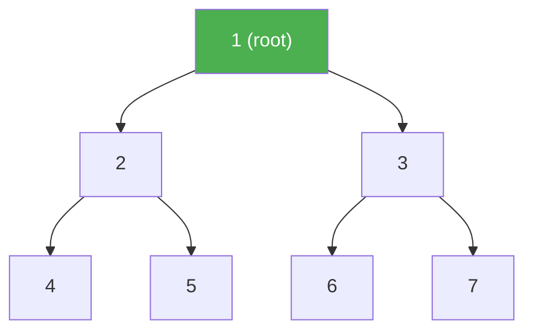

# Binary Trees and Traversals

> **One-line summary**: Binary trees are rooted trees in which every node has at most two children, and their traversal algorithms form the foundation for nearly every recursive tree operation in computer science.

## 🎯 Intuition
**The Core Idea:** Every node has at most two children (left and right), and every algorithm on the tree reduces to "process left, process right, process self" in some order.
**Analogy:** A family tree where each person has at most two children — to visit everyone, you choose an order: visit yourself first (pre-order), visit children first then yourself (post-order), or left child → yourself → right child (in-order).
**Why It Matters:** Binary trees and traversals are prerequisite knowledge for virtually every advanced tree structure — BSTs, AVL, red-black, heaps, segment trees, and tries all inherit this recursive decomposition.

---

## ⚙️ Core Mechanics
### How It Works
A **binary tree** is defined recursively: either empty, or a root node with a left and right subtree (each a binary tree). Key shapes:
- **Full** (strictly binary): every node has 0 or 2 children.
- **Complete**: every level filled except possibly the last, which is filled left to right (used by binary heaps).
- **Perfect**: both full and complete — exactly $2^{h+1}$ − 1 nodes at height h.

Structural properties:
- **Depth** of a node = distance from root; **height** = maximum depth.
- Height bounds: at least ⌊log₂ n⌋, at most n − 1.
- Number of structurally distinct binary trees on n nodes = **Catalan number** Cₙ = (1/(n+1)) · C(2n, n).

**Figure:** Binary tree structure — each node has at most two children (left and right)



**Four traversal orderings:**
- **In-order** (left, root, right): yields sorted output for BSTs.
- **Pre-order** (root, left, right): serialization that can reconstruct the tree.
- **Post-order** (left, right, root): evaluates expression trees.
- **Level-order** (BFS): visits top-to-bottom, left-to-right via a queue.

### Key Operations

| Operation | Time | Space | Notes |
|---|---|---|---|
| Recursive in-order | $O(n)$ | $O(h)$ | h = height; $O(\log n)$ balanced, $O(n)$ worst |
| Recursive pre-order | $O(n)$ | $O(h)$ | Same stack depth as in-order |
| Recursive post-order | $O(n)$ | $O(h)$ | Useful for deletion, expression eval |
| Level-order (BFS) | $O(n)$ | $O(w)$ | w = max width ≤ n/2 for complete tree |
| Morris in-order | $O(n)$ | $O(1)$ | Temporarily modifies tree pointers |
| Count distinct trees | $O(n)$ | $O(1)$ | Via Catalan number formula |

### Pseudocode
```
IN-ORDER(node):
    if node is null: return
    IN-ORDER(node.left)
    visit(node)
    IN-ORDER(node.right)

PRE-ORDER(node):
    if node is null: return
    visit(node)
    PRE-ORDER(node.left)
    PRE-ORDER(node.right)

POST-ORDER(node):
    if node is null: return
    POST-ORDER(node.left)
    POST-ORDER(node.right)
    visit(node)

LEVEL-ORDER(root):
    queue = [root]
    while queue is not empty:
        node = queue.dequeue()
        visit(node)
        if node.left: queue.enqueue(node.left)
        if node.right: queue.enqueue(node.right)

MORRIS-IN-ORDER(root):
    current = root
    while current is not null:
        if current.left is null:
            visit(current)
            current = current.right
        else:
            predecessor = current.left
            while predecessor.right ≠ null and predecessor.right ≠ current:
                predecessor = predecessor.right
            if predecessor.right is null:
                predecessor.right = current   // create thread
                current = current.left
            else:
                predecessor.right = null      // remove thread
                visit(current)
                current = current.right
```

### Key Facts
- Every binary tree with *n* internal nodes has exactly *n + 1* null (external) links.
- A complete binary tree of *n* nodes has height ⌊log₂ n⌋.
- The number of distinct binary trees on *n* nodes is the Catalan number Cₙ.
- In-order traversal of a BST produces keys in sorted order.
- Pre-order + in-order (or post-order + in-order) uniquely determine a binary tree's structure.
- Morris traversal uses $O(1)$ extra space by creating and then removing temporary threaded links.
- A full binary tree with *k* internal nodes has exactly *k + 1* leaves.
- Level-order traversal requires $O(w)$ space, where w is the maximum width of the tree.

---

## 🔬 Deep Dive
### Balance Proofs
For any binary tree with *n* nodes:
- **Minimum height** = ⌊log₂ n⌋ (achieved by complete/perfect trees).
- **Maximum height** = n − 1 (degenerate chain).
- The number of structurally distinct trees grows as $\Theta(4ⁿ / n^(3/2)$), from the Catalan number asymptotics — a result with deep connections to combinatorics and formal languages.

### Rotations and Rebalancing
Plain binary trees have no balancing. The **Morris traversal** is the key advanced technique here:
- Temporarily threads the tree by setting right-null pointers of in-order predecessors to their successors.
- Achieves $O(1)$ auxiliary space by using the tree's own null pointers as bookkeeping.
- Each edge is traversed at most twice (once to create the thread, once to remove it), maintaining $O(n)$ total time.

### Comparison with Other Trees

| Aspect | Binary Tree | BST | Heap (complete BT) | Trie |
|---|---|---|---|---|
| Ordering | None required | Left < Root < Right | Parent ≤ Children | Prefix-based |
| Shape constraint | None | None | Complete | Branching by char |
| Primary use | Structure | Search | Priority queue | String lookup |

### Real-World Usage
- **Compiler design:** AST (Abstract Syntax Tree) walking uses pre-order and post-order traversals.
- **Expression evaluation:** post-order traversal naturally evaluates expression trees.
- **Serialization:** pre-order serialization can reconstruct binary trees; used in file formats and network protocols.
- **Cache-oblivious algorithms:** understanding traversal space complexity prepares the ground for cache-efficient tree layouts.

---

## 🏋️ Practice
### Warm-Up (5 min)
1. Given a binary tree, write out its in-order, pre-order, and post-order traversals.
2. How many structurally distinct binary trees exist with 4 nodes? *(Hint: C₄ = ?)*
3. A complete binary tree has 15 nodes. What is its height?

### Core Problems
1. **Reconstruct from traversals** — Given pre-order [1, 2, 4, 5, 3, 6, 7] and in-order [4, 2, 5, 1, 6, 3, 7], reconstruct the binary tree. *(Hint: pre-order[0] is always the root; find it in in-order to split left/right.)*
2. **Level-order zigzag** — Print a binary tree level by level, alternating left-to-right and right-to-left. *(Uses BFS with a direction flag.)*

### Challenge
1. **Implement Morris in-order traversal** — Write a function that performs in-order traversal of a binary tree using $O(1)$ extra space (no stack, no recursion). Verify it produces the same output as recursive in-order and leaves the tree unmodified.

---

*See also:* [[Binary Search Trees]] | [[AVL Trees]] | [[Binary Heaps]] | [[Splay Trees and Treaps]] | [[Trees Overview]] | **CS Algorithms:** [[Binary Search]], [[Comparison Sort Lower Bound]]

## Supporting Chunks

- [[CS Data Structures/_chunks/chunk-ds-138 Succinct trees need only 2n bits for n nodes|Binary-tree Catalan counts support succinct tree bounds]]
- Source gap: no traversal-specific chunk has been extracted yet; traversal mechanics are currently backed by the domain [[CS Data Structures/Sources/Sources Index|Sources Index]].

## References

- [[CS Data Structures/Sources/Sources Index|Sources Index]]
