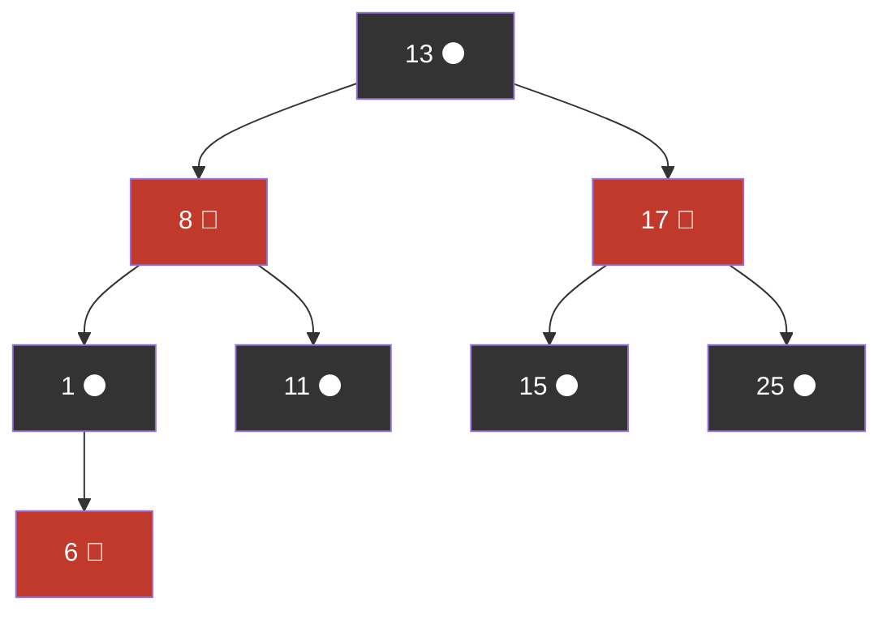

# Red-Black Trees

> **One-line summary**: Red-black trees are self-balancing binary search trees that enforce five colour-based properties to guarantee $O(\log n)$ operations with at most two rotations per insertion and three per deletion.

## 🎯 Intuition
**The Core Idea:** Colour each node red or black following five simple rules, and the tree automatically stays balanced enough that no path is more than twice as long as any other.
**Analogy:** Traffic light rules for tree balance — red means "caution, don't stack two in a row"; black means "solid, counts toward path length." The rules ensure every route through the tree passes the same number of black "checkpoints."
**Why It Matters:** Red-black trees power Java's `TreeMap`, C++'s `std::map`, and the Linux kernel scheduler. They offer the best mutation-to-balance trade-off: constant rotations per operation, making them ideal for concurrent and persistent data structures.

---

## ⚙️ Core Mechanics
### How It Works
Every node carries a one-bit colour attribute — red or black — and the tree satisfies five invariants:
1. Every node is red or black.
2. The root is black.
3. Every null leaf (NIL sentinel) is black.
4. A red node's children are both black (no two consecutive reds).
5. Every path from a node to its descendant NILs has the same number of black nodes (**black-height**).

**Figure:** Red-black tree — black nodes (dark) and red nodes (light) maintain balanced black-height



These guarantee the longest path is at most twice the shortest, yielding height ≤ 2 log₂(n + 1).

**Insertion:** Insert as red (preserves black-height). If red-red violation occurs, fix with recolouring and at most **2 rotations**.

**Deletion:** Removing a black node may violate property 5. Fix-up uses recolouring and at most **3 rotations**, with each case moving the problem toward the root.

### Key Operations

| Operation | Time (worst) | Rotations (worst) | Notes |
|---|---|---|---|
| Search | $O(\log n)$ | 0 | Standard BST search; height ≤ 2 log₂(n+1) |
| Insert | $O(\log n)$ | 2 | New red node; fix-up recolours + rotates |
| Delete | $O(\log n)$ | 3 | Black removal triggers fix-up cascade |
| Traversal | $O(n)$ | 0 | In-order yields sorted sequence |
| Minimum / Maximum | $O(\log n)$ | 0 | Walk leftmost / rightmost path |

### Pseudocode
```
RB-INSERT(tree, key):
    node = BST-INSERT(tree, key)
    node.color = RED
    RB-INSERT-FIXUP(tree, node)

RB-INSERT-FIXUP(tree, z):
    while z.parent.color == RED:
        if z.parent == z.grandparent.left:
            uncle = z.grandparent.right
            if uncle.color == RED:              // Case 1: recolour
                z.parent.color = BLACK
                uncle.color = BLACK
                z.grandparent.color = RED
                z = z.grandparent
            else:
                if z == z.parent.right:         // Case 2: left-rotate
                    z = z.parent
                    LEFT-ROTATE(tree, z)
                z.parent.color = BLACK           // Case 3: right-rotate
                z.grandparent.color = RED
                RIGHT-ROTATE(tree, z.grandparent)
        else: (symmetric for right side)
    tree.root.color = BLACK

RB-DELETE(tree, key):
    1. Standard BST delete with transplant
    2. If deleted/moved node was BLACK: RB-DELETE-FIXUP

RB-DELETE-FIXUP(tree, x):
    while x ≠ root and x.color == BLACK:
        (4 cases involving sibling colour and sibling's children colours)
        Each case: recolour or rotate, advancing toward root
    x.color = BLACK
```

### Key Facts
- Five properties (node colour, root black, NIL black, no red-red, equal black-height) define the invariant.
- Height is bounded by 2 log₂(n + 1), roughly 2× optimal.
- Insertion requires at most 2 rotations; deletion requires at most 3 rotations.
- Recolouring may propagate $O(\log n)$ levels, but rotations are $O(1)$ each.
- Isomorphic to 2-3-4 trees; left-leaning variant corresponds to 2-3 trees.
- Used in Java TreeMap, C++ std::map/std::set, Linux CFS, and many OS kernels.
- Compared to AVL, red-black trees have a looser height bound but fewer rotations on mutation.

---

## 🔬 Deep Dive
### Balance Proofs
The five invariants guarantee height ≤ 2 log₂(n + 1). Proof sketch:
- The **black-height** bh of the root satisfies: the subtree rooted at any node contains at least $2^{bh}$ − 1 internal nodes.
- Since at least half the nodes on any root-to-leaf path are black (no consecutive reds), bh ≥ h/2.
- Therefore n ≥ $2^{h/2}$ − 1, giving h ≤ 2 log₂(n + 1).

This is looser than AVL's 1.44 log₂ n bound, but the **constant rotation bound** per operation compensates in mutation-heavy workloads.

### Rotations and Rebalancing
**Insertion fix-up** has three cases (mirrored for left/right):
- **Case 1 (uncle is red):** Recolour parent and uncle black, grandparent red. Move up.
- **Case 2 (uncle is black, zig-zag):** Rotate to convert to Case 3.
- **Case 3 (uncle is black, zig-zig):** Rotate grandparent and recolour. Done.

**Deletion fix-up** has four cases per side, involving sibling colour and sibling's children colours. The key insight: each case either terminates or moves the "double-black" deficit one level closer to the root.

**2-3-4 tree isomorphism:** A black node with 0 red children → 2-node; 1 red child → 3-node; 2 red children → 4-node. This maps every RB operation to a 2-3-4 operation, providing an elegant correctness proof.

### Comparison with Other Trees

| Aspect | Red-Black | AVL | B-Tree | Splay |
|---|---|---|---|---|
| Height bound | 2 log₂(n+1) | 1.44 log₂ n | log_m n | amortised $O(\log n)$ |
| Rotations per insert | ≤ 2 | ≤ 1 | 0 (splits) | $O(\log n)$ amortised |
| Rotations per delete | ≤ 3 | $O(\log n)$ | 0 (merges) | $O(\log n)$ amortised |
| Best for | Mutation-heavy, libraries | Read-heavy | Disk-based | Skewed access |

### Real-World Usage
- **Java:** `TreeMap`, `TreeSet` — red-black tree implementation.
- **C++ STL:** `std::map`, `std::set`, `std::multimap`, `std::multiset`.
- **Linux kernel:** Completely Fair Scheduler (CFS) uses an RB tree to track process virtual runtimes.
- **Concurrent structures:** The constant rotation bound minimises lock contention; persistent RB trees minimise copy cost in functional settings.
- The 2-3-4 tree isomorphism bridges theory (multi-way balanced trees) and practice (binary trees with colour bits).

---

## 🏋️ Practice
### Warm-Up (5 min)
1. State the five red-black tree properties from memory.
2. Given a red-black tree, verify that every root-to-NIL path has the same black-height.
3. What colour must a newly inserted node be, and why?

### Core Problems
1. **Insert and fix up** — Insert keys [7, 3, 18, 10, 22, 8, 11, 26] into an empty red-black tree. Draw the tree after each fix-up, labelling colours.
2. **Implement left rotation** — Write `leftRotate(tree, x)` that performs a left rotation around node x, updating parent pointers and the tree root if necessary.

### Challenge
1. **Red-black deletion fix-up** — Implement the full `rbDeleteFixup(tree, x)` procedure handling all four cases per side. Test by deleting nodes from the tree built in Core Problem 1 and verifying all five properties still hold.

---

*See also:* [[Binary Search Trees]] | [[AVL Trees]] | [[B-Trees and B-Plus Trees]] | [[Splay Trees and Treaps]] | [[Trees Overview]] | **CS Algorithms:** [[Binary Search]], [[Comparison Sort Lower Bound]]

## Supporting Chunks / References

*Pending chunk extraction.*

→ Sources Index
