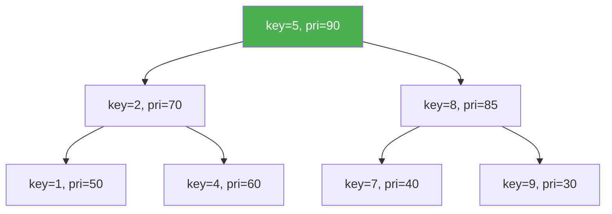

# Splay Trees and Treaps

> **One-line summary**: Splay trees are self-adjusting BSTs that move every accessed node to the root via zig, zig-zig, and zig-zag splaying steps, while treaps combine BST key ordering with random heap priorities to achieve expected logarithmic depth without explicit rotations.

## 🎯 Intuition
**The Core Idea:** Splay trees are "recently-used caches" as trees — whatever you just looked up floats to the top. Treaps are "random BSTs on demand" — random priorities keep the tree balanced without any explicit balancing logic.
**Analogy:** **Splay** = a recently-used cache or a deck of cards where the last card you drew goes to the top. **Treap** = a BST where each node also has a random lottery number, and nodes with higher lottery numbers rise to the top (heap property), keeping the tree randomly balanced.
**Why It Matters:** Splay trees excel when access patterns are skewed (80/20 rule) — hot items stay near the root. Treaps offer clean $O(\log n)$ expected performance with trivially simple split/merge, making them a favorite in competitive programming.

---

## ⚙️ Core Mechanics
### How It Works
**Splay trees** (Sleator & Tarjan, 1985): restructure on every access by moving the accessed node to the root via **splaying**. Three cases:
- **Zig:** target is child of root → single rotation.
- **Zig-zig:** target and parent lean same direction → rotate grandparent first, then parent (this order is critical for the amortised bound).
- **Zig-zag:** target and parent lean opposite directions → double rotation (identical to AVL double rotation).

No per-node balance metadata is stored. Despite individual operations costing $O(n)$ on degenerate trees, amortised cost per operation is $O(\log n)$.

**Figure:** Treap — BST ordering on keys (horizontal) with heap ordering on random priorities (vertical)



**Treaps** (Aragon & Seidel, 1989): each node has a key (BST order) and a **random priority** (heap order). The unique treap for a given set of key-priority pairs equals the BST from inserting keys in decreasing priority order. Because priorities are random, expected depth is $O(\log n)$.
- **Insert:** BST insert at leaf, then rotate upward until heap property holds.
- **Delete:** rotate target downward until it becomes a leaf, then remove.

### Key Operations

| Operation | Splay (amortised) | Treap (expected) | Notes |
|---|---|---|---|
| Search | $O(\log n)$ | $O(\log n)$ | Splay moves node to root |
| Insert | $O(\log n)$ | $O(\log n)$ | Treap rotates up to fix heap order |
| Delete | $O(\log n)$ | $O(\log n)$ | Treap rotates down to leaf |
| Split | $O(\log n)$ | $O(\log n)$ | Splay the split key; treap split by key |
| Merge / Join | $O(\log n)$ | $O(\log n)$ | Treap merge assumes disjoint key ranges |
| Finger search | $O(\log d)$ | — | d = rank distance; splay variant |

### Pseudocode
```
SPLAY(tree, key):
    while key ≠ root.key:
        if parent(x) == root:
            ZIG(x)                              // single rotation
        else if x and parent(x) lean same way:
            ZIG-ZIG(x)                          // rotate grandparent, then parent
        else:
            ZIG-ZAG(x)                          // rotate parent, then grandparent

SPLAY-SEARCH(tree, key):
    node = BST-SEARCH(tree.root, key)
    SPLAY(tree, node)
    return tree.root

SPLAY-INSERT(tree, key):
    BST-INSERT(tree, key)
    SPLAY(tree, key)

TREAP-INSERT(tree, key):
    node = new Node(key, random_priority())
    BST-INSERT(tree, node)
    while node.parent ≠ null and node.priority > node.parent.priority:
        if node == node.parent.left:
            RIGHT-ROTATE(node.parent)
        else:
            LEFT-ROTATE(node.parent)

TREAP-SPLIT(node, key):
    // Returns (left_treap, right_treap) split by key
    if node is null: return (null, null)
    if key < node.key:
        (L, R) = TREAP-SPLIT(node.left, key)
        node.left = R
        return (L, node)
    else:
        (L, R) = TREAP-SPLIT(node.right, key)
        node.right = L
        return (node, R)

TREAP-MERGE(left, right):
    // Merge two treaps where all keys in left < all keys in right
    if left is null: return right
    if right is null: return left
    if left.priority > right.priority:
        left.right = TREAP-MERGE(left.right, right)
        return left
    else:
        right.left = TREAP-MERGE(left, right.left)
        return right
```

### Key Facts
- Splay trees use three restructuring cases: zig, zig-zig, and zig-zag.
- Amortised cost per operation is $O(\log n)$; no balance metadata is stored.
- The working-set property gives faster access to recently accessed items.
- Splay trees achieve the dynamic optimality conjecture within an $O(\log \log n)$ factor (Tango trees).
- Treaps combine BST ordering on keys with heap ordering on random priorities.
- Expected depth in a treap is $O(\log n)$, matching a random BST.
- Treap insert rotates up; treap delete rotates down to a leaf.
- Treaps support efficient split and merge, enabling use as implicit balanced sequences.

---

## 🔬 Deep Dive
### Balance Proofs
**Splay trees:** The amortised $O(\log n)$ bound is proved via a potential function Φ = Σ log(size(x)) over all nodes x. Each splay step pays for the rotation cost plus the potential change. The zig-zig case is critical — rotating the grandparent first (rather than the parent) is what makes the potential argument work. Without this order, naive move-to-root has $\Theta(n)$ amortised cost.

**Treaps:** Since random priorities induce the same distribution as a randomly built BST, the expected depth of any node is $O(\log n)$. More precisely, the expected depth of the node with rank k is $O(\log min(k, n−k+1)$), giving a natural finger-search property.

### Rotations and Rebalancing
**Splay rotations:**
- **Zig** (single): one rotation when target is child of root.
- **Zig-zig** (same direction): rotate grandparent first, then parent. This "straightens" the path and is essential — distinguishes splaying from naive move-to-root.
- **Zig-zag** (opposite directions): rotate parent then grandparent (identical to AVL double rotation).

**Treap rotations:**
- Insert: rotate the new node upward (left or right rotation depending on which child it is) until heap property is satisfied.
- Delete: rotate the target downward (choosing the child with higher priority) until it becomes a leaf.
- Split/merge: elegant recursive operations that decompose/compose treaps along a key boundary.

### Comparison with Other Trees

| Aspect | Splay | Treap | AVL | Red-Black |
|---|---|---|---|---|
| Balance guarantee | Amortised $O(\log n)$ | Expected $O(\log n)$ | Worst-case 1.44 log₂ n | Worst-case 2 log₂(n+1) |
| Extra storage | None | Priority per node | Height/BF per node | Colour bit per node |
| Adaptive to access pattern | Yes (working-set) | No | No | No |
| Implementation complexity | Simple | Simple | Moderate | Complex |

### Real-World Usage
- **Splay trees:** Windows NT virtual memory manager; network routing with skewed access patterns; caches and memory allocators where hot items should be fast.
- **Treaps:** Popular in competitive programming for their clean split/merge interface; building blocks for persistent and parallel data structures; implicit treaps serve as balanced sequence containers.
- **Dynamic optimality:** Splay trees are conjectured to be dynamically optimal (matching the best possible BST for any access sequence). Tango trees achieve $O(\log \log n)$-competitive ratio, and splay trees are believed to achieve $O(1)$.

---

## 🏋️ Practice
### Warm-Up (5 min)
1. Splay the node with key 3 in a BST containing [1, 2, 3, 4, 5] (degenerate right chain). Draw each zig-zig and zig step.
2. Given keys [5, 2, 8, 1, 4] with priorities [90, 70, 85, 50, 60], draw the resulting treap.
3. Why is the zig-zig rotation order (grandparent first) critical for splay tree performance?

### Core Problems
1. **Implement splay** — Write a `splay(tree, key)` function that performs the three splay cases (zig, zig-zig, zig-zag) and moves the target node to the root.
2. **Treap split and merge** — Implement `split(node, key)` and `merge(left, right)` for a treap. Use them to implement insert and delete.

### Challenge
1. **Implicit treap as a sequence** — Implement an implicit treap (using subtree sizes as implicit keys instead of explicit keys) that supports $O(\log n)$ insert-at-position, delete-at-position, and range-reverse operations. This is a powerful competitive-programming tool.

---

*See also:* [[Binary Search Trees]] | [[AVL Trees]] | [[Red-Black Trees]] | [[Binary Heaps]] | [[Trees Overview]] | **CS Algorithms:** [[Binary Search]], [[Comparison Sort Lower Bound]]

## Supporting Chunks

- [[CS Data Structures/_chunks/chunk-ds-077 Splay trees achieve Ologn amortized via splaying|Splay trees achieve O(log n) amortized operations via splaying]]
- [[CS Data Structures/_chunks/chunk-ds-147 Splay zig-zig differentiates from naive move-to-root|Splay zig-zig differentiates splaying from naive move-to-root]]
- [[CS Data Structures/_chunks/chunk-ds-028 Treaps combine BST and heap properties with random priorities|Treaps combine BST and heap properties with random priorities]]
- [[CS Data Structures/_chunks/chunk-ds-129 Treap split and merge enable persistent BST operations|Treap split and merge enable persistent BST operations]]
- [[CS Data Structures/_chunks/chunk-ds-029 Implicit treaps enable array operations in Ologn|Implicit treaps enable array operations in O(log n) expected time]]

## References

- [[CS Data Structures/Sources/Sources Index|Sources Index]]
