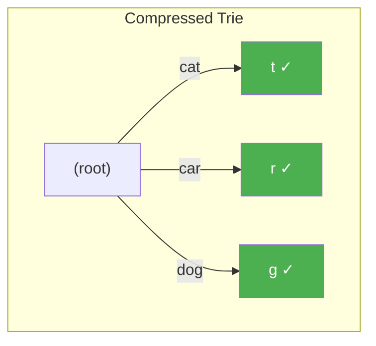

# Compressed Tries and Radix Trees

> **One-line summary**: A compressed trie (radix tree) collapses chains of single-child nodes into individual edges labeled with multi-character strings, guaranteeing $O(n)$ nodes for n stored keys while preserving $O(m)$ lookup time.

## 🎯 Intuition
**The Core Idea:** Keep branching points as nodes, and compress every non-branching run into one edge label.
**Analogy:** Like an autocomplete dropdown that skips ahead — instead of showing 't', 'th', 'the', it jumps straight to 'the' because there's no branching point until then.
**Why It Matters:** Compressed tries turn the elegant but often sparse standard trie into a structure that is practical at production scale. They retain $O(m)$ lookup behavior while bounding node count to $O(n)$, which is why they show up in routers, in-memory indexes, and as the compressed backbone of suffix trees.

---

## ⚙️ Core Mechanics
### How It Works
A standard trie can become extremely sparse: long strings that share no prefixes produce chains of nodes each having a single child. A compressed trie eliminates this waste by merging every maximal single-child chain into one edge whose label is the concatenated character sequence. The resulting structure — variously called a radix tree, Patricia trie (Practical Algorithm To Retrieve Information Coded in Alphanumeric), or compact trie — contains at most 2n − 1 nodes for n stored strings, because every internal node has at least two children.

**Figure:** Standard trie vs compressed trie — single-child chains merge into one edge

Donald Morrison introduced the PATRICIA trie in 1968 as a binary radix tree for alphanumeric retrieval. In Morrison's formulation, edge labels are represented not as literal strings but as (start, length) pairs referencing positions within the original key, saving substantial memory when keys are long. Modern implementations generalize this to arbitrary radix r, where each edge label may be a string over an alphabet of size r. The lookup, insert, and delete operations remain $O(m)$ in key length m, though insertions may require splitting an existing edge — adding one new internal node — when a new key diverges mid-edge.

Compressed tries are the structure of choice for longest-prefix-match operations in IP routing. A forwarding table with hundreds of thousands of CIDR prefixes compresses naturally into a radix tree where each lookup follows the destination address bit by bit, stopping at the deepest matching prefix. Linux's routing subsystem, the Level-Compressed (LC) trie, and various hardware implementations in network ASICs all derive from this principle. Beyond networking, radix trees serve as memory-efficient string dictionaries in databases (e.g., the adaptive radix tree, ART, by Leis et al. 2013) and are a foundation for more elaborate structures like suffix trees.

### Key Operations

| Operation | Time Complexity | Notes |
|---|---|---|
| Search | $O(m)$ | m = key length; compare edge labels |
| Insert | $O(m)$ | May split one edge (constant extra work) |
| Delete | $O(m)$ | May merge nodes if a parent becomes single-child |
| Longest prefix match | $O(m)$ | Track deepest match while descending |
| Enumerate by prefix | $O(p + k)$ | p = prefix length, k = results |
| Space | $O(n)$ nodes | Edge labels stored as references, not copies |

### Key Facts
- Internal nodes always have ≥ 2 children; total nodes ≤ 2n − 1 for n keys
- Edge labels are multi-character strings, stored as (start, length) to avoid copying
- Lookup, insert, and delete remain $O(m)$ for key length m
- Morrison's PATRICIA (1968) was the first published variant
- Adaptive Radix Tree (ART) uses path compression plus lazy expansion for cache efficiency
- The structure is the backbone of IP longest-prefix-match in routers
- Radix trees are the compressed backbone underlying suffix trees
- Linux kernel uses radix trees for page-cache lookups and PID management

---

## 🔬 Deep Dive
### Formal Properties
- If every internal node has at least two children, then a compressed trie storing n keys has at most 2n − 1 nodes, which gives linear structural size.
- Path compression preserves lookup correctness because each compressed edge label represents exactly the same character sequence that would have appeared along the removed single-child chain.
- Storing edge labels as (start, length) pairs avoids duplicating substrings, so edge-label storage can remain implicit in the original keys rather than materialized per edge.
- Operations remain $O(m)$ in key length m because a search still consumes each query character at most once while traversing edge labels; insertion and deletion add only local split/merge work.
- In binary Patricia tries for networking, longest-prefix-match is obtained by tracking the deepest node or terminal prefix seen during descent.

### Edge Cases and Pitfalls
- Insertion can diverge in the middle of an edge label, so implementations must split that edge precisely and preserve both suffix fragments.
- If one key is a prefix of another, you still need an explicit terminal marker or stored value to distinguish a complete key from an internal routing point.
- Copying substrings into edge labels defeats one of the main benefits; practical implementations usually store references such as (start, length).
- After deletion, failing to merge newly formed single-child paths leaves the structure correct but no longer compressed.

### Real-World Usage
Compressed tries dominate longest-prefix-match in IP routing, including LC tries and hardware routing tables. They also appear in memory-efficient ordered indexes such as ART and in Linux kernel subsystems that historically relied on radix-tree organization for fast keyed lookup. Conceptually, they are also the compressed-trie foundation from which suffix trees are built.

---

## 🏋️ Practice
### Warm-Up (5 min)
- Why does compressing single-child chains not change the correctness of trie lookup?
- Why does the bound of at most 2n − 1 nodes follow from every internal node having at least two children?

### Core Problems
- **Implement a Radix Tree Dictionary** — support insert, search, and delete while storing edge labels as substrings rather than copied strings.
- **Longest Prefix Match for CIDR Blocks** — build a bitwise Patricia trie that returns the deepest matching prefix for an IP address.
- **Convert Trie to Compressed Trie** — start from a standard trie and compress all maximal single-child chains while preserving terminal markers.

### Challenge
- **Design an ART-like Node Layout** — explain how you would combine path compression with adaptive node representations to improve cache efficiency without changing lookup semantics.

---

*See also:* [[Tries and Prefix Trees]], [[Suffix Trees]], [[Ternary Search Trees]], [[Trees and BSTs Overview]] | Cross-wiki links

## Supporting Chunks / References
### Supporting Chunks
- [[chunk-ds-089 Compressed tries reduce space via path compression]]
- [[chunk-ds-126 Radix trees store entire edges as strings]]

### References
- [[CS Data Structures/Sources/Sources Index|Sources Index]]
