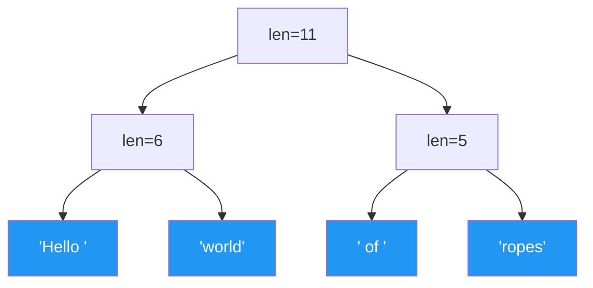

# Rope Data Structure

> **One-line summary**: A balanced binary tree of string fragments that enables efficient insertion, deletion, and concatenation of large strings in $O(\log n)$ time, avoiding the $O(n)$ cost of array-backed strings.

## 🎯 Intuition
**The Core Idea:** Instead of storing a string as a contiguous array, break it into small pieces (leaves) connected by a balanced binary tree. Operations like insert, delete, and concat become tree operations — logarithmic instead of linear.
**Analogy:** A rope is like a text editor's internal representation of a document. Instead of one giant array of characters (where inserting a paragraph means shifting millions of characters), the document is stored as a tree of small text chunks. Inserting text just means splitting a node and adding a new leaf — like splicing new pages into a binder rather than rewriting the entire book.
**Why It Matters:** Text editors (especially collaborative ones), IDEs, XML/JSON processing, and any system that manipulates large mutable strings need sub-linear edit operations that arrays can't provide.

---

## ⚙️ Core Mechanics
### How It Works
A rope is a binary tree where:
- **Leaf nodes** contain short strings (typically 64-512 characters).
- **Internal nodes** store the **weight** = total character count of their left subtree.
- The full string is the left-to-right concatenation of all leaf strings.

**Figure:** Rope — a balanced binary tree of string fragments enabling $O(\log n)$ edits

**Key Operations:**

**Index(i):** Find the character at position `i`.
- At each node, if `i < weight`, go left; else subtract weight and go right.
- Reaches the correct leaf in $O(\log n)$ time ($O(tree height)$).

**Concat(R1, R2):** Create a new root with R1 as left child and R2 as right child. Update weight. $O(1)$ if no rebalancing; $O(\log n)$ with rebalancing.

**Split(i):** Split rope into two ropes at position i.
- Walk down to find the leaf containing position i.
- Split the leaf string at the local offset.
- Rebuild the path back up, reassigning children. $O(\log n)$.

**Insert(i, str):** Split at position i into (left, right). Concat(left, new_rope(str), right). $O(\log n)$.

**Delete(i, j):** Split into three parts: [0..i), [i..j), [j..n). Concat first and third parts. Discard middle. $O(\log n)$.

### Key Operations

| Operation | Rope | Array String | Notes |
|-----------|------|-------------|-------|
| Index | $O(\log n)$ | $O(1)$ | Rope trades random access speed |
| Concat | $O(\log n)$ | $O(n)$ | Rope's biggest advantage |
| Split | $O(\log n)$ | $O(n)$ | Tree walk + rebuild |
| Insert at i | $O(\log n)$ | $O(n)$ | Split + concat |
| Delete [i,j) | $O(\log n)$ | $O(n)$ | Two splits + concat |
| Report/Print | $O(n)$ | $O(n)$ | Same — must visit all characters |
| Space | $O(n)$ | $O(n)$ | Rope has tree overhead (~2× in practice) |

### Key Facts
- **Concatenation is the killer feature**: `O(log n)` vs `O(n)` for arrays. This makes ropes ideal for building strings incrementally.
- **Immutable ropes** are naturally persistent: concat and split produce new trees sharing structure with the original.
- Ropes need **rebalancing** to maintain $O(\log n)$ height. Common strategies: weight-balanced trees, AVL rebalancing, or Splay tree–based ropes.
- For short strings (< ~1 KB), arrays outperform ropes due to cache locality and lower overhead. Ropes pay off for strings > 10 KB with frequent edits.
- **Leaf size tuning**: larger leaves (256-1024 chars) reduce tree depth and improve cache behavior at the cost of more copying on splits.

---

## 🔬 Deep Dive
### Formal Properties
**Height guarantee (balanced rope):**
If a rope is kept balanced (e.g., weight-balanced with α = 0.29), height is $O(\log n)$, ensuring all operations are $O(\log n)$.

**Fibonacci constraint (non-rebalanced ropes):**
Boehm et al. (1995) proved that a rope of depth d should contain at least F(d+2) characters (where F is Fibonacci). If this invariant is violated, the rope should be rebalanced by flattening to an array and rebuilding a balanced tree.

**Space overhead:**
Each internal node requires ~24-32 bytes (two pointers + weight + balance info). With leaf size L and string length N, overhead is `O(N/L)` nodes. For L=256, overhead is ~12.5% for pointer-rich representation.

**Amortized vs. worst-case:**
Splay-tree-based ropes give $O(\log n)$ amortized operations. Weight-balanced or AVL-based ropes give $O(\log n)$ worst-case. For interactive editors, worst-case is preferred to avoid latency spikes.

### Edge Cases and Pitfalls
- **Degenerate ropes**: repeated concat without rebalancing produces a linked list (height = number of concats). Always enforce a balance invariant.
- **Random access penalty**: if the workload is read-heavy with random access and few edits, arrays are strictly better. Ropes optimize for edit-heavy workloads.
- **Memory fragmentation**: many small leaf allocations can fragment the heap. Use a custom allocator or pool allocator for leaf nodes.
- **Thread safety**: concurrent editing requires either locking or using a persistent (immutable) rope variant where each edit produces a new root.
- **Unicode handling**: leaf splits must respect character boundaries (especially for multi-byte UTF-8 sequences and grapheme clusters). Splitting mid-codepoint corrupts the string.

### Real-World Usage
- **Xi-editor (Google)**: used a CRDT-based rope as its core text representation for collaborative editing.
- **Ropey (Rust)**: a production-quality rope library for Rust, used in multiple text editors (Helix editor).
- **Zed editor**: uses a rope-like structure (SumTree) for its text buffer, enabling fast edits on large files.
- **Cedar (Xerox PARC)**: one of the earliest uses of ropes in a programming environment (1980s).
- **Java's `StringBuilder`**: while not a rope, the concept influenced `StringBuffer` and `StringBuilder` as alternatives to immutable `String` concatenation.
- **SGI STL**: included a rope class (`__gnu_cxx::rope`) as an extension to the C++ standard library.

---

## 🏋️ Practice
### Warm-Up (5 min)
1. Why is inserting a character in the middle of a 1-million-character array $O(n)$, but $O(\log n)$ in a rope?
2. What happens to rope performance if you never rebalance after many concatenations?
3. Why do ropes use leaves of 256+ characters instead of single-character leaves?

### Core Problems
1. **Basic Rope Implementation**: Implement a rope with `index(i)`, `concat(r1, r2)`, `split(i)`, `insert(i, s)`, and `delete(i, j)`. Use a simple balanced BST (e.g., treap) for the tree structure. Test by loading a 1MB text file and performing 10,000 random inserts.
2. **Rope vs. Array Benchmark**: Compare rope vs. `std::string` / Python list for: (a) 10,000 random insertions into a 100KB string, (b) 10,000 random index accesses. Graph the results.

### Challenge
Implement a **collaborative text editor backend** using a persistent rope with operational transformation (OT) or CRDT. Two concurrent users edit the same document. Each edit produces a new rope version. Implement `insert(version, position, text)` and `delete(version, start, end)`, and design a merge function that resolves concurrent edits at the same position.

---

*See also:* [[Tries and Prefix Trees]] · [[Suffix Trees]] · [[Suffix Arrays]] · [[Persistent and Immutable Structures]] | **CS Algorithms:** [[String Algorithms]] · [[Text Editor Internals]]

## Supporting Chunks
- [[chunk-ds-046 Ropes make string insertion Ologn vs On for flat strings]]
- [[chunk-ds-149 Rope rebalancing uses Fibonacci thresholds]]

## References
- [[CS Data Structures/Sources/Sources Index|Sources Index]]
