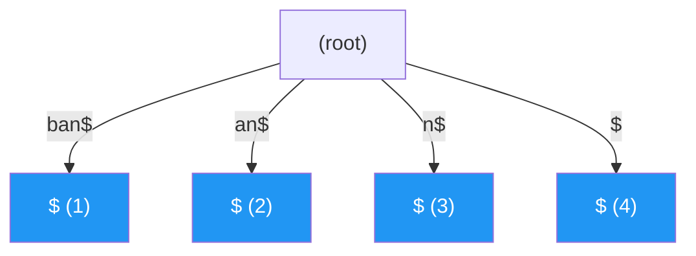

# Suffix Trees

> **One-line summary**: A suffix tree is a compressed trie built over every suffix of a given string, enabling $O(m)$ substring search and a wide range of string-analysis queries in linear space.

## 🎯 Intuition
**The Core Idea:** Index every suffix once in a path-compressed trie so that any pattern search becomes a walk along one root-to-node path.
**Analogy:** Like an every-possible-search index for a book — every possible substring starting point is pre-indexed, so any search is instant regardless of book length.
**Why It Matters:** Suffix trees are the theoretical gold standard for string indexing because they support an unusually wide range of substring queries in optimal time. Even when suffix arrays are preferred in practice for memory reasons, suffix trees remain essential for understanding linear-time string algorithms in text processing and bioinformatics.

---

## ⚙️ Core Mechanics
### How It Works
Given a string S of length n, its suffix tree contains one leaf for each of the n suffixes S[1..n], S[2..n], …, S[n..n]. A terminal character (conventionally '$') is appended to ensure no suffix is a prefix of another, so every suffix corresponds to exactly one leaf. The tree is path-compressed — identical to a Patricia trie — meaning every internal node has at least two children and edge labels are substrings of S stored as (start, length) pairs. This guarantees $O(n)$ nodes and $O(n)$ total edge-label space.

**Figure:** Suffix tree for "ban$" — each root-to-leaf path spells a suffix

Peter Weiner introduced suffix trees in 1973 with an $O(n)$ construction algorithm that proceeds right to left. Edward McCreight simplified the construction in 1976, and Esko Ukkonen published the most widely taught variant in 1995 — an online, left-to-right algorithm that uses suffix links and an "active point" bookkeeping trick to maintain $O(n)$ amortized time. Ukkonen's algorithm processes characters one at a time, extending the implicit suffix tree at each step, making it suitable for streaming text. Farach (1997) gave the first optimal algorithm for integer alphabets, important in bioinformatics where alphabets can be large.

Once built, a suffix tree answers a remarkable number of questions in optimal time. Exact substring search for a pattern of length m takes $O(m)$ — simply walk the tree following the pattern. Longest repeated substring corresponds to the deepest internal node. Longest common substring of two strings can be found in $O(n + m)$ using a generalized suffix tree. Counting the number of occurrences of a pattern is $O(m)$ plus the time to count leaves below the match node. Suffix trees also enable optimal algorithms for the longest palindromic substring, minimal unique substrings, and Lempel-Ziv factorization. These capabilities explain their central role in bioinformatics for genome assembly, sequence alignment, and motif discovery.

### Key Operations

| Operation | Time Complexity | Notes |
|---|---|---|
| Construction (Ukkonen) | $O(n)$ | Online, left-to-right |
| Exact substring search | $O(m)$ | m = pattern length |
| Count pattern occurrences | $O(m + occ)$ | occ = number of occurrences |
| Longest repeated substring | $O(n)$ | Deepest internal node |
| Longest common substring | $O(n + m)$ | Generalized suffix tree of two strings |
| Shortest unique substring | $O(n)$ | Shallowest leaf-only subtree |
| Space | $O(n)$ | ~20 bytes per character in practice |

### Key Facts
- Contains at most 2n − 1 nodes for a string of length n ($O(n)$ space)
- Practical space consumption is roughly 20n bytes — the large constant drove interest in suffix arrays
- Ukkonen's algorithm (1995) builds the tree online in $O(n)$ time
- Suffix links connect internal nodes to accelerate construction and some queries
- Generalized suffix trees index multiple strings simultaneously
- Every internal node has at least two children (path compression)
- A sentinel character ('$') ensures each suffix maps to a unique leaf
- Substring search is $O(m)$, independent of text length n

---

## 🔬 Deep Dive
### Formal Properties
- Appending a unique sentinel character ensures that no suffix is a prefix of another, so every suffix terminates at a distinct leaf.
- Path compression implies every internal node has at least two children, which yields at most 2n − 1 nodes for a string of length n.
- Edge labels are stored as substring references such as (start, length), so the total explicit label storage remains linear rather than duplicating substrings.
- A pattern of length m is present iff its characters can be consumed along a root-to-node/path walk, giving $O(m)$ substring search independent of text length n.
- In a generalized suffix tree, leaves are tagged by source string, enabling cross-string queries such as longest common substring in linear time.

### Edge Cases and Pitfalls
- Omitting the sentinel character can cause one suffix to be a prefix of another, breaking the one-suffix-per-leaf property.
- Implementations that copy edge substrings instead of storing references lose the linear-space benefit.
- Ukkonen's algorithm is easy to get subtly wrong: active point updates, suffix links, and implicit-tree phases are common sources of bugs.
- The asymptotic space is linear, but the constant factor is large enough that suffix trees are often impractical for very large texts unless memory is abundant.

### Real-World Usage
Suffix trees support exact substring search, longest repeated substring, longest common substring, palindromic substring analysis, minimal unique substring discovery, and Lempel-Ziv-style factorization. They remain especially important in bioinformatics, where generalized suffix trees support sequence alignment, motif discovery, repeat analysis, and related genome-scale workloads.

---

## 🏋️ Practice
### Warm-Up (5 min)
- Why is the sentinel character necessary in the standard suffix-tree definition?
- Why does the deepest internal node correspond to a longest repeated substring?

### Core Problems
- **Substring Search via Suffix Tree** — build the tree for a text and answer repeated pattern-existence queries in $O(m)$ time.
- **Longest Repeated Substring** — use internal-node depth to recover the longest repeated pattern in a string.
- **Longest Common Substring of Two Strings** — construct a generalized suffix tree and identify the deepest node with leaves from both strings.

### Challenge
- **Online Construction Intuition** — explain why Ukkonen's suffix links and active point are enough to keep left-to-right construction linear.

---

*See also:* [[Suffix Arrays]], [[Compressed Tries and Radix Trees]], [[Tries and Prefix Trees]], [[CS Data Structures/Graphs/Graphs Overview|Graphs Overview]] | Cross-wiki links

## Supporting Chunks
- [[chunk-ds-032 Ukkonens algorithm builds suffix trees in On time]]
- Source gap: the vault has no more specific extracted chunks for suffix-tree query variants yet; broader support remains in [[CS Data Structures/Sources/Sources Index|Sources Index]] via `raw-ds-027`.

## References
- [[CS Data Structures/Sources/Sources Index|Sources Index]] — `raw-ds-027` ("Suffix Trees") backs the suffix-tree construction, query, and suffix-tree versus suffix-array claims summarized here.
