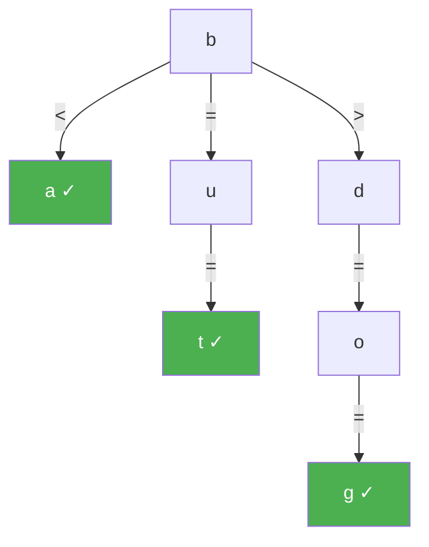

# Ternary Search Trees

> **One-line summary**: A ternary search tree (TST) gives each node three children -- less-than, equal, and greater-than -- combining the time efficiency of tries with the space efficiency of binary search trees, making it practical for large alphabets and prefix-based search.

## 🎯 Intuition
**The Core Idea:** Store one character per node, then use left/right branching to search among sibling characters and the middle branch to advance through the string.
**Analogy:** Like an autocomplete dropdown that works with any language — instead of reserving a slot for every possible character (wasteful for Unicode), it uses a quick left-right decision tree at each position.
**Why It Matters:** TSTs sit in a useful middle ground between tries and BSTs: they keep prefix-oriented behavior while avoiding the huge per-node child arrays that make tries expensive on large alphabets. That makes them practical for autocomplete, fuzzy dictionary lookup, and ordered symbol-table workloads.

---

## ⚙️ Core Mechanics
### How It Works
A **ternary search tree** stores strings in a tree where each node contains a single character and three child pointers: **lo** (characters less than the node's character), **eq** (proceed to the next character in the string), and **hi** (characters greater than the node's character). Searching for a string of length m follows the equal pointer on a character match and branches to lo or hi on a mismatch, resulting in $O(m + \log n)$ expected time -- the $O(m)$ trie component plus an $O(\log n)$ BST component for navigating among sibling characters at each position.

**Figure:** Ternary search tree — each node has three children: less-than, equal, and greater-than

The key advantage over a standard trie is **space efficiency**. A trie node with an array-based child map allocates sigma pointers (where sigma is the alphabet size), most of which may be null. A TST node always uses exactly three pointers, regardless of sigma. For large alphabets like Unicode (sigma > 100,000), this difference is dramatic: a trie node might waste hundreds of kilobytes per node, while a TST node uses a fixed ~24 bytes. The trade-off is speed: trie child access is $O(1)$ via array indexing, while TST child access is $O(\log sigma)$ in the balanced case.

TSTs naturally support **prefix search** (find all strings with a given prefix) and **near-neighbor search** (find all strings within Hamming distance d of a query) -- capabilities introduced in the seminal 1997 paper by Bentley and Sedgewick. The near-neighbor search is particularly elegant: at each node, if the remaining allowed mismatches are nonzero, all three subtrees are explored recursively. This makes TSTs a practical choice for spell checkers and approximate dictionary matching. Balancing is achieved by inserting keys in random order or by using median-based construction, analogous to building balanced BSTs.

### Key Operations

| Operation             | Time (expected)    | Notes                                     |
|-----------------------|-------------------|-------------------------------------------|
| Search                | $O(m + \log n)$      | m = key length, balanced tree assumed      |
| Insert                | $O(m + \log n)$      | Creates nodes along the path              |
| Delete                | $O(m + \log n)$      | Mark as deleted or prune                  |
| Prefix search         | $O(|P| + \log n + k)$| P = prefix, k = matches                  |
| Near-neighbor (dist d)| $O(?)$ data-dep.    | Explores 3 branches per allowed mismatch  |
| Space per node        | $O(1)$              | Character + 3 pointers (fixed)            |
| Total space           | $O(total chars)$    | One node per character in all stored keys  |

### Key Facts
- Each node stores one character and three pointers: lo, eq, hi -- fixed size independent of alphabet.
- Search time: $O(m + \log n)$ expected, where m = key length, n = number of stored keys.
- Space: 3 pointers per node, compared to sigma pointers for an array-based trie node.
- Prefix search: descend via equal pointers for the prefix, then collect all descendants -- same as a trie.
- Near-neighbor search within Hamming distance d: elegant recursive algorithm exploring all three branches when mismatches remain.
- Insertion order affects tree balance; randomized insertion or median-based static construction yields $O(\log n)$ BST depth.
- Introduced by Jon Bentley and Robert Sedgewick in "Fast Algorithms for Sorting and Searching Strings" (1997).
- TSTs can store any data associated with complete strings, functioning as an ordered symbol table.

---

## 🔬 Deep Dive
### Formal Properties
- Each node enforces a ternary ordering invariant: characters less than the node's character go to lo, greater characters go to hi, and equal characters advance one symbol via eq.
- Expected search is $O(m + \log n)$ when the BST-like lo/hi structure remains balanced, combining string depth m with logarithmic sibling navigation.
- Space is $O(total chars)$ because there is typically one node per stored character occurrence, with fixed-size nodes independent of alphabet size.
- Prefix enumeration mirrors trie behavior: match the prefix along eq pointers, then traverse the descendant subtree in order.

| Aspect              | Ternary Search Tree     | Standard Trie           | Hash Table             |
|---------------------|------------------------|-------------------------|------------------------|
| Child pointers      | 3 (fixed)              | sigma (alphabet size)   | N/A                    |
| Search time         | $O(m + \log n)$           | $O(m)$                    | $O(m)$ expected          |
| Space per node      | Small, fixed           | Large for big alphabets | N/A                    |
| Prefix search       | Supported              | Supported               | Not supported          |
| Near-neighbor search| Supported              | Possible but costly     | Not supported          |
| Sorted iteration    | Yes                    | Yes (DFS)               | No                     |

### Edge Cases and Pitfalls
- Insertion order matters: a poor order can make the lo/hi structure skewed and destroy the expected $O(\log n)$ sibling-navigation behavior.
- You still need a terminal marker or stored value flag, because reaching a node for the last character does not automatically mean a complete key is present.
- Prefix search implementations often forget that after matching the prefix, results come from the eq subtree of the final prefix character, not from arbitrary descendants.
- Near-neighbor search can expand rapidly as allowed Hamming distance grows, so it is powerful but not magically cheap for large d.

### Real-World Usage
TSTs are well suited to large alphabets, ordered dictionaries, autocomplete, spell checking, and fuzzy matching. Their support for prefix search, sorted iteration, and near-neighbor queries makes them attractive when hash tables are too unordered and array-based tries are too space-hungry.

---

## 🏋️ Practice
### Warm-Up (5 min)
- Why does a TST use dramatically less space than an array-based trie on Unicode text?
- What role do the lo, eq, and hi pointers each play during search?

### Core Problems
- **Implement a TST Symbol Table** — support insert, search, and delete while storing values at complete-string terminals.
- **Autocomplete with Prefix Search** — retrieve all keys sharing a prefix and emit them in lexicographic order.
- **Fuzzy Dictionary Lookup** — implement near-neighbor search within Hamming distance d for spell-check suggestions.

### Challenge
- **Balance Strategy Design** — compare randomized insertion with median-based bulk construction and explain how each affects the $O(m + \log n)$ expectation.

---

*See also:* [[Tries and Prefix Trees]], [[Compressed Tries and Radix Trees]], [[Suffix Trees]], [[Suffix Arrays]] | Cross-wiki links

## Supporting Chunks
### Supporting Chunks
- [[chunk-ds-071 TST uses less memory than tries for sparse alphabets]]

## References
- [[CS Data Structures/Sources/Sources Index|Sources Index]]
