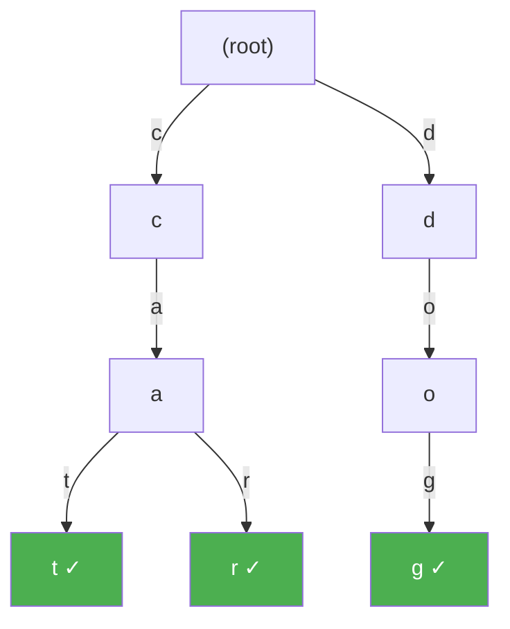

# Tries and Prefix Trees

> **One-line summary**: A trie is a tree-shaped data structure in which each edge corresponds to a single character, enabling string lookup, insertion, and deletion in $O(m)$ time where m is the key length, independent of the number of stored keys.

## 🎯 Intuition
**The Core Idea:** Represent a set of strings by shared prefixes so each character moves you one level deeper toward the answer.
**Analogy:** Like an autocomplete dropdown — as you type each letter, you're walking one level deeper in the trie, and all completions branch out below your current position.
**Why It Matters:** Tries excel whenever prefix-aware lookup matters more than minimizing pointer count. They power autocomplete, spell checking, DNS-style hierarchical lookup, longest-prefix matching, and sorted prefix enumeration, while also serving as the conceptual base for compressed tries, TSTs, and suffix structures.

---

## ⚙️ Core Mechanics
### How It Works
The trie — short for "retrieval" and coined by Edward Fredkin in 1960 — organizes a set of strings by their shared prefixes. Starting from an empty root, each path from root to a marked node spells out a stored key. Because every comparison examines exactly one character and follows exactly one edge, the cost of any single-key operation is bounded by the key's length, not by the total number of keys n in the structure. This $O(m)$ guarantee holds for search, insertion, and deletion alike.

**Figure:** Trie storing {"cat", "car", "dog"} — shared prefixes reduce node count

Internally, each node maintains a collection of child pointers indexed by character. The two dominant implementations are a fixed-size array (one slot per alphabet symbol) and a hash map. An array of size |Σ| gives $O(1)$ child lookup but wastes space when the alphabet is large or the trie is sparse. A hash map trades that constant-time guarantee for compact storage proportional to the number of children actually present — an important consideration for Unicode text or other large-alphabet domains.

Tries support several operations that no hash table can match efficiently. Prefix enumeration — retrieving every key that starts with a given prefix — requires only descending to the prefix node and collecting its subtree. Lexicographic ordering comes free because a depth-first traversal visits keys in sorted order. Longest prefix match, used in IP routing tables, follows the trie until no further edge matches. These capabilities make tries the backbone of autocomplete engines, spell checkers, DNS resolvers, and T9 predictive text systems.

### Key Operations

| Operation | Time Complexity | Notes |
|---|---|---|
| Search | $O(m)$ | m = length of query key |
| Insert | $O(m)$ | Creates new nodes as needed |
| Delete | $O(m)$ | May prune childless nodes upward |
| Prefix search | $O(p + k)$ | p = prefix length, k = number of matches |
| Longest prefix match | $O(m)$ | Follows path until mismatch |
| Lexicographic sort | $O(N)$ | N = total characters across all keys (DFS) |

### Key Facts
- Each edge encodes exactly one character; a root-to-leaf path spells a complete key
- Lookup, insert, and delete are all $O(m)$ for a key of length m
- Space in the worst case is $O(n · m · |Σ|)$ for n keys of average length m over alphabet Σ
- Array-based children: $O(1)$ per step, |Σ| pointers per node
- Hash-map children: amortized $O(1)$ per step, space proportional to actual children
- A "word-end" flag (or a stored value) distinguishes complete keys from mere prefixes
- Tries naturally produce keys in lexicographic order via DFS
- Fredkin introduced the concept in 1960; the structure is sometimes called a digital tree or prefix tree

---

## 🔬 Deep Dive
### Formal Properties
- A trie stores one character per edge, so any search, insertion, or deletion for a key of length m touches at most m edges.
- Shared prefixes are represented once, which is why tries excel when many keys overlap heavily near their beginnings.
- Worst-case space can be expressed as $O(n · m · |Σ|)$ for n keys of average length m over alphabet Σ in dense array-based representations.
- Lexicographic order emerges naturally from a depth-first traversal that visits child edges in character order.
- Longest-prefix-match follows the deepest terminal node encountered during descent, which is why trie variants are useful for routing.

### Edge Cases and Pitfalls
- If one stored key is a prefix of another, you must keep an explicit word-end flag; otherwise prefixes and complete keys become indistinguishable.
- Array-based children are fast but can waste enormous space on sparse tries or large alphabets such as Unicode.
- Delete is conceptually simple but easy to implement incorrectly: pruning must stop as soon as a node is still needed by another key.
- Text normalization matters in real systems; visually identical Unicode strings can follow different byte/character paths unless normalized consistently.

### Real-World Usage
Tries underpin autocomplete engines, spell checkers, DNS resolvers, T9 predictive text, and longest-prefix-match systems in networking. They are also the conceptual starting point for more specialized descendants such as compressed tries, ternary search trees, and suffix-family indexes.

---

## 🏋️ Practice
### Warm-Up (5 min)
- Why is trie lookup time independent of the number of stored keys?
- When would you choose hash-map children over array-based children?

### Core Problems
- **Implement a Prefix Dictionary Trie** — support insert, search, delete, and prefix enumeration for a dictionary of words.
- **Autocomplete Engine** — given a typed prefix, return all completions in lexicographic order with minimal extra sorting work.
- **Longest Prefix Match** — store routing prefixes or command abbreviations and return the deepest matching stored prefix for a query.

### Challenge
- **Array vs Hash-Map Trie Design** — choose a child-representation strategy for Unicode text and justify the time/space trade-off.

---

*See also:* [[Compressed Tries and Radix Trees]], [[Ternary Search Trees]], [[Suffix Trees]], [[CS Data Structures/Hash-Based Structures/Hash-Based Structures Overview|Hash-Based Structures Overview]], [[CS Data Structures/Trees/Trees Overview|Trees Overview]] | Cross-wiki links

## Supporting Chunks
- [[chunk-ds-013 Trie lookup is Om independent of stored keys]]

## References
- [[CS Data Structures/Sources/Sources Index|Sources Index]] — `raw-ds-010` ("Tries and String Indexing") backs the trie lookup, prefix-query, and string-indexing claims summarized here.
