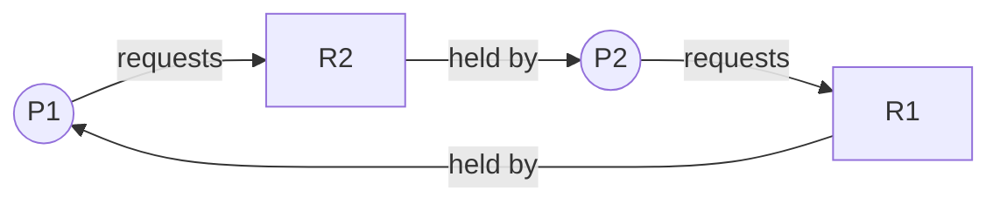

---
tags:
  - csos
  - csos/deadlocks
confidence: verified
up: "[[Deadlocks Overview]]"
tier-coverage:
  - intuition
  - core
  - deep-dive
  - practice
---
# Deadlock Fundamentals

## 🎯 Intuition

**The Core Idea:** A **deadlock** is a situation where a set of processes are each waiting for a resource held by another process in the set, so no process can ever proceed. All four of Coffman's (1971) necessary conditions must hold simultaneously for deadlock to occur.

**Analogy:** Two cars enter a one-lane bridge from opposite directions. Each blocks the other, neither can move forward, and neither can back out without outside intervention.

**Why It Matters:** Deadlock wastes resources and halts progress indefinitely. A system can appear busy while useful work has completely stopped.

## ⚙️ Core Mechanics

### The Four Coffman Conditions

| Condition | Description |
|-----------|-------------|
| **Mutual exclusion** | At least one resource is held in non-shareable mode — only one process can use it at a time |
| **Hold and wait** | A process is holding at least one resource while waiting to acquire additional resources |
| **No preemption** | Resources cannot be forcibly taken from a process — only voluntarily released |
| **Circular wait** | A circular chain of processes exists, each waiting for a resource held by the next |

All four must hold; if any is absent, deadlock cannot occur.

### Resource-Allocation Graph

A resource-allocation graph is a directed graph with two node types:
- **Process nodes** (circles): P₁, P₂, …
- **Resource nodes** (squares): R₁, R₂, … with dots for instances

Edges:
- **Request edge** `P → R`: process wants an instance of resource `R`
- **Assignment edge** `R → P`: an instance of `R` is assigned to process `P`

**Figure:** Resource-allocation graph with circular wait — P1 holds R1 and requests R2, while P2 holds R2 and requests R1 → deadlock.

### What Cycles Mean

**Theorem:** If the graph has no cycle, there is no deadlock. If it has a cycle:
- Single instance per resource → deadlock is certain.
- Multiple instances per resource → deadlock is *possible*, not guaranteed.

### Deadlock Strategies Overview

| Strategy | Approach |
|----------|----------|
| Prevention | Ensure at least one Coffman condition can never hold |
| Avoidance | Dynamically refuse grants that would lead to unsafe states |
| Detection + Recovery | Allow deadlock; detect and break it |
| Ignore ("ostrich") | Pretend it cannot happen; practical for most desktop OSes |

## 🔬 Deep Dive

### Why All Four Conditions Must Hold

The Coffman conditions are **jointly necessary**. Deadlock is not caused by any single condition alone. Instead, the system gets stuck only when non-shareable resources, held resources, non-preemptable ownership, and a wait cycle all line up at the same time.

### Reading Graph Structure Correctly

A cycle is a strong signal, but its meaning depends on resource multiplicity:
- With **single-instance** resource types, a cycle proves deadlock.
- With **multiple-instance** resource types, a cycle only shows that deadlock may exist because an alternative execution order might still free resources.

This is why graph reasoning is exact in some settings and only diagnostic in others.

### Strategy Trade-Offs

- **Prevention** removes the structural possibility of deadlock, but often reduces flexibility or utilisation.
- **Avoidance** makes decisions dynamically, but requires runtime state checks.
- **Detection + Recovery** accepts occasional deadlock, then pays the cost to clean it up.
- **Ignore/ostrich** is common when deadlocks are rare enough that prevention cost is not justified.

## 🏋️ Practice

### Warm-Up

- Which Coffman condition does lock ordering eliminate?

### Core Problems

- Draw a resource-allocation graph with 2 processes and 2 resources showing deadlock.

### Challenge

- Can deadlock occur with a cycle in a multi-instance resource graph? Explain.

## Supporting Chunks

- [[Deadlocks - Deadlock requires all four Coffman conditions to hold simultaneously]]
- [[Deadlocks - Resource-allocation graph cycles indicate potential deadlock]]
- [[Synchronization - The dining philosophers problem exposes deadlock and starvation in resource allocation]]

## See Also

- [[Race Conditions and Mutual Exclusion]] — mutual exclusion is one of the four Coffman conditions
- [[Semaphores]] — incorrect P-ordering on semaphores is a classic deadlock trigger
- [[Classic Synchronization Problems]] — the dining philosophers problem directly illustrates deadlock
- [[Interprocess Communication]] — blocking send/receive can create circular waits between processes

## References

See [[CS Operating Systems/Sources/Sources Index#Tanenbaum 2015|Sources Index]]. Chapter 6.
