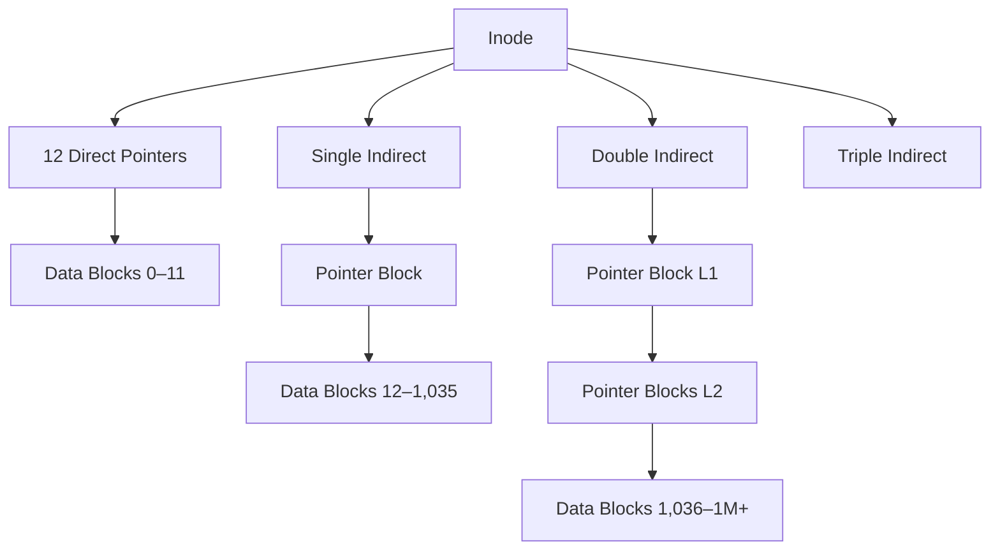

---
tags:
  - csos
  - csos/filesystems
confidence: verified
freshness: stable
up: "[[File Systems Overview]]"
tier-coverage:
  - intuition
  - core
  - deep-dive
  - practice
---
# File System Implementation

## 🎯 Intuition
**The Core Idea:** File system implementation maps the logical file model onto the physical storage model of fixed-size blocks on a disk or SSD.
**Analogy:** It works like a book's table of contents: when you ask for byte 5000 of a file, the file system figures out which block and physical location actually contain that data.
**Why It Matters:** Allocation strategy determines performance, fragmentation behavior, growth flexibility, and maximum file size.

## ⚙️ Core Mechanics
### Logical Model to Physical Blocks
The OS exposes files as names, byte streams, and metadata, but storage hardware exposes fixed-size blocks. The implementation layer translates between those two views.

### Block Allocation Methods
#### Contiguous Allocation
Each file occupies a contiguous run of blocks. This is simple and gives fast random access, but it suffers from **external fragmentation** and makes file growth difficult.

#### Linked Allocation
Each block points to the next, and the directory stores the first block. This avoids external fragmentation and works well for sequential access, but random access is **$O(n)$** because the chain must be followed block by block.

#### FAT Variation
FAT improves linked allocation by moving next-block pointers into a separate in-memory table. Once the FAT is loaded, following the chain becomes much faster and pointer lookup is effectively **$O(1)$** per step.

## 🔬 Deep Dive
### Indexed Allocation and Inodes

**Figure:** Inode block lookup — direct pointers for small files; single/double/triple indirect for increasingly large files.

In indexed allocation, each file has an **inode** containing attributes and block pointers:
- **12 direct pointers** typically address the first 12 blocks directly
- **single indirect** points to a block full of pointers
- **double indirect** points to a block of pointer blocks
- **triple indirect** extends the scheme to very large files

With 4 KiB blocks and 4-byte pointers, one indirect block holds 1024 pointers, so the inode can address:
- `12` direct blocks
- `1024` single-indirect blocks
- `1024²` double-indirect blocks
- `1024³` triple-indirect blocks

That supports files up to several terabytes.

### Free-Space Management

| Method | Description |
|--------|-------------|
| Bitmap | One bit per block; 0 = free, 1 = allocated. Compact; scan for runs |
| Free list | Linked list of free blocks; chained in unused block space |
| Grouping | Stores addresses of N free blocks in first free block; scales better |

### Superblock
The superblock stores file-system-wide metadata such as block count, inode count, block size, free-block count, inode table location, magic number, and last-mount timestamp.

## 🏋️ Practice
### Warm-Up
Calculate the maximum file size for 4 KiB blocks, 4-byte pointers, and an inode with 12 direct pointers plus single and double indirect pointers.

### Core Problems
Compare random-access behavior for contiguous, linked, and indexed allocation.

### Challenge
Why does FAT move pointers out of data blocks instead of storing the next-block pointer inside each file block?

## Supporting Chunks

- [[File Systems - Inode-based allocation stores metadata and block pointers in fixed-size structures]]
- [[File Systems - Free-space management uses bitmaps or free lists to track available blocks]]
- [[Case Studies - The VFS layer lets Linux support heterogeneous file systems behind a uniform interface]]

## See Also

- [[Disk Scheduling Algorithms]] — block allocation patterns affect seek distance; the I/O scheduler reorders requests
- [[Virtual Memory and Paging]] — memory-mapped files load file blocks on demand through page faults
- [[Access Control]] — permission bits and ACLs are stored in inode metadata
- [[Interrupts and DMA]] — DMA transfers move disk blocks to memory without CPU involvement

## References

See [[CS Operating Systems/Sources/Sources Index#Tanenbaum 2015|Sources Index]]. Chapter 4.