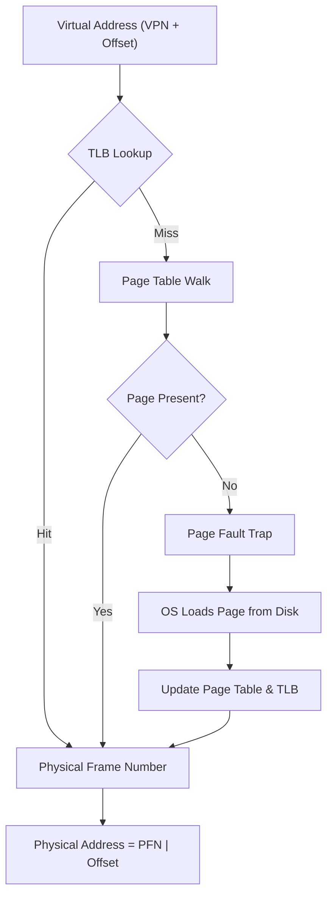

---
tags:
  - csos
  - csos/memory
confidence: verified
up: "[[Memory Management Overview]]"
tier-coverage:
  - intuition
  - core
  - deep-dive
  - practice
---
# Virtual Memory and Paging

> **One-line summary**: Paging divides virtual and physical memory into fixed-size pages/frames, using a per-process page table (translated by the MMU) to map between them — enabling demand loading, protection, and overcommitment.

## 🎯 Intuition
**The Core Idea:** Paging is the OS's way of giving every process the illusion of unlimited, contiguous memory — even when physical RAM is scarce and fragmented.
**Analogy:** Imagine a library with limited desk space (RAM) and vast bookshelves (disk). You request books (pages) and the librarian places them on your desk (frames). If your desk is full, the librarian removes a book you haven't used recently (page replacement) and fetches the new one. The card catalogue (page table) tracks which book is on which desk slot. A fast lookup index taped to the desk (TLB) lets you skip checking the catalogue for recent books.
**Why It Matters:** Virtual memory with paging is the single most important memory management technique — it enables process isolation, eliminates external fragmentation, allows programs larger than RAM, and makes memory-mapped files possible.

---

## ⚙️ Core Mechanics
### How It Works
**Paging** divides a process's virtual address space and physical RAM into fixed-size units called **pages** (virtual) and **frames** (physical), typically 4 KiB. The OS maintains a **page table** per process mapping each virtual page number (VPN) to a physical frame number (PFN). The MMU performs this translation on every memory access.

#### Paging Mechanics
1. CPU generates virtual address VA = (VPN, offset).
2. MMU indexes the page table with VPN → finds PFN (or "not present").
3. Physical address = (PFN << page_size_bits) | offset.
4. If the page-table entry says "not present" → **page fault** trap → OS handler.

**Figure:** Virtual-to-physical address translation — TLB hit is the fast path; a miss triggers a page table walk; a missing page triggers a page fault.

### Key Concepts

| Flag | Meaning |
|------|---------|
| Present (P) | Page is in physical memory |
| Read/Write (R/W) | Write permission |
| User/Supervisor (U/S) | Accessible from user mode |
| Dirty (D) | Page has been written; must be written to disk before eviction |
| Accessed (A) | Page has been read recently; used by replacement algorithms |

### Multi-Level Page Tables
A flat page table for a 48-bit virtual address space at 4 KiB granularity would need $2^{36}$ ≈ 64 billion entries — impractical. x86-64 uses **4 levels** (PML4 → PDP → PD → PT), each 512 entries. Only the levels needed for mapped regions are allocated, making the structure sparse and memory-efficient.

### Demand Paging
Not all pages need to be in RAM. On first access the OS loads the page from disk (or zeroes it for anonymous memory). This allows:
- Programs to have larger address spaces than physical RAM.
- Fast process startup (only load what is touched).
- Memory-mapped files (lazily load file pages on access).

### TLB
See partner note: [[Page Replacement Algorithms]].
TLB caching is covered in: [[Memory - TLBs cache recent address translations to make paging affordable]].

### Key Facts
- Pages and frames are the same size (typically 4 KiB); this eliminates external fragmentation.
- The page table is a per-process data structure maintained by the OS; the MMU walks it in hardware.
- A page fault is a trap to the kernel — the OS loads the missing page from disk, updates the page table, and restarts the instruction.
- Multi-level page tables are sparse — only populated regions consume memory.
- The TLB caches recent translations; a TLB miss costs ~10–100 ns (page table walk); a TLB hit costs ~1 ns.

---

## 🔬 Deep Dive
### Implementation Details
- **x86-64 four-level page tables**: Virtual address bits [47:39] index PML4, [38:30] index PDP, [29:21] index PD, [20:12] index PT. Each level has 512 entries × 8 bytes = 4 KiB per table (one page). Total translation requires 4 memory accesses in the worst case (all cached in TLB on a hit = 0 extra accesses).
- **5-level page tables (LA57)**: Intel's extension adds PML5, enabling 57-bit virtual addresses (128 PiB). Used in servers with very large memory. Linux supports it since kernel 4.14.
- **Huge pages**: 2 MiB (PD-level entry) or 1 GiB (PDP-level entry) pages reduce TLB pressure for large contiguous allocations. Linux: Transparent Huge Pages (THP) or explicit `hugetlbfs`. Trade-off: internal fragmentation and memory waste for small allocations.
- **Copy-on-write (COW)**: After `fork()`, parent and child share the same physical frames with read-only PTEs. On write, a page fault triggers the kernel to copy just that page. This makes `fork()` nearly instant.
- **Inverted page tables**: Instead of one table per process, a single global table with one entry per physical frame. Used by PowerPC and IA-64 (Itanium). Saves memory but makes lookups harder (hash-based).

### Edge Cases and Pitfalls
- **TLB shootdown**: On multiprocessor systems, when one CPU modifies a page table, all other CPUs caching that translation must invalidate their TLBs. This is expensive (inter-processor interrupts) and a scalability bottleneck.
- **Page table memory overhead**: A process mapping scattered virtual addresses may allocate many page table pages with few valid entries. Solutions: larger pages, inverted page tables, or lazy allocation.
- **Swap storms**: When physical memory is exhausted, aggressive paging to swap creates a feedback loop — every page fault generates disk I/O, blocking processes and triggering more faults. The OOM killer terminates processes as a last resort.
- **Internal fragmentation**: The last page of each allocation wastes (on average) half a page. With 4 KiB pages this is minor; with 2 MiB huge pages it can be significant.

### Real-World Systems
- **Linux**: 4-level (or 5-level) page tables; demand paging; swap to disk or zram (compressed RAM swap); THP for transparent 2 MiB pages; KSM (Kernel Same-page Merging) for memory deduplication.
- **Windows**: 4-level page tables on x86-64; working set trimmer manages per-process resident sets; page file for swap; large page support via `MEM_LARGE_PAGES`.
- **macOS**: Mach VM with paging; compressed memory (introduced in OS X 10.9) stores unused pages compressed in RAM before resorting to swap — reducing disk I/O.
- **Hypervisors (EPT/NPT)**: Intel EPT (Extended Page Tables) and AMD NPT (Nested Page Tables) add a second translation layer: guest virtual → guest physical → host physical. This replaces expensive shadow page tables.

---

## 🏋️ Practice
### Warm-Up (5 min)
1. What is the difference between a page and a frame?
2. What happens when the MMU finds a "not present" bit in a page table entry?
3. Why do multi-level page tables save memory compared to a flat page table?

### Core Problems
1. **Address translation**: A system has 32-bit virtual addresses, 4 KiB pages, and a two-level page table (10-bit first level, 10-bit second level, 12-bit offset). (a) How many entries in the first-level table? Second-level? (b) Translate virtual address 0x00403004: identify the first-level index, second-level index, and offset. (c) If the first-level entry points to frame 0x5, and the second-level entry at that index points to frame 0x1A3, what is the physical address?
2. **TLB performance**: A system has a TLB hit rate of 98% (TLB hit = 1 ns, TLB miss = 50 ns page table walk). (a) What is the effective memory access time? (b) If TLB hit rate drops to 90% (due to address space switch), what is the new EMAT? (c) How do huge pages improve TLB hit rates?

### Challenge
Design a page table structure for a hypothetical 64-bit architecture with variable page sizes (4 KiB, 64 KiB, 1 MiB) that can be mixed within a single address space. Your design should: (a) support sparse address spaces efficiently, (b) allow the OS to choose page size per-region (small pages for stacks, large pages for heap/mmap), (c) work with a hardware TLB that caches entries of any size. Describe the page table layout, the translation algorithm, and how TLB entries encode the page size. Compare your design to ARM's TTBRx approach with multiple translation granules.

---

*See also:* [[File System Implementation]] — memory-mapped files and the page cache bridge virtual memory and the file system · [[Hypervisors]] — nested/shadow page tables virtualise the MMU for guest operating systems · [[Processes Overview]] — each process has its own page table, giving it an isolated address space · [[Disk Scheduling Algorithms]] — page-fault servicing depends on disk I/O performance

## Supporting Chunks

- [[Memory - Paging maps fixed-size virtual pages to physical frames eliminating external fragmentation]]
- [[Memory - TLBs cache recent address translations to make paging affordable]]

## References

See [[CS Operating Systems/Sources/Sources Index#Tanenbaum 2015|Sources Index]]. Chapter 3.
