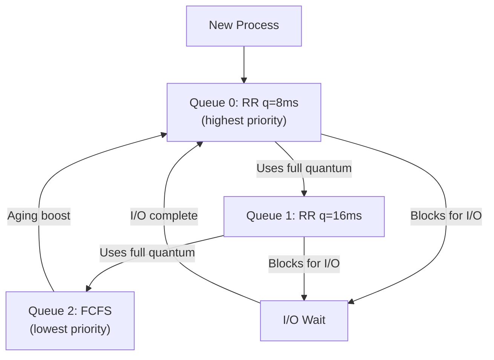

---
tags:
  - csos
  - csos/processes
confidence: verified
up: "[[Processes Overview]]"
tier-coverage:
  - intuition
  - core
  - deep-dive
  - practice
---
# CPU Scheduling

> **One-line summary**: The CPU scheduler decides which ready process/thread runs next and for how long, balancing throughput, response time, and fairness.

## 🎯 Intuition
**The Core Idea:** The scheduler is the traffic controller deciding which car (process) gets the single-lane bridge (CPU) next.
**Analogy:** Imagine a single checkout lane at a grocery store. FCFS = serve in arrival order (slow if someone has a full cart). SJF = let the person with fewest items go first (optimal average wait, but you need to guess cart sizes). Round-Robin = everyone gets 30 seconds, then goes to the back of the line (fair, responsive). MLFQ = express lanes that demote slow shoppers automatically.
**Why It Matters:** Scheduling policy directly determines whether your system feels snappy (interactive) or maximises batch throughput — you can't fully optimise for both.

---

## ⚙️ Core Mechanics
### How It Works
The **scheduler** decides which ready process or thread gets to run on the CPU next, and for how long. Scheduling policy determines system throughput, response time, and fairness.

#### Preemptive vs Non-Preemptive
- **Non-preemptive**: a process runs until it voluntarily yields or blocks.
- **Preemptive**: the scheduler can interrupt a running process at any time (on quantum expiry or when a higher-priority process becomes ready). Required for interactive systems.

### Key Concepts / Algorithms

**First-Come, First-Served (FCFS)**
Non-preemptive; processes run to completion in arrival order. Simple but suffers the convoy effect — a long job blocks many short ones.

**Shortest Job First (SJF)**
Non-preemptive; run the job with the shortest estimated burst first. Optimal for average waiting time, but requires burst time prediction.

**Round-Robin (RR)**
Each process gets a fixed time quantum (typically 10–100 ms); preempted at quantum expiry and placed at the back of the ready queue. Good for interactive systems.

**Priority Scheduling**
Each process has a priority; highest priority runs next. Can be preemptive. Risk of **starvation** for low-priority processes — solved by aging (gradually raise priority of waiting processes).

**Multilevel Feedback Queues (MLFQ)**
Multiple ready queues with different priorities and quantum sizes. A process starts in the highest-priority queue; if it uses its quantum, it drops to a lower queue. I/O-bound (short burst) processes stay at high priority naturally.

**Figure:** Multilevel Feedback Queue — I/O-bound processes stay high-priority; CPU-bound processes sink; aging prevents starvation.

### Key Metrics

| Metric | Definition |
|--------|------------|
| Throughput | Jobs completed per unit time |
| Turnaround time | Total time from job submission to completion |
| Response time | Time from request to first response (interactive) |
| Waiting time | Time spent in the ready queue |
| CPU utilisation | Fraction of time the CPU is busy |

### Key Facts
- FCFS is simple but suffers the convoy effect.
- SJF is provably optimal for average waiting time but requires future knowledge.
- Round-Robin trades throughput for fairness and responsiveness.
- Priority scheduling risks starvation; aging is the standard fix.
- MLFQ adapts automatically: I/O-bound jobs stay high-priority; CPU hogs sink.

---

## 🔬 Deep Dive
### Implementation Details
- **Linux CFS (Completely Fair Scheduler)**: Uses a red-black tree keyed by "virtual runtime" (vruntime). The process with the smallest vruntime runs next. Processes that use less CPU accumulate vruntime slowly → get more chances. Time complexity: $O(\log n)$ for pick-next. CFS replaced the $O(1)$ scheduler in Linux 2.6.23 (2007).
- **Linux EEVDF**: Starting in Linux 6.6 (2023), EEVDF (Earliest Eligible Virtual Deadline First) replaces CFS for better latency fairness. It assigns virtual deadlines and picks the eligible task with the earliest deadline.
- **Windows thread scheduler**: Priority-based preemptive with 32 priority levels (0–31). Threads in the same priority compete via round-robin. The "balance set manager" adjusts priorities dynamically.
- **Timer tick**: Preemptive scheduling depends on the hardware timer interrupt (typically 1–10 ms). On each tick, the scheduler checks if the running process has exhausted its quantum.

### Edge Cases and Pitfalls
- **Priority inversion**: A high-priority thread waits for a lock held by a low-priority thread, which is preempted by a medium-priority thread. Solution: priority inheritance (temporarily boost the lock holder's priority). Famous example: Mars Pathfinder (1997).
- **Quantum size trade-off**: Too small → excessive context-switch overhead. Too large → poor response time. Typical values: 1–10 ms for interactive; 100+ ms for batch.
- **Starvation**: Under strict priority scheduling, low-priority processes may never run. Aging prevents this but adds complexity.
- **Multiprocessor complications**: Cache affinity, NUMA topology, and load balancing add dimensions not captured by single-CPU algorithms.

### Real-World Systems
- **Linux**: CFS/EEVDF for normal tasks; SCHED_FIFO and SCHED_RR for real-time tasks.
- **Windows**: Multi-level priority queue with dynamic priority boosting for I/O-completing threads.
- **macOS**: Mach-based scheduler with decay-usage priority adjustment.
- **Real-time systems**: Rate-Monotonic Scheduling (RMS) and Earliest Deadline First (EDF) provide formal guarantees for periodic tasks.

---

## 🏋️ Practice
### Warm-Up (5 min)
1. Why is SJF optimal for average waiting time, and why is it impractical in a real OS?
2. What happens to response time if you double the Round-Robin quantum? What if you halve it?
3. Explain the convoy effect in FCFS with a concrete example.

### Core Problems
1. **Gantt chart exercise**: Jobs A(burst=8), B(burst=4), C(burst=2), D(burst=1) arrive at time 0 in that order. Draw Gantt charts and compute average waiting time + turnaround time for: (a) FCFS, (b) SJF, (c) Round-Robin with quantum=3. Which algorithm wins on each metric?
2. **MLFQ design**: Design a 3-level MLFQ where Queue 0 has quantum=8ms, Queue 1 has quantum=16ms, and Queue 2 is FCFS. A process starts in Queue 0. Trace what happens to: (a) a process with a 5ms CPU burst, (b) a process with a 50ms CPU burst. How does aging prevent starvation in your design?

### Challenge
The Mars Pathfinder spacecraft experienced system resets due to priority inversion between a high-priority bus management task and a low-priority meteorological task sharing a mutex. The fix was enabling VxWorks' priority inheritance. Analyse: (a) Draw the exact sequence of events causing the inversion. (b) Explain how priority inheritance resolves it. (c) Why might priority ceiling protocol be preferred over priority inheritance in safety-critical systems?

---

*See also:* [[Multiprocessor Systems]] — gang scheduling, affinity, and NUMA-aware placement extend scheduling to multiple cores · [[Threads and Multithreading]] — threads are the actual units the scheduler dispatches · [[Interrupts and DMA]] — timer interrupts drive preemptive scheduling · [[Deadlock Fundamentals]] — priority inversion is a scheduling-related deadlock hazard

## Supporting Chunks

- [[Processes - Round-robin scheduling gives each process a quantum for fair CPU sharing]]

## References

See [[CS Operating Systems/Sources/Sources Index#Tanenbaum 2015|Sources Index]]. Chapter 2.
