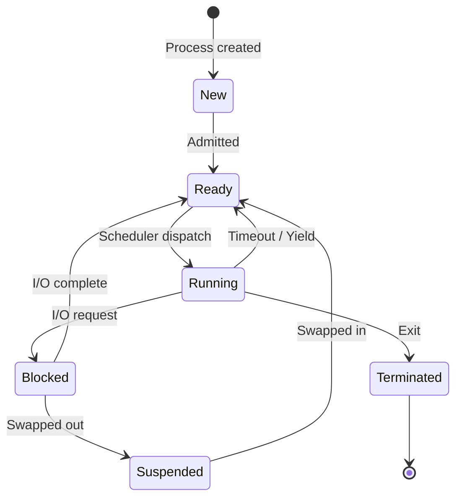

---
tags:
  - csos
  - csos/processes
confidence: verified
freshness: stable
up: "[[Processes Overview]]"
tier-coverage:
  - intuition
  - core
  - deep-dive
  - practice
---
# Process States and Transitions

> **One-line summary**: Every process cycles through Running, Ready, and Blocked states — driven by scheduler decisions and I/O events.

## 🎯 Intuition
**The Core Idea:** A process is like a student in a classroom — sometimes answering questions (Running), sometimes waiting to be called on (Ready), sometimes waiting for a textbook to arrive from the library (Blocked).
**Analogy:** Running = you're at the whiteboard solving a problem. Ready = you know the answer and your hand is raised, waiting for the teacher (scheduler). Blocked = you've asked the librarian (I/O system) for a book and can't proceed until it arrives. When the book arrives, your hand goes up again (Blocked → Ready).
**Why It Matters:** Understanding state transitions explains why your system feels slow (too many blocked processes), why context switching has overhead, and how the scheduler keeps the CPU busy.

---

## ⚙️ Core Mechanics
### How It Works
A process is not always executing. The OS tracks each process's lifecycle through a set of **states**, transitioning between them in response to scheduler decisions and I/O events.

#### Three-State Model

```
         dispatch             timeout / yield
READY ──────────────► RUNNING ───────────────► READY
  ▲                      │
  │      I/O complete     │  I/O request / sleep
  └───────────────────────┘
            BLOCKED
```

### Key Concepts

| State | Meaning |
|-------|---------|
| **Running** | Currently executing on a CPU core |
| **Ready** | Able to run; waiting for the scheduler to assign a CPU |
| **Blocked** | Waiting for an external event (I/O completion, signal, semaphore) |

### Key Transitions

| Transition | Trigger |
|------------|---------|
| Running → Ready | Time quantum expires; higher-priority process becomes runnable |
| Running → Blocked | Process calls `read()`, `sleep()`, or waits on a semaphore/lock |
| Blocked → Ready | I/O completes; signal arrives; resource becomes available |
| Ready → Running | Scheduler selects this process; dispatcher loads its CPU state |

### Key Facts
- A process can never go directly from Blocked → Running; it must pass through Ready first (the scheduler decides who runs).
- Only one process per CPU core can be in the Running state at any time.
- The ready queue may hold many processes; the blocked queue is typically per-event (one queue per disk, per semaphore, etc.).
- Context switching (Ready → Running) involves saving/restoring registers, PC, SP, and potentially flushing TLB entries.

---

## 🔬 Deep Dive
### Extended States
Real systems add refinements:
- **New**: process being created (PCB allocated but not yet runnable).
- **Zombie**: process has exited but parent has not yet called `wait()`.
- **Suspended**: blocked process swapped to disk to free physical memory.



**Figure:** Extended process state model — includes New, Terminated, and Suspended states beyond the basic three-state cycle.

### Implementation Details
- **Linux process states**: `TASK_RUNNING` (ready or running — Linux doesn't distinguish at the task_struct level), `TASK_INTERRUPTIBLE` (blocked, can be woken by signals), `TASK_UNINTERRUPTIBLE` (blocked, cannot be interrupted — e.g., waiting for disk I/O), `TASK_STOPPED` (stopped by SIGSTOP), `TASK_ZOMBIE` (exit_state).
- **The `D` state problem**: `TASK_UNINTERRUPTIBLE` processes show as "D" in `ps`/`top` and cannot be killed — even with `SIGKILL`. This typically indicates a stuck NFS mount or a hung disk driver. Linux added `TASK_KILLABLE` to allow SIGKILL during most uninterruptible waits.
- **Context switch cost**: On modern x86-64 hardware, a context switch takes ~1–5 μs. This includes saving/restoring ~16 general-purpose registers, the FPU/SSE/AVX state (potentially hundreds of bytes), updating the page table base register (CR3), and invalidating TLB entries.
- **Dispatch latency**: The time from when the scheduler decides to run a process to when it actually executes. Includes time to switch context and sometimes restore cache lines. Critical for real-time systems.

### Edge Cases and Pitfalls
- **Blocked → Ready is NOT the process's choice**: The process doesn't decide when I/O completes — the interrupt handler moves it to the ready queue.
- **Starvation**: A process stuck in the Ready state forever because higher-priority processes always run first. Aging solves this.
- **Live lock vs blocked**: A process busy-waiting on a spin lock appears Running (consuming CPU) but is logically waiting — the state model doesn't capture this distinction.

### Real-World Systems
- **Linux**: Uses a single run queue per CPU; processes in `TASK_RUNNING` are on the CFS red-black tree. Blocked processes are on wait queues associated with their blocking event.
- **Windows**: Thread states include Initialized, Ready, Running, Standby (selected to run next), Waiting (blocked), Transition (ready but kernel stack paged out), and Terminated.
- **Real-time OSes**: Often add Suspended-Ready and Suspended-Blocked states for explicit memory management.

---

## 🏋️ Practice
### Warm-Up (5 min)
1. Can a process transition directly from Blocked to Running? Why or why not?
2. What triggers the Running → Blocked transition? Give three concrete examples.
3. Why does Linux not distinguish between "Ready" and "Running" in the `task_struct` state field?

### Core Problems
1. **State trace**: A process does the following: starts, computes for 3 ms, calls `read()` (disk takes 10 ms), computes for 2 ms, calls `sleep(5)`, computes for 1 ms, exits. Draw a timeline showing which state the process is in at each point. Assume a 5 ms quantum and that the scheduler always runs this process when it's ready.
2. **Multi-process scenario**: Three processes (A, B, C) share a single CPU with a 4 ms quantum. At t=0: A is Running, B is Ready, C is Blocked (I/O completes at t=6). Trace the state of each process from t=0 to t=20 under Round-Robin scheduling.

### Challenge
A Linux system administrator notices many processes in the "D" (uninterruptible sleep) state in `top`. These processes cannot be killed with `kill -9`. (a) Explain what the D state means at the kernel level. (b) What typically causes it? (c) Why can't SIGKILL terminate them? (d) What is `TASK_KILLABLE` and how does it help? (e) Propose a diagnostic strategy to identify the root cause.

---

*See also:* [[Process Model]], [[CPU Scheduling]], [[Threads and Multithreading]]

## Supporting Chunks

- [[Processes - Process states form a three-state lifecycle driven by scheduler and IO events]]

## References

See [[CS Operating Systems/Sources/Sources Index#Tanenbaum 2015|Sources Index]]. Chapter 2.
