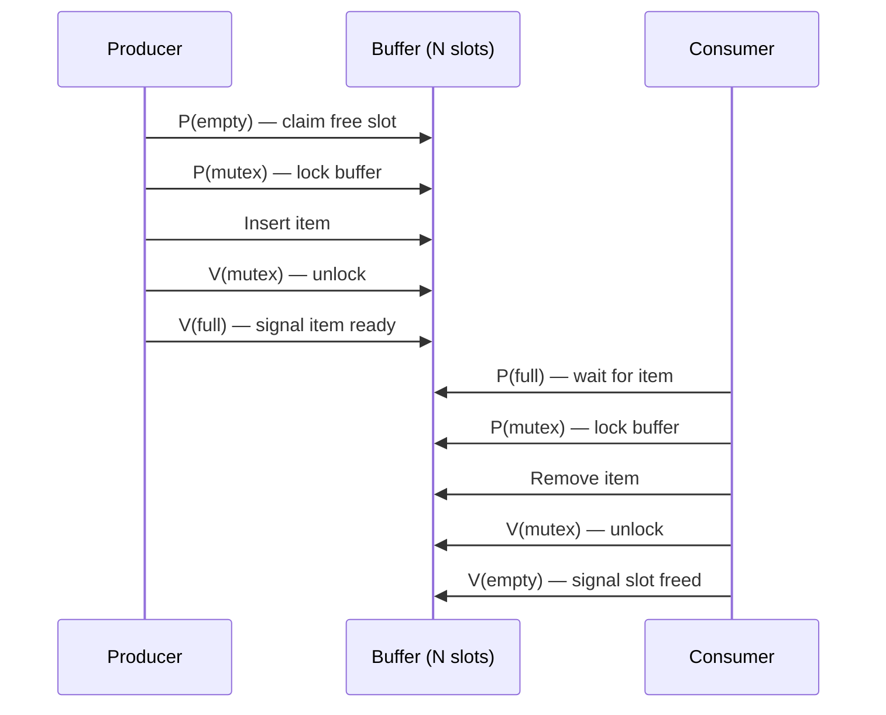

---
tags:
  - csos
  - csos/synchronization
confidence: verified
up: "[[Synchronization Overview]]"
tier-coverage:
  - intuition
  - core
  - deep-dive
  - practice
---
# Classic Synchronization Problems

> **One-line summary**: Three canonical problems — Producer-Consumer, Readers-Writers, and Dining Philosophers — stress-test synchronisation primitives and expose deadlock, starvation, and race conditions.

## 🎯 Intuition
**The Core Idea:** These three problems are the "crash tests" of concurrency — if your synchronisation primitives handle these correctly, they'll likely handle real workloads too.
**Analogy:** Producer-Consumer = a sushi conveyor belt (chef adds plates, diners take them; belt has limited space). Readers-Writers = a museum exhibit (many visitors can look simultaneously, but the curator needs exclusive access to rearrange). Dining Philosophers = five people at a round table with one chopstick between each pair — everyone needs two chopsticks to eat.
**Why It Matters:** Nearly every real concurrent system is a variant of one of these problems: thread pools, database read/write locks, and resource allocation all map directly to these patterns.

---

## ⚙️ Core Mechanics
### How It Works
Three canonical problems stress-test synchronisation primitives. Every serious concurrent system design should be checked against them.

### 1. The Producer-Consumer Problem (Bounded Buffer)

**Scenario:** Producers add items to a fixed-size buffer; consumers remove them. Producers must wait when the buffer is full; consumers must wait when it is empty.

**Semaphore solution:**
- `mutex = 1` — mutual exclusion on buffer access.
- `empty = N` — count of free slots.
- `full = 0` — count of filled slots.

Producer: `P(empty)` → `P(mutex)` → add item → `V(mutex)` → `V(full)`
Consumer: `P(full)` → `P(mutex)` → remove item → `V(mutex)` → `V(empty)`

**Figure:** Producer-Consumer with semaphores — P(empty)/P(full) must precede P(mutex) to prevent deadlock.

**Key insight:** Always P(resource-count) before P(mutex) to avoid deadlock.

### 2. The Readers-Writers Problem

**Scenario:** A shared database can be read by many concurrent readers but written by only one writer, with no concurrent readers.

**First readers-writers:** Readers prefer — writers may starve if readers continuously arrive.
**Second readers-writers:** Writers prefer — readers may starve.
**Third (fair):** FIFO ordering prevents starvation of either.

### 3. The Dining Philosophers Problem

**Scenario:** Five philosophers alternate between thinking and eating. Each needs two forks (shared with neighbours) to eat. With naïve "pick up left then right" strategy, all pick up their left fork simultaneously → **deadlock**.

**Correct solutions:**
- **Asymmetric ordering:** One philosopher picks up right fork first; breaks circular wait.
- **Arbitrator (waiter) solution:** Philosophers ask permission before picking up any fork.
- **Chandy/Misra:** Message-passing solution that scales to distributed systems.
- **Limit occupancy:** Allow at most four of five philosophers to sit at a time.

**Teaching value:** Illustrates deadlock, starvation, and the need for careful resource ordering.

### Key Concepts

| Problem | Resources | Hazards | Classic Fix |
|---------|-----------|---------|-------------|
| Producer-Consumer | Bounded buffer slots | Deadlock (wrong P order), race on buffer | Semaphores (empty, full, mutex) |
| Readers-Writers | Shared data | Writer starvation or reader starvation | Read/write locks with fairness policy |
| Dining Philosophers | Forks (shared) | Deadlock (circular wait), starvation | Resource ordering, occupancy limit |

### Key Facts
- In the producer-consumer solution, P(resource-count) MUST come before P(mutex) — reversing the order causes deadlock.
- The readers-writers problem has no perfect solution: favouring readers starves writers and vice versa. FIFO fairness adds overhead.
- The dining philosophers problem demonstrates all four Coffman deadlock conditions simultaneously.
- All three problems have solutions using semaphores, monitors, or message passing.

---

## 🔬 Deep Dive
### Implementation Details
- **Producer-Consumer in Linux**: The kernel's `kfifo` (kernel FIFO) implements a lock-free single-producer, single-consumer circular buffer using memory barriers instead of mutexes. For multi-producer/multi-consumer, a spinlock protects the buffer.
- **Read-Write Locks in POSIX**: `pthread_rwlock_t` provides readers-writers semantics. Default policy varies by implementation — glibc prefers readers; `PTHREAD_RWLOCK_PREFER_WRITER_NONRECURSIVE_NP` prefers writers. Neither guarantees FIFO fairness.
- **RCU (Read-Copy-Update)**: Linux's alternative to read-write locks for kernel data structures. Readers proceed with zero synchronisation overhead; writers create a modified copy and atomically swap it in, then wait for all readers to finish (a "grace period") before freeing the old version. Ideal for read-heavy workloads.
- **Dining Philosophers — Chandy/Misra**: Each fork is a token with a "dirty" flag. A philosopher requesting a dirty fork gets it (the holder cleans it before sending). This prevents deadlock and starvation in distributed systems.

### Edge Cases and Pitfalls
- **Bounded buffer with wrong semaphore order**: `P(mutex)` then `P(empty)` → producer holds mutex, waits for empty slots; consumer needs mutex to free slots → deadlock.
- **Reader-lock starvation**: Under readers-prefer, a steady stream of readers prevents writers from ever acquiring the lock. In a database, this means writes (commits) can be blocked indefinitely.
- **Dining philosophers with all-same ordering**: All philosophers pick up left then right → all hold left, all wait for right → deadlock. Just one philosopher reversing the order breaks the cycle.
- **Spurious wakeups**: Monitor-based solutions must use `while` (not `if`) for condition checks because the scheduler may wake a thread without the condition being true.

### Real-World Systems
- **Databases**: Row-level read-write locks are essentially the readers-writers problem. PostgreSQL uses MVCC (Multi-Version Concurrency Control) to avoid locking readers entirely.
- **Linux kernel**: RCU for routing tables, module lists, and file system data; kfifo for device driver buffers; rwlock for less performance-critical structures.
- **Java `java.util.concurrent`**: `BlockingQueue` (producer-consumer), `ReadWriteLock` (readers-writers), `Semaphore` (dining philosophers and general counting).
- **Go channels**: Producer-consumer is idiomatic in Go using buffered channels — the runtime handles all synchronisation.

---

## 🏋️ Practice
### Warm-Up (5 min)
1. In the producer-consumer solution, why must `P(empty)` come before `P(mutex)` in the producer?
2. Under the first readers-writers policy, describe a scenario where the writer starves.
3. In the dining philosophers problem, what specific deadlock condition does the "asymmetric ordering" solution break?

### Core Problems
1. **Bounded buffer implementation**: Implement the producer-consumer problem using POSIX semaphores in pseudocode. Then re-implement it using a monitor (mutex + two condition variables: `not_full` and `not_empty`). Compare the two approaches: which is easier to get right? Which is more error-prone?
2. **Readers-Writers fairness**: Design a FIFO-fair readers-writers lock where requests are served in arrival order: if a writer is waiting, no new readers can start until the writer has been served. Implement using a mutex, a condition variable, and a queue. Trace a scenario with: R1 arrives, R2 arrives, W1 arrives, R3 arrives. Show the order of execution.

### Challenge
The "Cigarette Smokers Problem" (Patil, 1971) involves three smokers and an agent. Each smoker has an infinite supply of one of three ingredients (tobacco, paper, matches); the agent places two ingredients on the table. The smoker with the third ingredient picks them up and smokes. Design a solution using: (a) semaphores only, (b) monitors with condition variables. The classic semaphore solution requires "helper" threads — explain why a direct semaphore solution without helpers is impossible and what this reveals about the expressiveness of semaphores vs. monitors.

---

*See also:* [[Deadlock Fundamentals]] — the dining philosophers problem is a canonical deadlock scenario · [[Deadlock Prevention]] — resource ordering solves the dining philosophers by breaking circular wait · [[Interprocess Communication]] — producer-consumer is an IPC pattern (pipes, bounded buffers) · [[Multiprocessor Systems]] — readers-writers performance depends on cache coherence and spin lock design

## Supporting Chunks

- [[Synchronization - The producer-consumer problem requires a bounded buffer with synchronised access]]
- [[Synchronization - The dining philosophers problem exposes deadlock and starvation in resource allocation]]

## References

See [[CS Operating Systems/Sources/Sources Index#Tanenbaum 2015|Sources Index]]. Chapter 2.
