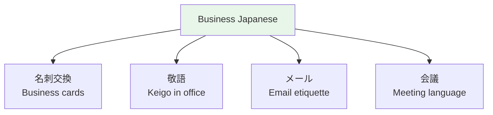

# Business Japanese — Workplace Communication



## 🎯 Intuition

**The Core Idea:** Japanese workplace communication has strict rules — business cards, email etiquette, meeting language.
**Analogy:** Like a workplace etiquette manual — but in Japan, the rules are more rigid and deviation is noticed.
**Why It Matters:** Business Japanese is a distinct skill set that even native speakers study formally.

## ⚙️ Core Mechanics

## Email Structure
```
[Company] [Department] [Name] 様

お世話になっております。
![[nontbl-010-osewa-ni-natte.mp3]]
[Your company]の[Name]です。

[Main content]

お忙しいところ恐縮ですが、
![[nontbl-011-oisogashii-tokoro.mp3]]
ご確認のほど、よろしくおねがいいたします。
![[nontbl-012-gokakunin-nohodo.mp3]]

[Your Company]
[Your Name]
```

> お世話になっております。
> ![[business-007-osewa-ni-natte-orimasu.mp3]]

> お忙しいところ恐縮ですが、
> ![[biz2-001-oisogashii-tokoro-kyoushuku-desu-ga.mp3]]

> ご確認のほど、よろしくおねがいいたします。
> ![[business-008-gokakunin-yoroshiku.mp3]]


## Essential Business Phrases

| Japanese | Use | Audio |
|----------|-----|-------|
| お疲れ様です | Greeting colleagues (anytime) | ![[business-001-otsukaresama-desu.mp3]] |
| 失礼します | Entering/leaving a room | ![[business-002-shitsurei-shimasu.mp3]] |
| 少々おまちください | "Please wait a moment" | ![[business-003-shoushou-omachi-kudasai.mp3]] |
| かしこまりました | "Understood" (very polite) | ![[business-004-kashikomarimashita.mp3]] |
| 承知しました | "Understood" (polite) | ![[business-005-shouchi-shimashita.mp3]] |
| 申し訳ございません | Deep apology | ![[business-006-moushiwake-gozaimasen.mp3]] |


## Meeting Language

| Japanese | Meaning | Audio |
|----------|---------|-------|
| 会議を始めましょう | Let's start the meeting | ![[business-009-kaigi-wo-hajimemashou.mp3]] |
| ご意見をおねがいします | Please share your opinion | ![[biz2-002-goiken-wo-onegaishimasu.mp3]] |
| 以上です | That concludes my part | ![[business-010-ijou-desu.mp3]] |


## Phone Etiquette
- Answer: もしもし ![[biz2-003-moshimoshi.mp3]] is for PERSONAL calls. Business: はい、[Company]でございます。
- Taking a message: 伝言をおあずかりいたします。 ![[biz2-004-dengon-wo-oazukari-itashimasu.mp3]]


## 🔬 Deep Dive

### Nuances and Exceptions
- Context is king in Japanese — the same expression can have different nuances in different situations.
- Pay attention to how native speakers use these patterns in real conversation.

### Formal vs Informal Usage
- Most patterns have both polite (です/ます) and casual (dictionary form) variants.
- Choose formality based on your relationship with the listener and the situation.

### Common Mistakes by English Speakers
- Transferring English pronunciation habits to Japanese sounds.
- Missing register differences that are critical in Japanese social contexts.
- Underestimating the importance of non-verbal communication.

## 🏋️ Practice

### Warm-Up — Recognition
1. What number is considered unlucky in Japan? → (4 — sounds like 死 'death')
2. When should you use keigo? → (Business, formal situations, with superiors)
3. What do you say when entering someone's home? → (お邪魔します)

### Core Exercises — Production
1. **Choose the register:** Your boss asks about a project. Respond using appropriate keigo.
2. **Translate to polite:** 食べる → 召し上がる (sonkeigo) / いただく (kenjōgo)

### Challenge — Real World
You receive a business card from a Japanese colleague. Describe the proper protocol step-by-step, then write a follow-up thank-you email using appropriate formal language.

## References
- [[Japanese/Sources/Sources Index|Sources Index]]
