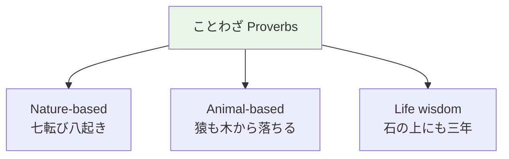

# Idioms and Proverbs — ことわざ

## 🎯 Intuition

**The Core Idea:** Japanese proverbs (ことわざ) and idioms pack cultural wisdom into memorable phrases.
**Analogy:** Like 'the early bird catches the worm' — ことわざ reveal Japanese values and thinking patterns.
**Why It Matters:** Using proverbs in conversation shows cultural depth and impresses native speakers.

## ⚙️ Core Mechanics

## Common Proverbs

| Japanese | Literal | Meaning | Audio |
|----------|---------|---------|-------|
| 猿も木から落ちる | Even monkeys fall from trees | Anyone can make mistakes | ![[idiom-001-saru-mo-ki-kara-ochiru.mp3]] |
| 七転び八起き | Fall 7 times, rise 8 | Never give up | ![[idiom-002-nanakorobi-yaoki.mp3]] |
| 石の上にも三年 | 3 years on a stone | Patience pays off | ![[idiom-003-ishi-no-ue-ni-mo-sannen.mp3]] |
| 出る杭は打たれる | The nail that sticks out gets hammered | Don't stand out too much | ![[idiom-004-deru-kui-wa-utareru.mp3]] |
| 一期一会 | One time, one meeting | Every encounter is unique | ![[idiom-005-ichigo-ichie.mp3]] |
| 花より団子 | Dumplings over flowers | Substance over beauty | ![[idiom-006-hana-yori-dango.mp3]] |

## Four-Character Idioms (四字熟語)

| Japanese | Reading | Meaning | Audio |
|----------|---------|---------|-------|
| 一石二鳥 | isseki nichō | Kill two birds with one stone | ![[idiom-007-isseki-nichou.mp3]] |
| 十人十色 | jūnin toiro | Ten people, ten colors | ![[idiom-008-juunin-toiro.mp3]] |
| 自業自得 | jigō jitoku | You reap what you sow | ![[idiom-009-jigou-jitoku.mp3]] |
| 以心伝心 | ishin denshin | Telepathy / unspoken understanding | ![[idiom-010-ishin-denshin.mp3]] |

## Body Idioms

| Japanese | Literal | Meaning | Audio |
|----------|---------|---------|-------|
| 首を長くする | Lengthen one's neck | Wait eagerly | ![[idiom-011-kubi-wo-nagaku-suru.mp3]] |
| 目が高い | Eyes are high | Have good taste | ![[idiom-012-me-ga-takai.mp3]] |
| 腹が立つ | Stomach stands up | Get angry | ![[idiom-013-hara-ga-tatsu.mp3]] |

## 🔬 Deep Dive

### Nuances and Exceptions
- Context is king in Japanese — the same expression can have different nuances in different situations.
- Pay attention to how native speakers use these patterns in real conversation.

### Formal vs Informal Usage
- Most patterns have both polite (です/ます) and casual (dictionary form) variants.
- Choose formality based on your relationship with the listener and the situation.

### Common Mistakes by English Speakers
- Transferring English pronunciation habits to Japanese sounds.
- Missing register differences that are critical in Japanese social contexts.
- Underestimating the importance of non-verbal communication.

## 🏋️ Practice

### Warm-Up — Recognition
1. What number is considered unlucky in Japan? → (4 — sounds like 死 'death')
2. When should you use keigo? → (Business, formal situations, with superiors)
3. What do you say when entering someone's home? → (お邪魔します)

### Core Exercises — Production
1. **Choose the register:** Your boss asks about a project. Respond using appropriate keigo.
2. **Translate to polite:** 食べる → 召し上がる (sonkeigo) / いただく (kenjōgo)

### Challenge — Real World
You receive a business card from a Japanese colleague. Describe the proper protocol step-by-step, then write a follow-up thank-you email using appropriate formal language.

## References
- [[Japanese/Sources/Sources Index|Sources Index]]
