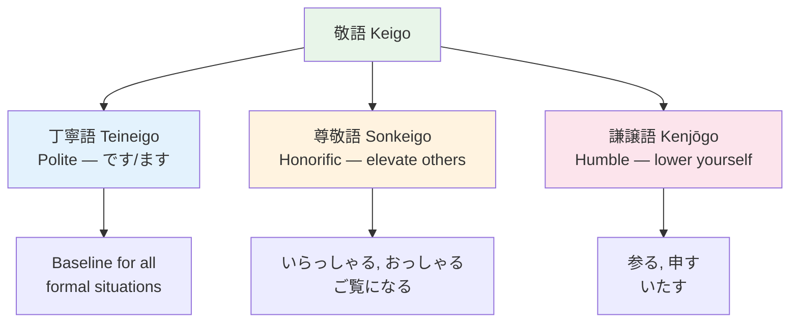

# Keigo — Kenjōgo (Humble) ![[kenjo2-001-kenjougo.mp3]]

> **謙譲語 lowers yourself or your in-group. Use when describing YOUR actions to someone of higher status.**

## 🎯 Intuition

**The Core Idea:** Kenjōgo (謙譲語) lowers your own actions — the humble counterpart to sonkeigo.
**Analogy:** Like saying 'I humbly submit' instead of 'I'll send it' — you lower yourself to elevate the listener.
**Why It Matters:** Paired with sonkeigo, kenjōgo is essential for proper business Japanese.

## ⚙️ Core Mechanics

謙譲語 lowers yourself or your in-group. Use when describing YOUR actions to someone of higher status.
![[nontbl-036-kenjougo.mp3]]

## Formation Patterns

### Pattern 1: お + stem + する
- 持つ → お持ちする (I'll carry it for you) ![[keigo-007-omochi-suru.mp3]]
- 送る → お送りする (I'll send it) ![[kenjo2-002-o-okuri-suru.mp3]]

### Pattern 2: Special replacement verbs

| Plain | Kenjōgo | Meaning | Audio |
|-------|---------|---------|-------|
| いる | おる | To be | ![[kenjo2-003-oru.mp3]] |
| 行く/来る | 参る | To go/come | ![[keigo-008-mairu.mp3]] |
| 食べる/飲む | いただく | To eat/drink | ![[keigo-010-itadaku.mp3]] |
| 言う | 申す | To say | ![[keigo-009-mousu.mp3]] |
| 見る | 拝見する | To see/look | ![[keigo-011-haiken-suru.mp3]] |
| する | いたす | To do | ![[keigo-012-itasu.mp3]] |
| 知っている | 存じている | To know | ![[kenjo2-004-zonjite-iru.mp3]] |
| もらう | いただく | To receive | ![[gap-001-phrase.mp3]] |
| あげる | 差し上げる | To give | ![[kenjo2-005-sashiageru.mp3]] |

> 存じております。 (I am aware / I know.)
> ![[keigo-013-zonjite-orimasu.mp3]]

## Examples in Context
> 私から先生にお伝えいたします。 (I will convey it to the teacher.)
> ![[keigo-016-watashi-kara-otsutae.mp3]]

> 資料を拝見しました。 (I have seen the documents.)
> ![[keigo-017-shiryou-wo-haiken.mp3]]

> 明日参ります。 (I will come tomorrow.)
> ![[keigo-018-ashita-mairimasu.mp3]]

## The Uchi-Soto Rule in Action
Talking to a client about YOUR boss:
- ✗ 部長がおっしゃいました (sonkeigo — wrong! Boss is uchi here) ![[kenjo2-006-buchou-ga-osshaimashita.mp3]]
- ○ 部長が申しておりました (kenjōgo — correct! Lower your in-group) ![[keigo-019-buchou-moushite-orimashita.mp3]]

## 🔬 Deep Dive

### Nuances and Exceptions
- Context is king in Japanese — the same expression can have different nuances in different situations.
- Pay attention to how native speakers use these patterns in real conversation.

### Formal vs Informal Usage
- Most patterns have both polite (です/ます) and casual (dictionary form) variants.
- Choose formality based on your relationship with the listener and the situation.

### Common Mistakes by English Speakers
- Transferring English pronunciation habits to Japanese sounds.
- Missing register differences that are critical in Japanese social contexts.
- Underestimating the importance of non-verbal communication.

## 🏋️ Practice

### Warm-Up — Recognition
1. What are the three types of keigo? → (丁寧語, 尊敬語, 謙譲語)
2. Which keigo type do you use about YOUR OWN actions? → (謙譲語 Kenjōgo / humble)
3. What is the sonkeigo form of 食べる? → (召し上がる)

### Core Exercises — Production
1. **Convert to keigo:** 先生が言った → 先生がおっしゃった (sonkeigo)
2. **Convert to humble:** 私が行く → 私が参る (kenjōgo)

### Challenge — Real World
You're calling a client's office. Write a phone script that uses all three keigo types: teineigo for the call structure, sonkeigo when referring to the client, and kenjōgo for your own actions.

## References
- [[Japanese/Sources/Sources Index|Sources Index]]
