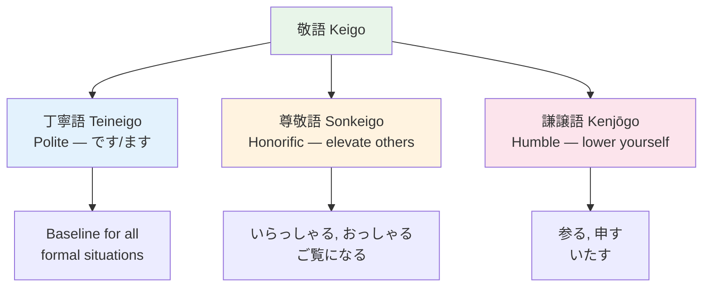

# Keigo — Sonkeigo (Honorific) ![[sonkei2-001-sonkeigo.mp3]]

> **尊敬語 elevates the listener or a third party. Use when describing actions of someone you respect.**

## 🎯 Intuition

**The Core Idea:** Sonkeigo (尊敬語) elevates others' actions — used when talking about superiors or customers.
**Analogy:** Like saying 'His Excellency departs' instead of 'he leaves' — sonkeigo linguistically raises the other person.
**Why It Matters:** Required in business when discussing bosses, clients, or anyone deserving respect.

## ⚙️ Core Mechanics

尊敬語 elevates the listener or a third party. Use when describing actions of someone you respect.
![[nontbl-035-sonkeigo.mp3]]

## Formation Patterns

### Pattern 1: お + stem + になる
- 読む → お読みになる (You read) ![[keigo-001-oyomi-ni-naru.mp3]]
- 書く → お書きになる (You write) ![[sonkei2-002-o-kaki-ni-naru.mp3]]
- 使う → お使いになる (You use) ![[sonkei2-003-o-tsukai-ni-naru.mp3]]

### Pattern 2: Special replacement verbs

| Plain | Sonkeigo | Meaning | Audio |
|-------|----------|---------|-------|
| いる | いらっしゃる | To be/exist | ![[keigo-002-irassharu.mp3]] |
| 行く/来る | いらっしゃる | To go/come | ![[gap-006-.mp3]] |
| 食べる/飲む | 召し上がる | To eat/drink | ![[keigo-003-meshiagaru.mp3]] |
| 言う | おっしゃる | To say | ![[keigo-004-ossharu.mp3]] |
| 見る | ご覧になる | To see/look | ![[keigo-005-goran-ni-naru.mp3]] |
| する | なさる | To do | ![[keigo-006-nasaru.mp3]] |
| 知っている | ご存じだ | To know | ![[sonkei2-004-gozonji-da.mp3]] |
| くれる | くださる | To give (to me) | ![[sonkei2-005-kudasaru.mp3]] |

### Pattern 3: Passive form as honorific
- 先生が来られました。 (The teacher came.) — Less formal than いらっしゃる ![[sonkei2-006-sensei-ga-koraremashita.mp3]]

## Examples in Context
> 社長はもうお帰りになりました。 (The president has already left.)
> ![[keigo-014-shachou-okaeiri.mp3]]

> 先生は何とおっしゃいましたか。 (What did the teacher say?)
> ![[keigo-015-sensei-osshaimashita.mp3]]

## 🔬 Deep Dive

### Nuances and Exceptions
- Context is king in Japanese — the same expression can have different nuances in different situations.
- Pay attention to how native speakers use these patterns in real conversation.

### Formal vs Informal Usage
- Most patterns have both polite (です/ます) and casual (dictionary form) variants.
- Choose formality based on your relationship with the listener and the situation.

### Common Mistakes by English Speakers
- Transferring English pronunciation habits to Japanese sounds.
- Missing register differences that are critical in Japanese social contexts.
- Underestimating the importance of non-verbal communication.

## 🏋️ Practice

### Warm-Up — Recognition
1. What are the three types of keigo? → (丁寧語, 尊敬語, 謙譲語)
2. Which keigo type do you use about YOUR OWN actions? → (謙譲語 Kenjōgo / humble)
3. What is the sonkeigo form of 食べる? → (召し上がる)

### Core Exercises — Production
1. **Convert to keigo:** 先生が言った → 先生がおっしゃった (sonkeigo)
2. **Convert to humble:** 私が行く → 私が参る (kenjōgo)

### Challenge — Real World
You're calling a client's office. Write a phone script that uses all three keigo types: teineigo for the call structure, sonkeigo when referring to the client, and kenjōgo for your own actions.

## References
- [[Sources Index]]
