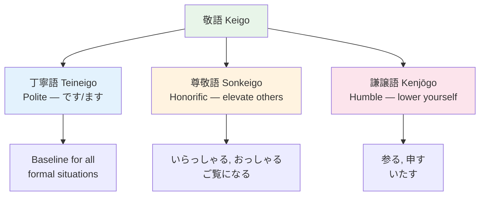

# Keigo — Teineigo (Polite) ![[teinei-001-teineigo.mp3]]

> **丁寧語 is the most basic level of politeness. It's the です/ます form you learn first.**

## 🎯 Intuition

**The Core Idea:** Teineigo (丁寧語) is polite language — the です/ます baseline that every learner starts with.
**Analogy:** Like using 'please' and 'thank you' — teineigo is the minimum politeness expected with strangers.
**Why It Matters:** This is your default register for all non-casual situations.

## ⚙️ Core Mechanics

丁寧語 is the most basic level of politeness. It's the です/ます form you learn first.
![[nontbl-037-teineigo.mp3]]

## The です/ます System ![[teinei-002-desu-masu.mp3]]

| Type     | Plain  | Teineigo | Audio                                        |
| -------- | ------ | -------- | -------------------------------------------- |
| Noun/adj | だ      | です       | ![[teinei-003-desu.mp3]]              |
| Verb     | 食べる    | 食べます     | ![[teinei-004-tabemasu.mp3]]          |
| Past     | 食べた    | 食べました    | ![[teinei-005-tabemashita.mp3]]       |
| Negative | 食べない   | 食べません    | ![[teinei-006-tabemasen.mp3]]         |
| Past neg | 食べなかった | 食べませんでした | ![[teinei-007-tabemasen-deshita.mp3]] |

## When to Use
- First meeting with anyone
- Shops, restaurants, public situations
- Workplace (baseline)
- Anyone older, unless they say otherwise

## 美化語 (Bikago) — Beautifying Language ![[teinei-008-bikago.mp3]]
![[nontbl-046-bikago.mp3]]
Adding お/ご to make words more refined: ![[teinei-009-o-go.mp3]]

| Word | Bikago | Notes | Audio |
|------|--------|-------|-------|
| 水 | お水 | Always used | ![[teinei-010-omizu.mp3]] |
| 茶 | お茶 | Always used | ![[teinei-011-ocha.mp3]] |
| 金 | お金 | Always used | ![[teinei-012-okane.mp3]] |
| 返事 | ご返事 | ご for Sino-Japanese | ![[teinei-013-gohenji.mp3]] |
| 住所 | ご住所 | ご for Sino-Japanese | ![[teinei-014-gojuusho.mp3]] |

## 🔬 Deep Dive

### When Plain Is OK
- Close friends
- Family
- People clearly younger in casual settings
- Internal monologue / diary

### Nuances and Exceptions
- Context is king in Japanese — the same expression can have different nuances in different situations.
- Pay attention to how native speakers use these patterns in real conversation.

### Formal vs Informal Usage
- Most patterns have both polite (です/ます) and casual (dictionary form) variants.
- Choose formality based on your relationship with the listener and the situation.

### Common Mistakes by English Speakers
- Transferring English pronunciation habits to Japanese sounds.
- Missing register differences that are critical in Japanese social contexts.
- Underestimating the importance of non-verbal communication.

## 🏋️ Practice

### Warm-Up — Recognition
1. What are the three types of keigo? → (丁寧語, 尊敬語, 謙譲語)
2. Which keigo type do you use about YOUR OWN actions? → (謙譲語 Kenjōgo / humble)
3. What is the sonkeigo form of 食べる? → (召し上がる)

### Core Exercises — Production
1. **Convert to keigo:** 先生が言った → 先生がおっしゃった (sonkeigo)
2. **Convert to humble:** 私が行く → 私が参る (kenjōgo)

### Challenge — Real World
You're calling a client's office. Write a phone script that uses all three keigo types: teineigo for the call structure, sonkeigo when referring to the client, and kenjōgo for your own actions.

## References
- [[Japanese/Sources/Sources Index|Sources Index]]
