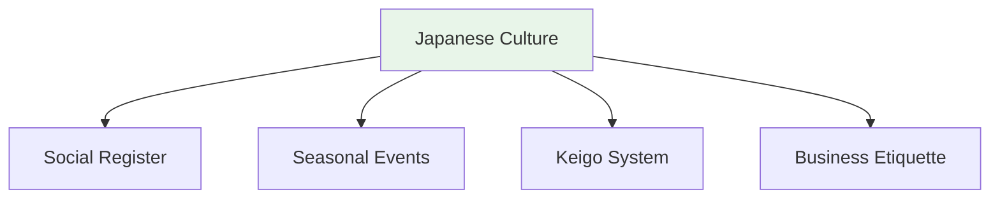

# Numbers and Superstitions

## 🎯 Intuition

**The Core Idea:** Japanese number superstitions influence gifts, addresses, hospitals, and daily life.
**Analogy:** Like how 13 is unlucky in the West — but in Japan it's 4 (sounds like 'death') and 9 (sounds like 'suffering').
**Why It Matters:** Knowing number taboos prevents serious social blunders in gift-giving and formal situations.

## ⚙️ Core Mechanics

## Unlucky Numbers

| Number | Reading | Why | Audio |
|--------|---------|-----|-------|
| 4 | し (shi) | Sounds like 死 (death) | ![[numsuper-001-shi.mp3]] |
| 9 | く (ku) | Sounds like 苦 (suffering) | ![[numsuper-002-ku.mp3]] |
| 42 | しに | Sounds like 死に (to death) | ![[numsuper-003-shini.mp3]] |
| 49 | しく | Sounds like 死苦 (death suffering) | ![[numsuper-004-shiku.mp3]] |

### Real-World Impact
- Many hospitals skip room/floor 4 and 9
- Gifts: NEVER give sets of 4
- When counting, use よん (yon) instead of し ![[numsuper-007-yon.mp3]]

## Lucky Numbers

| Number | Why | Audio |
|--------|-----|-------|
| 7 | Lucky in many traditions (七福神, seven lucky gods) | ![[numsuper-005-shichifukujin.mp3]] |
| 8 | 末広がり — the kanji 八 widens at bottom = expanding fortune | ![[numsuper-006-suehirogari.mp3]] |

## Gift-Giving Number Rules

| ✗ Avoid | ○ Preferred |
|---------|------------|
| 4 of anything | 3, 5, 7 items |
| Sharp objects (symbolize cutting ties) | Sweets, fruit |
| White flowers (funerals) | Seasonal items |

## Other Superstitions
- Don't stick chopsticks upright in rice (funeral offering)
- Don't pass food chopstick-to-chopstick (funeral ritual)
- Don't sleep facing north (corpses are placed facing north)

## 🔬 Deep Dive

### Nuances and Exceptions
- Context is king in Japanese — the same expression can have different nuances in different situations.
- Pay attention to how native speakers use these patterns in real conversation.

### Formal vs Informal Usage
- Most patterns have both polite (です/ます) and casual (dictionary form) variants.
- Choose formality based on your relationship with the listener and the situation.

### Common Mistakes by English Speakers
- Transferring English pronunciation habits to Japanese sounds.
- Missing register differences that are critical in Japanese social contexts.
- Underestimating the importance of non-verbal communication.

## 🏋️ Practice

### Warm-Up — Recognition
1. What number is considered unlucky in Japan? → (4 — sounds like 死 'death')
2. When should you use keigo? → (Business, formal situations, with superiors)
3. What do you say when entering someone's home? → (お邪魔します)

### Core Exercises — Production
1. **Choose the register:** Your boss asks about a project. Respond using appropriate keigo.
2. **Translate to polite:** 食べる → 召し上がる (sonkeigo) / いただく (kenjōgo)

### Challenge — Real World
You receive a business card from a Japanese colleague. Describe the proper protocol step-by-step, then write a follow-up thank-you email using appropriate formal language.

## References
- [[Sources Index]]
