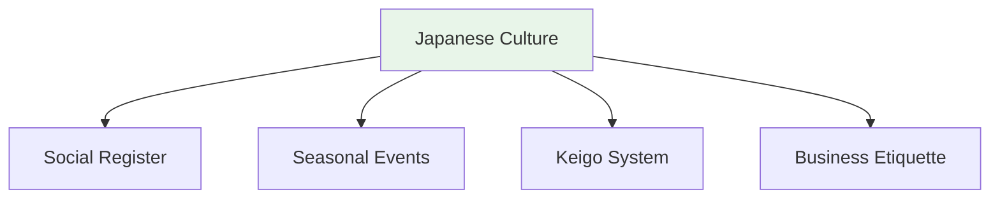

# Seasonal Greetings and Cultural Expressions

## 🎯 Intuition

**The Core Idea:** Japanese seasonal greetings and cultural expressions tied to the calendar.
**Analogy:** Like how English has 'Merry Christmas' — Japan has specific greetings for every season and life event.
**Why It Matters:** Seasonal awareness (季節感) is deeply valued in Japanese culture and communication.

## ⚙️ Core Mechanics

## New Year (正月) ![[season2-001-shougatsu.mp3]]

| Japanese | Meaning | Audio |
|----------|---------|-------|
| あけましておめでとうございます | Happy New Year | ![[culture-006-akemashite-omedetou.mp3]] |
| 今年もよろしくおねがいします | Please be kind this year too | ![[culture-007-kotoshi-mo-yoroshiku.mp3]] |
| 年賀状 (nengajō) | New Year's card | ![[season2-002-nengajou.mp3]] |

## Seasonal Greetings

| Season | Phrase | Meaning | Audio |
|--------|--------|---------|-------|
| Summer | 暑中お見舞い申し上げます | Summer greetings | ![[season2-003-shochuu-omimai-moushiagemasu.mp3]] |
| Year-end | よいお年を | Have a good new year | ![[culture-008-yoi-otoshi-wo.mp3]] |

## Gift-Giving (贈り物) ![[season2-004-okurimono.mp3]]

| Japanese | When | Audio |
|----------|------|-------|
| お中元 (ochūgen) | Mid-year gifts (July) | ![[season2-005-ochuugen.mp3]] |
| お歳暮 (oseibo) | Year-end gifts (December) | ![[season2-006-oseibo.mp3]] |
| つまらないものですが | "This is a trifle" (when giving) | ![[culture-009-tsumaranai-mono-desu-ga.mp3]] |

## Common Set Phrases

| Japanese | Meaning | Audio |
|----------|---------|-------|
| いただきます | Before eating | ![[culture-001-itadakimasu2.mp3]] |
| ごちそうさまでした | After eating | ![[culture-002-gochisousama2.mp3]] |
| おじゃまします | Entering someone's home | ![[culture-003-ojama-shimasu.mp3]] |
| お大事に | "Take care" (to sick person) | ![[culture-004-odaiji-ni.mp3]] |
| がんばってください | "Do your best" | ![[culture-005-ganbatte-kudasai.mp3]] |

## Celebration Toast
> 乾杯！(kanpai!)
> ![[culture-010-kanpai.mp3]]

## 🔬 Deep Dive

### Nuances and Exceptions
- Context is king in Japanese — the same expression can have different nuances in different situations.
- Pay attention to how native speakers use these patterns in real conversation.

### Formal vs Informal Usage
- Most patterns have both polite (です/ます) and casual (dictionary form) variants.
- Choose formality based on your relationship with the listener and the situation.

### Common Mistakes by English Speakers
- Transferring English pronunciation habits to Japanese sounds.
- Missing register differences that are critical in Japanese social contexts.
- Underestimating the importance of non-verbal communication.

## 🏋️ Practice

### Warm-Up — Recognition
1. What number is considered unlucky in Japan? → (4 — sounds like 死 'death')
2. When should you use keigo? → (Business, formal situations, with superiors)
3. What do you say when entering someone's home? → (お邪魔します)

### Core Exercises — Production
1. **Choose the register:** Your boss asks about a project. Respond using appropriate keigo.
2. **Translate to polite:** 食べる → 召し上がる (sonkeigo) / いただく (kenjōgo)

### Challenge — Real World
You receive a business card from a Japanese colleague. Describe the proper protocol step-by-step, then write a follow-up thank-you email using appropriate formal language.

## References
- [[Japanese/Sources/Sources Index|Sources Index]]
