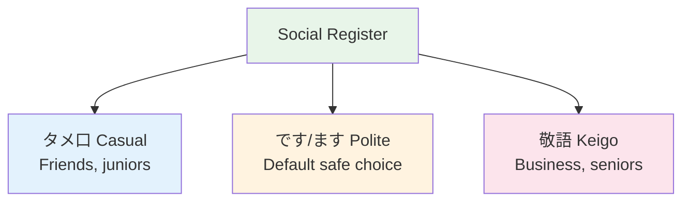

# Social Register — When to Use What

## 🎯 Intuition

**The Core Idea:** Social register determines which language level to use with whom — getting it wrong is a serious faux pas.
**Analogy:** Like knowing when to use 'Hey dude' vs 'Good afternoon, sir' — but with grammatical consequences.
**Why It Matters:** Choosing the wrong register can offend, embarrass, or create social distance.

## ⚙️ Core Mechanics

## The Five Levels (Practical)

| Level | Name | Use with | Example | Audio |
|-------|------|----------|---------|-------|
| 1 | タメ口 (Casual) | Close friends, family | 食べる | ![[register-001-tameguchi.mp3]] |
| 2 | です/ます (Polite) | Strangers, colleagues | 食べます | ![[register-002-desu-masu.mp3]] |
| 3 | 敬語 Light | Senior colleagues, teachers | 召し上がりますか | ![[register-003-meshiagarimasu-ka.mp3]] |
| 4 | Full 敬語 | Clients, formal business | 召し上がっていただけますか | ![[register-004-meshiagatte-itadakemasu-ka.mp3]] |
| 5 | 最高敬語 | Emperor, extreme formality | (rarely encountered) | ![[register-005-saikou-keigo.mp3]] |

## Common Situations

| Situation | Register |
|-----------|----------|
| Email to professor | Level 3-4 |
| Text to classmate | Level 1-2 |
| Job interview | Level 4 |
| Convenience store | Level 2 |
| First date | Level 2-3, shifting to 1-2 |

## 🔬 Deep Dive

### Shifting Register
Natural conversations SHIFT registers:
- Start formal → relax as rapport builds
- Drinking parties (飲み会) often trigger a register drop ![[register-006-nomikai.mp3]]
- The senior person usually signals it: "もっとラフでいいよ" ![[register-007-motto-rafu-de-ii-yo.mp3]]

### Nuances and Exceptions
- Context is king in Japanese — the same expression can have different nuances in different situations.
- Pay attention to how native speakers use these patterns in real conversation.

### Common Mistakes by English Speakers
- Transferring English pronunciation habits to Japanese sounds.
- Missing register differences that are critical in Japanese social contexts.
- Underestimating the importance of non-verbal communication.

## 🏋️ Practice

### Warm-Up — Recognition
1. What number is considered unlucky in Japan? → (4 — sounds like 死 'death')
2. When should you use keigo? → (Business, formal situations, with superiors)
3. What do you say when entering someone's home? → (お邪魔します)

### Core Exercises — Production
1. **Choose the register:** Your boss asks about a project. Respond using appropriate keigo.
2. **Translate to polite:** 食べる → 召し上がる (sonkeigo) / いただく (kenjōgo)

### Challenge — Real World
You receive a business card from a Japanese colleague. Describe the proper protocol step-by-step, then write a follow-up thank-you email using appropriate formal language.

## References
- [[Japanese/Sources/Sources Index|Sources Index]]
