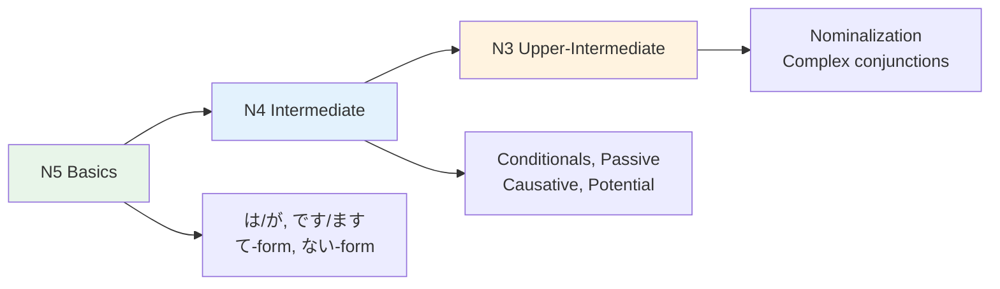

# Grammar — Comparison Across Levels

> **How the same concepts evolve from N5 to N3, showing the progression of complexity.**

## 🎯 Intuition

**The Core Idea:** A cross-level comparison showing how the same grammatical concepts evolve from N5 to N3.
**Analogy:** Like seeing the same math concept from arithmetic → algebra → calculus — grammar builds on itself.
**Why It Matters:** Understanding the progression helps you see where you are and what's coming next.

## ⚙️ Core Mechanics

## Expressing "Because"

| Level | Pattern | Example |
|-------|---------|---------|
| N5 | から (kara) | 雨だから (because it's raining) ![[gramcomp-001-amedakara.mp3]]|
| N4 | ので (node) | 雨なので (because it's raining — formal) ![[gramcomp-002-amenanode.mp3]]|
| N3 | ため (tame) | 雨のため (due to rain — written) ![[gramcomp-003-amenotame.mp3]]|

## Expressing "But"

| Level | Pattern | Example |
|-------|---------|---------|
| N5 | でも (demo) | でも、行きたい。 (But I want to go.) ![[gramcomp-004-demo-ikitai.mp3]]|
| N4 | けど/が | 難しいけど... (It's hard, but...) ![[gramcomp-005-muzukashiikedo.mp3]]|
| N3 | にもかかわらず | 雨にもかかわらず (despite the rain) ![[gramcomp-006-amenimokakawarazu.mp3]]|

## Expressing "If"

| Level | Pattern | Nuance |
|-------|---------|--------|
| N5 | と (to) ![[gramcomp-007-to.mp3]]| Automatic result |
| N4 | たら (tara) ![[gramcomp-008-tara.mp3]]| General "if/when" |
| N4 | ば (ba) ![[gramcomp-009-ba.mp3]]| Condition focus |
| N4 | なら (nara) ![[gramcomp-010-nara.mp3]]| Reacting to information |

## Expressing "Want"

| Level | Pattern | Example |
|-------|---------|---------|
| N5 | たい | 食べたい (I want to eat) ![[gramcomp-011-tabetai.mp3]]|
| N4 | てほしい | 食べてほしい (I want you to eat) ![[gramcomp-012-tabetehoshii.mp3]]|
| N3 | たがる | 食べたがる (show signs of wanting to eat) ![[gramcomp-013-tabetagaru.mp3]]|

## Expressing Ability

| Level | Pattern | Example |
|-------|---------|---------|
| N5 | できる | 日本語ができる (can do Japanese) ![[gramcomp-014-nihongogadekiru.mp3]]|
| N4 | Potential form | 話せる (can speak) ![[gramcomp-015-hanaseru.mp3]]|
| N3 | ようになる | 話せるようになる (come to be able to speak) ![[gramcomp-016-hanaseruyouninaru.mp3]]|

## Passive/Causative Evolution

| Level | Form | Example |
|-------|------|---------|
| N5 | Active only | 食べる (eat) ![[gramcomp-017-taberu.mp3]]|
| N4 | Passive | 食べられる (be eaten) ![[gramcomp-018-taberareru.mp3]]|
| N4 | Causative | 食べさせる (make eat) ![[gramcomp-019-tabesaseru.mp3]]|
| N4 | Causative-passive | 食べさせられる (be made to eat) ![[gramcomp-020-tabesaserareru.mp3]]|

## Key Insight
Japanese grammar builds in layers. N5 patterns aren't replaced — they're still used. Higher levels add nuance, formality, and precision. A native speaker uses ALL levels fluidly based on context.

## 🔬 Deep Dive

### Nuances and Exceptions
- Pay attention to context — the same grammar point can have different nuances in formal vs casual speech.
- Exceptions often come from classical Japanese or set phrases that don't follow modern rules.

### Formal vs Informal Usage
- Most patterns have both polite (です/ます) and casual (dictionary form) variants.
- Choose formality based on your relationship with the listener and the situation.

### Common Mistakes by English Speakers
- Applying English word order (SVO) instead of Japanese (SOV).
- Overusing pronouns — Japanese drops subjects when context is clear.
- Translating literally instead of using natural Japanese patterns.

## 🏋️ Practice

### Warm-Up — Recognition
1. Which particle completes this sentence? 私＿学生です。 → (は)
2. Is this sentence correct? 本が読みます。 → (No — should be 本を読みます)
3. What does この mean in: この本は面白い → (this)

### Core Exercises — Production
1. **Translate:** "I go to school by bus every day."
   → 毎日バスで学校に行きます。
2. **Fill in:** 友達＿映画＿見ました。 → (と / を)

### Challenge — Real World
You're at a konbini (convenience store). The clerk asks これでよろしいですか？ How do you respond if you also want to add a drink? Use appropriate particles and polite form.

## References
- [[Japanese/Sources/Sources Index|Sources Index]]
