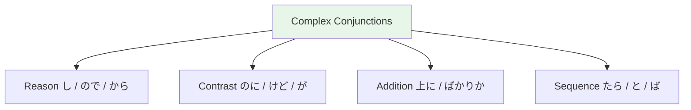

# N3 Grammar — Complex Conjunctions

> **N3 conjunctions let you express nuanced relationships between ideas — essential for reading and formal writing.**

## 🎯 Intuition

**The Core Idea:** Complex conjunctions connect clauses in nuanced ways — reason, contrast, addition, and sequence.
**Analogy:** Beyond basic 'and/but/so' — these are the sophisticated connectors like 'furthermore', 'despite', 'as a result of'.
**Why It Matters:** N3-level conjunctions are what separate textbook Japanese from natural-sounding speech.

## ⚙️ Core Mechanics

## Time-Related

### うちに (uchi ni) — "while (still in a state)"
![[n3conj-001-uchini.mp3]]
- 若いうちに、たくさん旅行したい。 (While I'm still young, I want to travel a lot.)
  ![[n3conj-002-wakaiuchini-takusanryokoushitai.mp3]]
- Implies the state won't last forever

### につれて (ni tsurete) — "as X increases, Y also"
![[n3conj-003-nitsurete.mp3]]
- 季節が変わるにつれて、景色も変わります。 (As the seasons change, the scenery also changes.)
  ![[n3conj-004-kisetsugakawarunitsurete-keshikimokawarimasu.mp3]]

### たびに (tabi ni) — "every time"
![[n3conj-005-tabini.mp3]]
- 日本に行くたびに、新しい発見があります。 (Every time I go to Japan, there are new discoveries.)
  ![[n3conj-006-nipponniikutabini-atarashiihakkengaarimasu.mp3]]

### とたんに (to tan ni) — "as soon as"
![[n3conj-007-totanni.mp3]]
- 家に着いたとたんに、雨が降り始めた。 (As soon as I arrived home, it started raining.)
  ![[n3conj-008-ienitsuitatotanni-amegaorihajimeta.mp3]]

## Degree and Extent

### ほど (hodo) — "to the extent that"
![[n3conj-009-hodo.mp3]]
- 死ぬほど疲れた。 (I was tired to the point of death.)
  ![[n3conj-010-shinuhodotsukareta.mp3]]
- 日本語は勉強すればするほど難しくなる。 (The more you study Japanese, the harder it gets.)
  ![[n3conj-011-nihongohabenkyousurebasuruhodomuzukashikunaru.mp3]]

### ばかり (bakari) — "only, nothing but"
![[n3conj-012-bakari.mp3]]
- 最近、雨ばかりです。 (Lately, it's been nothing but rain.)
  ![[n3conj-013-saikin-amebakaridesu.mp3]]
- たばかり — just did something: 今来たばかりです。 (I just arrived.)
  ![[n3conj-014-konraitabakaridesu.mp3]]

### くらい / ぐらい — "about, approximately"
![[n3conj-015-kurai-gurai.mp3]]
- 二時間ぐらいかかります。 (It takes about 2 hours.)
  ![[n3conj-016-nijikanguraikakarimasu.mp3]]

## Concession

### のに (noni) — "even though"
![[n3conj-017-noni.mp3]]
- 約束したのに、来なかった。 (Even though they promised, they didn't come.)
  ![[n3conj-018-yakusokushitanoni-konakatta.mp3]]
- Implies dissatisfaction or surprise

### くせに (kuse ni) — "despite, and yet" (critical/negative)
![[n3conj-019-kuseni.mp3]]
- 自分でできないくせに、文句ばかり言う。 (Despite not being able to do it themselves, they only complain.)
  ![[n3conj-020-jibundedekinaikuseni-monkubakariiu.mp3]]

### にもかかわらず (nimo kakawarazu) — "despite"
![[n3conj-021-nimokakawarazu.mp3]]
- 雨にもかかわらず、出かけました。 (Ame nimo kakawarazu, dekakemashita.) — Despite the rain, I went out.
  ![[gramn3-003-ame-nimo-kakawarazu.mp3]]

## Means / Channels

### を通じて (wo tsuujite) — "through, via"
![[n3conj-022-wotsuujite.mp3]]
- インターネットを通じて、勉強します。 (Intaanetto wo tsuujite, benkyou shimasu.) — I study through the internet.
  ![[gramn3-005-intaanetto-wo-tsuujite.mp3]]

## Addition

### 上に (ue ni) — "in addition to"
![[n3conj-023-ueni.mp3]]
- 日本語の上に、中国語も話せます。 (In addition to Japanese, I can also speak Chinese.)
  ![[n3conj-024-nihongonoueni-chuugokugomohanasemasu.mp3]]

### だけでなく (dake de naku) — "not only"
![[n3conj-025-dakedenaku.mp3]]
- 読むだけでなく、書くことも大切です。 (Not only reading, but writing is also important.)
  ![[n3conj-026-yomudakedenaku-kakukotomotaisetsudesu.mp3]]

## 🔬 Deep Dive

### Nuances and Exceptions
- Pay attention to context — the same grammar point can have different nuances in formal vs casual speech.
- Exceptions often come from classical Japanese or set phrases that don't follow modern rules.

### Formal vs Informal Usage
- Most patterns have both polite (です/ます) and casual (dictionary form) variants.
- Choose formality based on your relationship with the listener and the situation.

### Common Mistakes by English Speakers
- Applying English word order (SVO) instead of Japanese (SOV).
- Overusing pronouns — Japanese drops subjects when context is clear.
- Translating literally instead of using natural Japanese patterns.

## 🏋️ Practice

### Warm-Up — Recognition
1. Which particle completes this sentence? 私＿学生です。 → (は)
2. Is this sentence correct? 本が読みます。 → (No — should be 本を読みます)
3. What does この mean in: この本は面白い → (this)

### Core Exercises — Production
1. **Translate:** "I go to school by bus every day."
   → 毎日バスで学校に行きます。
2. **Fill in:** 友達＿映画＿見ました。 → (と / を)

### Challenge — Real World
You're at a konbini (convenience store). The clerk asks これでよろしいですか？ How do you respond if you also want to add a drink? Use appropriate particles and polite form.

## Quick Reference

| Conjunction | Meaning | Tone |
|-------------|---------|------|
| うちに ![[n3conj-027-uchini.mp3]]| while still | Neutral |
| につれて ![[n3conj-028-nitsurete.mp3]]| as X, so Y | Formal |
| たびに ![[n3conj-029-tabini.mp3]]| every time | Neutral |
| ほど ![[n3conj-030-hodo.mp3]]| to the extent | Neutral |
| ばかり ![[n3conj-031-bakari.mp3]]| nothing but | Casual |
| のに ![[n3conj-032-noni.mp3]]| even though | Emotional |
| くせに ![[n3conj-033-kuseni.mp3]]| despite (critical) | Negative |
| 上に ![[n3conj-034-ueni.mp3]]| in addition | Formal |

## References
- [[Sources Index]]
