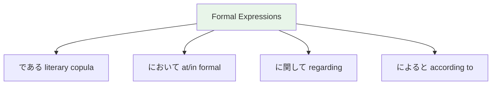

# N3 Grammar — Formal Expressions

> **N3 introduces grammar patterns used in formal writing, news, and business. These are the bridge to reading real Japanese.**

## 🎯 Intuition

**The Core Idea:** Formal expressions used in writing, speeches, and polished communication.
**Analogy:** Like the difference between 'gonna' and 'one shall' — Japanese has a distinct formal register for serious contexts.
**Why It Matters:** These expressions appear in news, academic writing, business documents, and formal speeches.

## ⚙️ Core Mechanics

## Humble / Polite Expressions
- ありがとうございます。 (Arigatou gozaimasu.) — Thank you very much.
  ![[gramn3-001-arigatou-gozaimasu2.mp3]]
- 確認いたします。 (Kakunin itashimasu.) — I will confirm.
  ![[gramn3-002-kakunin-itashimasu.mp3]]

## Key Formal Patterns

### について (ni tsuite) — "regarding, about"
![[n3form-001-nitsuite.mp3]]
- 日本の文化について調べました。 (I researched about Japanese culture.)
  ![[n3form-002-nipponnobunkanitsuiteshirabemashita.mp3]]
- Very common in academic and business contexts

### によると (ni yoru to) — "according to"
![[n3form-003-niyoruto.mp3]]
- ニュースによると、明日は雨です。 (According to the news, it will rain tomorrow.)
  ![[n3form-004-nyuusuniyoruto-ashitahaamedesu.mp3]]

### によって (ni yotte) — "depending on" / "by means of"
![[n3form-005-niyotte.mp3]]
- 人によって違います。 (It differs depending on the person.)
  ![[n3form-006-ninniyottechigaimasu.mp3]]
- この建物は有名な建築家によって建てられました。 (This building was built by a famous architect.)
  ![[n3form-007-konotatemonohayuumeinakenchikukaniyottetaterarem.mp3]]

### に対して (ni tai shite) — "toward, against, in contrast"
![[n3form-008-nitaishite.mp3]]
- この問題に対して、どう思いますか。 (What do you think about this issue?)
  ![[n3form-009-konomondainitaishite-douomoimasuka.mp3]]

### に関して (ni kanshite) — "regarding, concerning"
![[n3form-010-nikanshite.mp3]]
- この問題に関して、話し合いましょう。 (Kono mondai ni kanshite, hanashiaimashou.) — Let's discuss this issue.
  ![[gramn3-004-kono-mondai-ni-kanshite.mp3]]

### にかかわらず (ni kakawarazu) — "regardless of"
![[n3form-011-nikakawarazu.mp3]]
- 天気にかかわらず、試合は行われます。 (Regardless of weather, the game will be held.)
  ![[n3form-012-tenkinikakawarazu-shiaihaokonawaremasu.mp3]]

### による / により (ni yoru / ni yori) — "due to, caused by"
![[n3form-013-niyoru-niyori.mp3]]
- 台風により、飛行機が欠航になりました。 (Due to the typhoon, flights were cancelled.)
  ![[n3form-014-taifuuniyori-hikoukigakekkouninarimashita.mp3]]

### として (to shite) — "as"
![[n3form-015-toshite.mp3]]
- 先生として働いています。 (I work as a teacher.)
  ![[n3form-016-senseitoshitehataraiteimasu.mp3]]

### によると vs によって vs により
![[n3form-017-niyorutoniyotteniyori.mp3]]

| Pattern | Meaning | Example |
|---------|---------|---------|
| によると | According to | 予報によると (according to the forecast) ![[n3form-018-yohouniyoruto.mp3]]|
| によって | Depending on / By | 国によって (depending on the country) ![[n3form-019-kuniniyotte.mp3]]|
| により | Due to (formal) | 事故により (due to an accident) ![[n3form-020-jikoniyori.mp3]]|

## Formal Sentence Endings

| Pattern | Meaning | Replaces |
|---------|---------|----------|
| である ![[n3form-021-dearu.mp3]]| is (formal written) | だ |
| であります ![[n3form-022-dearimasu.mp3]]| is (ultra-polite) | です |
| ではないか ![[n3form-023-dehanaika.mp3]]| isn't it? (rhetorical) | じゃない? |

## Where You'll See These
- News articles (NHK)
- Business emails
- Formal speeches
- JLPT reading passages

## 🔬 Deep Dive

### Nuances and Exceptions
- Pay attention to context — the same grammar point can have different nuances in formal vs casual speech.
- Exceptions often come from classical Japanese or set phrases that don't follow modern rules.

### Formal vs Informal Usage
- Most patterns have both polite (です/ます) and casual (dictionary form) variants.
- Choose formality based on your relationship with the listener and the situation.

### Common Mistakes by English Speakers
- Applying English word order (SVO) instead of Japanese (SOV).
- Overusing pronouns — Japanese drops subjects when context is clear.
- Translating literally instead of using natural Japanese patterns.

## 🏋️ Practice

### Warm-Up — Recognition
1. Which particle completes this sentence? 私＿学生です。 → (は)
2. Is this sentence correct? 本が読みます。 → (No — should be 本を読みます)
3. What does この mean in: この本は面白い → (this)

### Core Exercises — Production
1. **Translate:** "I go to school by bus every day."
   → 毎日バスで学校に行きます。
2. **Fill in:** 友達＿映画＿見ました。 → (と / を)

### Challenge — Real World
You're at a konbini (convenience store). The clerk asks これでよろしいですか？ How do you respond if you also want to add a drink? Use appropriate particles and polite form.

## References
- [[Sources Index]]
