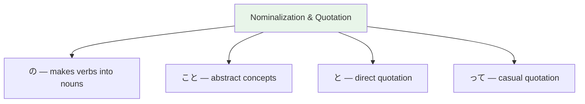

# N3 Grammar — Nominalization and Quotation

> **Turning verbs and sentences into nouns, and reporting what others say. Essential for complex expression.**

## 🎯 Intuition

**The Core Idea:** Nominalization turns verbs into nouns; quotation marks reported speech — both expand what you can express.
**Analogy:** Like adding '-ing' or 'the act of' in English — 食べる (eat) → 食べること (eating/the act of eating).
**Why It Matters:** These patterns are essential for expressing opinions, explaining concepts, and reporting what others said.

## ⚙️ Core Mechanics

## Nominalization: こと and の
![[n3nom-001-koto-no.mp3]]

### こと (koto) — Abstract concepts and facts
![[n3nom-002-koto.mp3]]
- 日本語を話すことができます。 (I can speak Japanese.) — ことができる = "can do"
  ![[n3nom-003-nihongowohanasukotogadekimasu.mp3]]
- 旅行することが好きです。 (I like traveling.)
  ![[n3nom-004-ryokousurukotogasukidesu.mp3]]
- 読むことが好きです。 (Yomu koto ga suki desu.) — I like reading.
  ![[gramn3-006-yomu-koto-ga-suki.mp3]]
- 大切なことは諦めないことです。 (The important thing is to not give up.)
  ![[n3nom-005-taisetsunakotohaakiramenaikotodesu.mp3]]

### の (no) — Specific, perceived events
![[n3nom-006-no.mp3]]
- 子供が遊んでいるのを見ました。 (I saw children playing.)
  ![[n3nom-007-kodomogaasondeirunowomimashita.mp3]]
- 電車が来るのが見えます。 (I can see the train coming.)
  ![[n3nom-008-denshagakurunogamiemasu.mp3]]
- 走るのが見えた。 (Hashiru no ga mieta.) — I saw [someone] running.
  ![[gramn3-007-hashiru-no-ga-mieta.mp3]]

### こと vs の
![[n3nom-009-koto-no.mp3]]

| Use こと for ![[n3nom-010-koto.mp3]]| Use の for |
|-----------|--------|
| Abstract facts | Directly perceived events |
| General statements | Specific sensory experiences |
| After ことがある (have done) | After 見る, 聞く, 感じる ![[n3nom-011-miru-kiku-kanjiru.mp3]]|
| After ことにする (decide to) ![[n3nom-012-kotonisuru.mp3]]| Before は, が (as topic/subject) |

## Quotation: と and という
![[n3nom-013-to-toiu.mp3]]

### Direct Quote: 「...」と
![[n3nom-014-to.mp3]]
- 彼は「行く」と言いました。 (He said "I'll go.")
  ![[n3nom-015-kareha-iku-toiimashita.mp3]]

### Indirect Quote: ...と
![[n3nom-016-to.mp3]]
- 彼は行くと言いました。 (He said he would go.)
  ![[n3nom-017-karehaikutoiimashita.mp3]]
- 明日雨だと思います。 (I think it will rain tomorrow.)
  ![[n3nom-018-ashitaamedatoomoimasu.mp3]]
- 日本は安全だと思います。 (Nihon wa anzen da to omoimasu.) — I think Japan is safe.
  ![[gramn3-009-nihon-wa-anzen-da-to-omoimasu.mp3]]

### という (to iu) — "called, that says"
![[n3nom-019-toiu.mp3]]
- 「寿司」という食べ物を知っていますか。 (Do you know the food called "sushi"?)
  ![[n3nom-020-sushi-toiutabemonowoshitteimasuka.mp3]]
- 東京という町です。 (Toukyou to iu machi desu.) — It's a city called Tokyo.
  ![[gramn3-008-toukyou-to-iu-machi.mp3]]
- 彼が来るということを聞きました。 (I heard that he is coming.)
  ![[n3nom-021-karegakurutoiukotowokikimashita.mp3]]

### Common と Patterns
![[n3nom-022-to.mp3]]

| Pattern | Meaning |
|---------|---------|
| と思う ![[n3nom-023-toomou.mp3]]| I think that... |
| と言う ![[n3nom-024-toiu.mp3]]| to say that... |
| と聞く ![[n3nom-025-tokiku.mp3]]| to hear that... |
| ということは ![[n3nom-026-toiukotoha.mp3]]| the fact that... means... |
| というのは ![[n3nom-027-toiunoha.mp3]]| the thing called... |

## ように (yō ni) — "so that, in order to"
![[n3nom-028-youni.mp3]]

### ようにする — "make it so that"
![[n3nom-029-younisuru.mp3]]
- 毎日運動するようにしています。 (I make a point of exercising every day.)
  ![[n3nom-030-mainichiundousuruyounishiteimasu.mp3]]

### ようになる — "come to be able to"
![[n3nom-031-youninaru.mp3]]
- 日本語が話せるようになりました。 (I've come to be able to speak Japanese.)
  ![[n3nom-032-nihongogahanaseruyouninarimashita.mp3]]

### ないように — "so as not to"
![[n3nom-033-naiyouni.mp3]]
- 遅れないように、早く出ました。 (So as not to be late, I left early.)
  ![[n3nom-034-okurenaiyouni-hayakudemashita.mp3]]

## 🔬 Deep Dive

### Nuances and Exceptions
- Pay attention to context — the same grammar point can have different nuances in formal vs casual speech.
- Exceptions often come from classical Japanese or set phrases that don't follow modern rules.

### Formal vs Informal Usage
- Most patterns have both polite (です/ます) and casual (dictionary form) variants.
- Choose formality based on your relationship with the listener and the situation.

### Common Mistakes by English Speakers
- Applying English word order (SVO) instead of Japanese (SOV).
- Overusing pronouns — Japanese drops subjects when context is clear.
- Translating literally instead of using natural Japanese patterns.

## 🏋️ Practice

### Warm-Up — Recognition
1. Which particle completes this sentence? 私＿学生です。 → (は)
2. Is this sentence correct? 本が読みます。 → (No — should be 本を読みます)
3. What does この mean in: この本は面白い → (this)

### Core Exercises — Production
1. **Translate:** "I go to school by bus every day."
   → 毎日バスで学校に行きます。
2. **Fill in:** 友達＿映画＿見ました。 → (と / を)

### Challenge — Real World
You're at a konbini (convenience store). The clerk asks これでよろしいですか？ How do you respond if you also want to add a drink? Use appropriate particles and polite form.

## References
- [[Japanese/Sources/Sources Index|Sources Index]]
