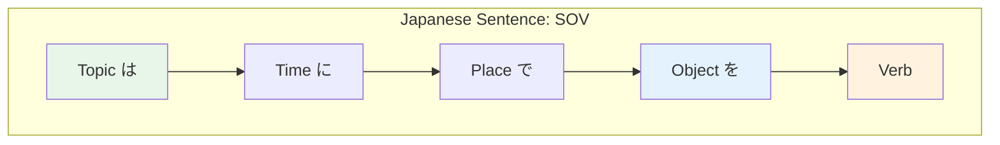

# N4 Grammar — Compound Sentences

> **Connecting ideas smoothly is what separates choppy beginner Japanese from natural-sounding speech.**

## 🎯 Intuition

**The Core Idea:** Compound sentences connect multiple clauses to express complex ideas.
**Analogy:** Like using 'and', 'but', 'so', 'because' in English — but Japanese has unique connective patterns.
**Why It Matters:** Moving beyond simple sentences to compound ones is the leap from beginner to intermediate.

## ⚙️ Core Mechanics

## Connecting with て/で (and then)
![[n4comp-001-te-de.mp3]]
Sequential actions or descriptions:
- 朝起きて、シャワーを浴びて、会社に行きます。
  ![[n4comp-002-asaokite-shawaawoabite-kaishaniikimasu.mp3]]
  (I wake up, take a shower, and go to work.)
- このレストランは安くておいしいです。
  ![[n4comp-003-konoresutoranhayasukuteoishiidesu.mp3]]
  (This restaurant is cheap and delicious.)

## Common て-form Compounds
![[n4comp-004-te.mp3]]
- 食べている。 (Tabete iru.) — is eating.
  ![[gramn4-012-tabete-iru.mp3]]
- 窓が開けてある。 (Mado ga akete aru.) — the window has been left open.
  ![[gramn4-013-mado-ga-akete-aru.mp3]]
- 予約しておく。 (Yoyaku shite oku.) — make a reservation in advance.
  ![[gramn4-014-yoyaku-shite-oku.mp3]]
- 食べてしまった。 (Tabete shimatta.) — ended up eating / ate it all.
  ![[gramn4-015-tabete-shimatta.mp3]]
- 食べてみる。 (Tabete miru.) — try eating.
  ![[gramn4-016-tabete-miru.mp3]]
- 来てほしい。 (Kite hoshii.) — I want you to come.
  ![[gramn4-017-kite-hoshii.mp3]]

## Contrast: が / けど (but)
![[n4comp-005-ga-kedo.mp3]]
- 日本語は難しいですが、おもしろいです。
  ![[n4comp-006-nihongohamuzukashiidesuga-omoshiroidesu.mp3]]
  (Japanese is difficult, but interesting.)
- 行きたかったけど、時間がなかった。
  ![[n4comp-007-ikitakattakedo-jikanganakatta.mp3]]
  (I wanted to go, but I didn't have time.)
- が is slightly more formal, けど is conversational
  ![[n4comp-008-ga-kedo.mp3]]

## Reason: ので / から (because)
![[n4comp-009-node-kara.mp3]]
- 雨なので、家にいます。 (Because it's raining, I'll stay home.) — more formal/written
  ![[n4comp-010-amenanode-ieniimasu.mp3]]
- 雨だから、家にいます。 (Because it's raining, I'll stay home.) — more casual
  ![[n4comp-011-amedakara-ieniimasu.mp3]]
- ので states objective reason; から can be more subjective/personal
  ![[n4comp-012-node-kara.mp3]]

## Despite: のに / のにもかかわらず
![[n4comp-013-noni-nonimokakawarazu.mp3]]
- 雨なのに、出かけました。 (Despite the rain, I went out.)
  ![[n4comp-014-amenanoni-dekakemashita.mp3]]
- 勉強したのに、テストに落ちました。 (Despite studying, I failed the test.)
  ![[n4comp-015-benkyoushitanoni-tesutoniochimashita.mp3]]

## Purpose: ために / のに (in order to)
![[n4comp-016-tameni-noni.mp3]]
- 日本語を勉強するために、毎日練習します。
  ![[n4comp-017-nihongowobenkyousurutameni-mainichirenshuushimas.mp3]]
  (In order to study Japanese, I practice every day.)

## While: ながら / 間に
![[n4comp-018-nagara-mani.mp3]]
- 音楽を聞きながら、勉強します。 (I study while listening to music.)
  ![[n4comp-019-ongakuwokikinagara-benkyoushimasu.mp3]]
- ながら = simultaneous actions by same person
  ![[n4comp-020-nagara.mp3]]
- 間に = during a time period
  ![[n4comp-021-mani.mp3]]

## Listing Reasons: し (and also)
![[n4comp-022-shi.mp3]]
- このアパートは広いし、安いし、駅に近いし、最高です。
  ![[n4comp-023-konoapaatohahiroishi-yasuishi-ekinichikaishi-sai.mp3]]
  (This apartment is spacious, cheap, close to the station — it's the best.)

## Summary

| Connector | Meaning | Formality |
|-----------|---------|-----------|
| て ![[n4comp-024-te.mp3]]| and then, and | Neutral |
| が ![[n4comp-025-ga.mp3]]| but | Formal |
| けど ![[n4comp-026-kedo.mp3]]| but | Casual |
| ので ![[n4comp-027-node.mp3]]| because | Formal |
| から ![[n4comp-028-kara.mp3]]| because | Casual |
| のに ![[n4comp-029-noni.mp3]]| despite | Neutral |
| ために ![[n4comp-030-tameni.mp3]]| in order to | Neutral |
| ながら ![[n4comp-031-nagara.mp3]]| while | Neutral |
| し ![[n4comp-032-shi.mp3]]| and also (listing) | Neutral |

## 🔬 Deep Dive

### Nuances and Exceptions
- Pay attention to context — the same grammar point can have different nuances in formal vs casual speech.
- Exceptions often come from classical Japanese or set phrases that don't follow modern rules.

### Formal vs Informal Usage
- Most patterns have both polite (です/ます) and casual (dictionary form) variants.
- Choose formality based on your relationship with the listener and the situation.

### Common Mistakes by English Speakers
- Applying English word order (SVO) instead of Japanese (SOV).
- Overusing pronouns — Japanese drops subjects when context is clear.
- Translating literally instead of using natural Japanese patterns.

## 🏋️ Practice

### Warm-Up — Recognition
1. Which particle completes this sentence? 私＿学生です。 → (は)
2. Is this sentence correct? 本が読みます。 → (No — should be 本を読みます)
3. What does この mean in: この本は面白い → (this)

### Core Exercises — Production
1. **Translate:** "I go to school by bus every day."
   → 毎日バスで学校に行きます。
2. **Fill in:** 友達＿映画＿見ました。 → (と / を)

### Challenge — Real World
You're at a konbini (convenience store). The clerk asks これでよろしいですか？ How do you respond if you also want to add a drink? Use appropriate particles and polite form.

## References
- [[Japanese/Sources/Sources Index|Sources Index]]
