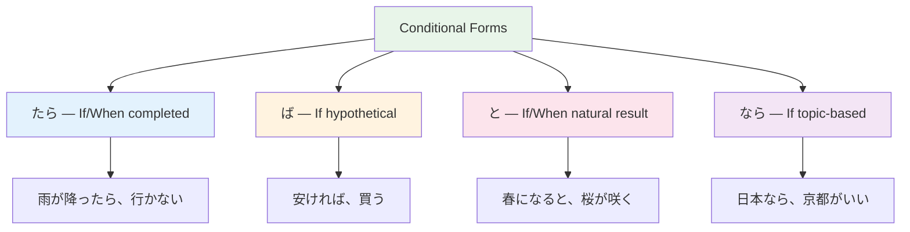

# N4 Grammar — Conditional Forms

> **Japanese has FOUR ways to say "if" — each with different nuances.**

## 🎯 Intuition

**The Core Idea:** Four conditional forms (たら, ば, と, なら) each express 'if' with different nuances.
**Analogy:** Like the difference between 'if', 'when', 'in case', and 'assuming that' in English.
**Why It Matters:** Conditionals are essential for planning, giving advice, making hypotheses, and everyday conversation.

## ⚙️ Core Mechanics

## The Four Conditionals

### 1. たら (tara) — "If/When X happens"
![[n4cond-001-tara.mp3]]
**Formation:** Past tense + ら
![[n4cond-002-ra.mp3]]
- 雨が降ったら、行きません。 (Ame ga futtara, ikimasen.) — If it rains, I won't go.
  ![[gramn4-001-ame-ga-futtara.mp3]]
- **Character:** Most versatile. Good default choice.

### 2. ば (ba) — "If X is the case"
![[n4cond-003-ba.mp3]]
**Formation:** Change final vowel to -eba
- 練習すれば、上手になります。 (Renshuu sureba, jouzu ni narimasu.) — If you practice, you'll improve.
  ![[gramn4-002-renshuu-sureba.mp3]]

| Type | Rule | Example |
|------|------|---------|
| G1 verb | -u → -eba | 行く → 行けば ![[n4cond-004-iku-ikeba.mp3]]|
| G2 verb | -ru → -reba | 食べる → 食べれば ![[n4cond-005-taberu-tabereba.mp3]]|
| i-adj | -i → -kereba | 高い → 高ければ ![[n4cond-006-takai-takakereba.mp3]]|

### 3. なら (nara) — "If what you said is true"
![[n4cond-007-nara.mp3]]
- 日本に行くなら、京都がおすすめです。 (Nihon ni iku nara, Kyoto ga osusume desu.) — If you're going to Japan, I recommend Kyoto.
  ![[gramn4-003-nihon-ni-iku-nara.mp3]]
- **Character:** Responds to information. "If that's the case..."

### 4. と (to) — "Whenever X, always Y"
![[n4cond-008-to.mp3]]
- 春になると、花が咲きます。 (Haru ni naru to, hana ga sakimasu.) — When spring comes, flowers bloom.
  ![[gramn4-004-haru-ni-naru-to.mp3]]
- **Character:** Natural/automatic results. NOT for requests.

## Quick Comparison

| Form | Best for | Can't use for |
|------|---------|--------------|
| たら ![[n4cond-009-tara.mp3]]| Anything (safest default) | — |
| ば ![[n4cond-010-ba.mp3]]| General truths, advice | Past events |
| なら ![[n4cond-011-nara.mp3]]| Reacting to information | Automatic results |
| と ![[n4cond-012-to.mp3]]| Natural/automatic results | Requests, invitations |

## The Golden Rule
When in doubt, use たら. It works in the most situations.
![[n4cond-013-tara.mp3]]

## 🔬 Deep Dive

### Nuances and Exceptions
- Pay attention to context — the same grammar point can have different nuances in formal vs casual speech.
- Exceptions often come from classical Japanese or set phrases that don't follow modern rules.

### Formal vs Informal Usage
- Most patterns have both polite (です/ます) and casual (dictionary form) variants.
- Choose formality based on your relationship with the listener and the situation.

### Common Mistakes by English Speakers
- Applying English word order (SVO) instead of Japanese (SOV).
- Overusing pronouns — Japanese drops subjects when context is clear.
- Translating literally instead of using natural Japanese patterns.

## 🏋️ Practice

### Warm-Up — Recognition
1. Which conditional expresses a natural/inevitable result? → (と)
2. Which conditional is most versatile for 'if X happens'? → (たら)
3. Can ば be used with past events? → (No — ば is for hypothetical/general conditions)

### Core Exercises — Production
1. **Translate using たら:** "If it rains tomorrow, I'll stay home." → 明日雨が降ったら、家にいます。
2. **Fill in the correct conditional:** 春になる＿、桜が咲きます。 → (と)

### Challenge — Real World
A friend asks you to recommend what to do in Tokyo. Give 3 pieces of advice using different conditional forms (たら, ば, なら).

## References
- [[Sources Index]]
