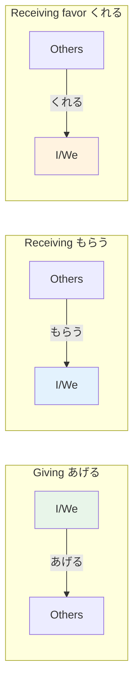

# N4 Grammar — Giving and Receiving

> **Japanese has a complex system of give/receive verbs that encode social relationships. Who gives to whom determines which verb you use.**

## 🎯 Intuition

**The Core Idea:** Japanese has a nuanced system for giving and receiving that encodes social relationships.
**Analogy:** Unlike English's simple 'give/receive', Japanese uses different verbs depending on social direction (up/down/neutral).
**Why It Matters:** This grammar appears in requests, favors, and describing what people did for each other.

## ⚙️ Core Mechanics

## The Three Core Verbs

### あげる (ageru) — I/someone gives (outward)
![[n4give-001-ageru.mp3]]
- Speaker gives to someone, or third person gives to another third person
- 私は友達にプレゼントをあげました。 (I gave my friend a present.)
  ![[n4give-002-watashihatomodachinipurezentowoagemashita.mp3]]
- Direction: Me/In-group → Others
- 友達にあげた。 (Tomodachi ni ageta.) — I gave it to a friend.
  ![[gramn4-009-tomodachi-ni-ageta.mp3]]

### もらう (morau) — I/someone receives
![[n4give-003-morau.mp3]]
- Speaker receives from someone
- 私は友達にプレゼントをもらいました。 (I received a present from my friend.)
  ![[n4give-004-watashihatomodachinipurezentowomoraimashita.mp3]]
- Direction: Others → Me/In-group (speaker's perspective)

### くれる (kureru) — Someone gives to me
![[n4give-005-kureru.mp3]]
- Someone gives to the speaker or speaker's in-group
- 友達が私にプレゼントをくれました。 (My friend gave me a present.)
  ![[n4give-006-tomodachigawatashinipurezentowokuremashita.mp3]]
- Direction: Others → Me/In-group (giver's action emphasized)

## て-form + Give/Receive (Favor Expressions)
![[n4give-007-te.mp3]]

This is where it gets really useful — expressing doing favors:

### てあげる — I do something for someone
![[n4give-008-teageru.mp3]]
- 私は弟に日本語を教えてあげました。 (I taught my brother Japanese [as a favor].)
  ![[n4give-009-watashihaotoutoninihongowooshieteagemashita.mp3]]

### てもらう — I have someone do something for me
![[n4give-010-temorau.mp3]]
- 先生に教えてもらった。 (Sensei ni oshiete moratta.) — I had the teacher teach me.
  ![[gramn4-010-sensei-ni-oshiete-moratta.mp3]]
- 友達に手伝ってもらいました。 (I had my friend help me.)
  ![[n4give-011-tomodachinitetsudatsutemoraimashita.mp3]]
- Very useful for polite requests: てもらえますか (Could you do ~ for me?)
  ![[n4give-012-temoraemasuka.mp3]]

### てくれる — Someone does something for me
![[n4give-013-tekureru.mp3]]
- 母が作ってくれた。 (Haha ga tsukutte kureta.) — My mother made it for me.
  ![[gramn4-011-haha-ga-tsukutte-kureta.mp3]]
- 母がお弁当を作ってくれました。 (Mom made a bento for me.)
  ![[n4give-014-hahagaobentouwotsukutsutekuremashita.mp3]]
- Expresses gratitude for the action

## Honorific Versions

| Plain | Honorific | Use |
|-------|-----------|-----|
| あげる | さしあげる ![[n4give-015-sashiageru.mp3]]| Giving to someone higher |
| もらう | いただく ![[n4give-016-itadaku.mp3]]| Receiving from someone higher |
| くれる | くださる ![[n4give-017-kudasaru.mp3]]| Someone higher gives to me |

## Visual Flow
`
        ageru (I give)
  ME ──────────────────> OTHERS
  ME <──────────────────  OTHERS
        kureru (they give to me)
        morau (I receive)
`

## 🔬 Deep Dive

### Common Mistakes
1. Using あげる when someone gives to YOU (should be くれる)
   ![[n4give-018-ageru-kureru.mp3]]
2. Forgetting the social encoding — these verbs aren't just about objects, they're about relationships
3. Using あげる to superiors (use さしあげる or avoid entirely)
   ![[n4give-019-ageru-sashiageru.mp3]]

### Nuances and Exceptions
- Pay attention to context — the same grammar point can have different nuances in formal vs casual speech.
- Exceptions often come from classical Japanese or set phrases that don't follow modern rules.

### Formal vs Informal Usage
- Most patterns have both polite (です/ます) and casual (dictionary form) variants.
- Choose formality based on your relationship with the listener and the situation.

## 🏋️ Practice

### Warm-Up — Recognition
1. Who benefits in: 友達が本をくれた? → (I/the speaker benefits)
2. What's the difference between あげる and くれる? → (あげる = I give out; くれる = someone gives to me)
3. When do you use もらう? → (When you receive something, focused on the receiver)

### Core Exercises — Production
1. **Translate:** "My teacher gave me a book." → 先生が本をくれた。
2. **Fill in:** 友達＿ケーキを作って＿。(for a friend) → (に / あげた)

### Challenge — Real World
Describe 3 recent favors: one you did for someone (あげる), one someone did for you (くれる), and one you received (もらう).

## 🔊 Audio
- Practice dialogues that use all three verbs in context

## References
- [[Japanese/Sources/Sources Index|Sources Index]]
