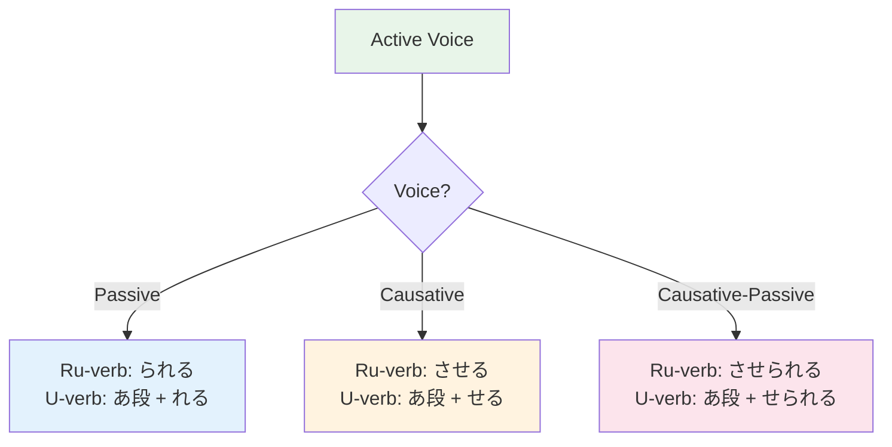

# N4 Grammar — Passive and Causative

> **Two important N4 grammar points that change WHO does the action and WHO is affected.**

## 🎯 Intuition

**The Core Idea:** Passive and causative voices let you express being affected by others' actions or making someone do something.
**Analogy:** Passive = 'was done to me'; Causative = 'made/let someone do' — like 'I was told' vs 'I made him go'.
**Why It Matters:** These forms appear constantly in business, news, and storytelling contexts.

## ⚙️ Core Mechanics

## Passive (受身 うけみ)
![[n4pass-001-ukemi-ukemi.mp3]]

### Formation

| Group | Rule | Example |
|-------|------|---------|
| G1 | -u → -areru | 読む → 読まれる (yomareru) ![[n4pass-002-yomu-yomareru.mp3]]|
| G2 | -ru → -rareru | 食べる → 食べられる (taberareru) ![[n4pass-003-taberu-taberareru.mp3]]|
| Irr | する → される, くる → こられる ![[n4pass-004-suru-sareru-kuru-korareru.mp3]]| |

### Three Types
1. **Direct Passive:** 私は先生にほめられた。 (Watashi wa sensei ni homerareta.) — I was praised by the teacher.
   ![[gramn4-005-sensei-ni-homerareta.mp3]]
2. **Indirect Passive (unique to Japanese):** 雨に降られた。 (Ame ni furareta.) — I was rained on.
   ![[gramn4-006-ame-ni-furareta.mp3]]
   Implies inconvenience
3. **Impersonal:** この本は多くの人に読まれています。 (This book is read by many people.)
   ![[n4pass-005-konohonhaookunoninniyomareteimasu.mp3]]

## Causative (使役 しえき)
![[n4pass-006-shieki-shieki.mp3]]

### Formation

| Group | Rule | Example |
|-------|------|---------|
| G1 | -u → -aseru | 読む → 読ませる (yomaseru) ![[n4pass-007-yomu-yomaseru.mp3]]|
| G2 | -ru → -saseru | 食べる → 食べさせる (tabesaseru) ![[n4pass-008-taberu-tabesaseru.mp3]]|
| Irr | する → させる, くる → こさせる ![[n4pass-009-suru-saseru-kuru-kosaseru.mp3]]| |

### Two Uses
1. **Make someone do:** 先生は学生に本を読ませた。 (Sensei wa gakusei ni hon o yomaseta.) — The teacher made students read.
   ![[gramn4-007-sensei-wa-yomaseta.mp3]]
2. **Let someone do:** 母は私に遊ばせてくれた。 (Mom let me play.)
   ![[n4pass-010-hahahawatashiniasobasetekureta.mp3]]

## Causative-Passive — "I was MADE TO do"
- 野菜を食べさせられた。 (Yasai wo tabesaserareta.) — I was made to eat vegetables.
  ![[gramn4-008-yasai-wo-tabesaserareta.mp3]]

## Summary

| Form | Meaning | Example |
|------|---------|---------|
| 食べる ![[n4pass-011-taberu.mp3]]| I eat | Active |
| 食べられる ![[n4pass-012-taberareru.mp3]]| I am eaten | Passive |
| 食べさせる ![[n4pass-013-tabesaseru.mp3]]| I make someone eat | Causative |
| 食べさせられる ![[n4pass-014-tabesaserareru.mp3]]| I am made to eat | Causative-passive |

## 🔬 Deep Dive

### Nuances and Exceptions
- Pay attention to context — the same grammar point can have different nuances in formal vs casual speech.
- Exceptions often come from classical Japanese or set phrases that don't follow modern rules.

### Formal vs Informal Usage
- Most patterns have both polite (です/ます) and casual (dictionary form) variants.
- Choose formality based on your relationship with the listener and the situation.

### Common Mistakes by English Speakers
- Applying English word order (SVO) instead of Japanese (SOV).
- Overusing pronouns — Japanese drops subjects when context is clear.
- Translating literally instead of using natural Japanese patterns.

## 🏋️ Practice

### Warm-Up — Recognition
1. What does 食べさせる mean? → (to make/let someone eat)
2. Is 褒められた passive or causative? → (passive — was praised)
3. What's the causative-passive of 読む? → (読まされる — was made to read)

### Core Exercises — Production
1. **Convert to passive:** 先生が学生を褒めた → 学生が先生に褒められた
2. **Translate:** "My mom made me eat vegetables." → 母に野菜を食べさせられた。

### Challenge — Real World
Describe a childhood experience using both passive (something done to you) and causative (something you were made to do) forms.

## References
- [[Sources Index]]
