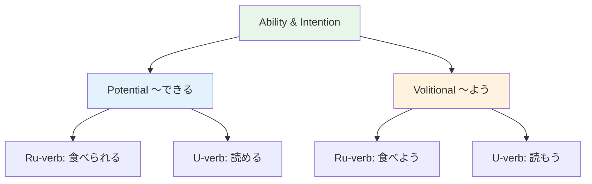

# N4 Grammar — Potential and Volitional

> **Two important verb forms: expressing ability ("can do") and intention ("let's / I'll").**

## 🎯 Intuition

**The Core Idea:** Potential form expresses ability ('can do'); volitional expresses intention or suggestion ('let's do').
**Analogy:** Potential = 'I can eat' (食べられる); Volitional = 'let's eat' (食べよう) — ability vs intention.
**Why It Matters:** These forms are essential for expressing what you can do and proposing plans.

## ⚙️ Core Mechanics

## Potential Form (可能形)
![[n4pot-001-kanoukatachi.mp3]]

### Formation

| Group | Rule | Example |
|-------|------|---------|
| G1 | -u → -eru | 読む → 読める (yomeru) ![[n4pot-002-yomu-yomeru.mp3]]|
| G2 | -ru → -rareru | 食べる → 食べられる (taberareru) ![[n4pot-003-taberu-taberareru.mp3]]|
| Irr | する → できる, くる → こられる ![[n4pot-004-suru-dekiru-kuru-korareru.mp3]]| |

### Usage
- 書ける。 (Kakeru.) — I can write.
  ![[gramn4-018-kakeru.mp3]]
- 食べられる。 (Taberareru.) — I can eat.
  ![[gramn4-019-taberareru.mp3]]
- 日本語が話せます。 (I can speak Japanese.)
  ![[n4pot-005-nihongogahanasemasu.mp3]]
- お箸が使えますか。 (Can you use chopsticks?)
  ![[n4pot-006-otsukaemasuka.mp3]]
- **Note:** Object particle changes from を to が with potential form
  ![[n4pot-007-wo-ga.mp3]]

### Ra-nuki (ら抜き) — Colloquial Shortcut
![[n4pot-008-ranuki.mp3]]
In casual speech, Group 2 verbs drop ら:
![[n4pot-009-ra.mp3]]
- 食べられる → 食べれる (tabereru) — widely used but technically informal
  ![[n4pot-010-taberareru-tabereru.mp3]]
- 見られる → 見れる (mireru)
  ![[n4pot-011-mirareru-mireru.mp3]]

## Volitional Form (意向形)
![[n4pot-012-ikoukatachi.mp3]]

### Formation

| Group | Rule | Example |
|-------|------|---------|
| G1 | -u → -ō | 行く → 行こう (ikō) ![[n4pot-013-iku-ikou.mp3]]|
| G2 | -ru → -yō | 食べる → 食べよう (tabeyō) ![[n4pot-014-taberu-tabeyou.mp3]]|
| Irr | する → しよう, くる → こよう ![[n4pot-015-suru-shiyou-kuru-koyou.mp3]]| |

### Usage
**1. "Let's ~" (suggestion)**
- 食べよう。 (Tabeyou.) — Let's eat.
  ![[gramn4-020-tabeyou.mp3]]
- 行こうか。 (Shall we go?)
  ![[n4pot-016-ikouka.mp3]]

**2. "I'll ~" (personal intention)**
- 明日早く起きよう。 (I'll wake up early tomorrow.)
  ![[n4pot-017-ashitahayakuokiyou.mp3]]

**3. と思う (I think I'll ~)**
![[n4pot-018-toomou.mp3]]
- 日本語を勉強しようと思います。 (I think I'll study Japanese.)
  ![[n4pot-019-nihongowobenkyoushiyoutoomoimasu.mp3]]

**4. とする (to try to ~)**
![[n4pot-020-tosuru.mp3]]
- 店に入ろうとしたが、閉まっていた。 (I tried to enter the shop, but it was closed.)
  ![[n4pot-021-miseniiroutoshitaga-shimatteita.mp3]]

## Comparison: Ways to Say "Can"

| Expression | Nuance |
|-----------|--------|
| Potential form | General ability |
| ことができる ![[n4pot-022-kotogadekiru.mp3]]| Ability (formal) |
| 見える/聞こえる ![[n4pot-023-mieru-kikoeru.mp3]]| Can see/hear (involuntary) |

## 🔬 Deep Dive

### Nuances and Exceptions
- Pay attention to context — the same grammar point can have different nuances in formal vs casual speech.
- Exceptions often come from classical Japanese or set phrases that don't follow modern rules.

### Formal vs Informal Usage
- Most patterns have both polite (です/ます) and casual (dictionary form) variants.
- Choose formality based on your relationship with the listener and the situation.

### Common Mistakes by English Speakers
- Applying English word order (SVO) instead of Japanese (SOV).
- Overusing pronouns — Japanese drops subjects when context is clear.
- Translating literally instead of using natural Japanese patterns.

## 🏋️ Practice

### Warm-Up — Recognition
1. What's the potential form of 読む? → (読める)
2. What does 食べよう mean? → (Let's eat / I'll eat)
3. Can you use potential form with を or が? → (Both work, but が is more traditional)

### Core Exercises — Production
1. **Convert to potential:** 話す → 話せる | 見る → 見られる | する → できる
2. **Translate using volitional:** "Let's go to the park!" → 公園に行こう！

### Challenge — Real World
Your friend visits Japan for the first time. Suggest 3 activities using volitional form and ask about their abilities using potential form.

## References
- [[Sources Index]]
